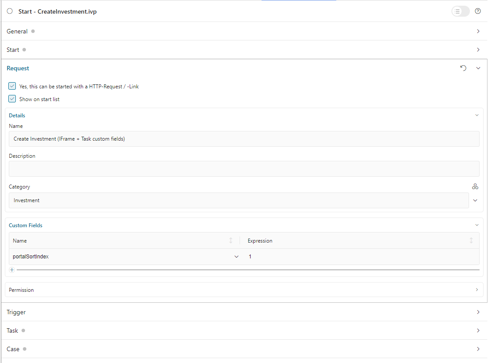

.. _configure-new-dashboard-proces-widget-ja:

プロセスウィジェットの設定
==================================================

プロセスウィジェットの定義
-------------------------------------------------------

ポータルダッシュボードのプロセスウィジェットは、3 つのモードの柔軟なプロセスリストです。
詳細については、:ref:`プロセスリストウィジェット <new-dashboard-process-list-widget-ja>` を参照してください。

プロセスウィジェットの JSON の基本構造は以下のとおりです。

   .. code-block:: javascript

      {
         "type": "compact-process",
         "id": "process-widget",
         "names": [
            {
               "locale": "en",
               "value": "Process Widget"
            }
         ],
         "layout": {
            "x": 10, "y": 0, "w": 2, "h": 4
         },
         "showFullscreenMode" : true,
         "showWidgetInfo" : true
      }
   ..

The basic structure of the JSON of a Process widget

   ``type``：プロセスウィジェットのタイプ。関連する表示モードには、 ``compact-process`` （コンパクトモード）、 ``combined-process`` （複合モード）、 ``full-process`` （フルモード）、 ``image-process`` （イメージモード）の 4 つのタイプがあります。
   
   

   ``id``：ウィジェットの ID。

   ``names``：UI に表示されるウィジェットの複数言語の名前。

   ``layout``：ウィジェットのレイアウトの定義。

      ``x``：HTML DOMスタイル ``left`` は ``x / 12 * 100%`` として計算されます。

      ``y``：HTML DOMスタイル ``top`` は ``y / 12 * 100%`` として計算されます。

      ``w``：HTML DOMスタイル ``width`` は ``60 * w + 20 * (w - 1)`` として計算されます。

      ``h``：HTML DOMスタイル ``height`` は ``60 * h + 20 * (h - 1)`` として計算されます。

      ``styleClass`` （オプション）：CSS クラスをウィジェットの HTML DOM に追加します。

      ``style`` （オプション）：インラインスタイルをウィジェットの HTML DOM に追加します。
      
   ``showFullscreenMode``：全画面モードのアイコンの表示設定。デフォルト値は ``true`` です。アイコンを非表示にするには ``false`` に設定してください。
   
   
   ``showWidgetInfo``：ウィジェット情報アイコンの表示設定。デフォルト値は ``true`` です。アイコンを非表示にするには ``false`` に設定してください。
   

モードごとに JSON 定義が異なります。これらのモードでプロセスウィジェットを正しく定義する方法については、以下のセクションを参照してください。

コンパクトモード
-------------------------------------------

以下はコンパクトモードのプロセスウィジェットの標準的な JSON 定義の例です。

   .. code-block:: javascript

      {
         "type": "compact-process",
         "id": "compact_mode",
         "names": [
            {
               "locale": "en",
               "value": "Process Widget"
            }
         ],
         "layout": {
            "x": 10, "y": 0, "w": 2, "h": 4
         },
         "processPaths": ["designer/portal-developer-examples/Start Processes/Request/createNewRequest.ivp", "designer/portal-developer-examples/Start Processes/Request/collectDataRequest.ivp"],
         "categories": ["/Categories/Showcase/Customized", "/Categories/Showcase/PortalDialogExample"],
         "sorting": "SORTING_INDEX",
         "enableQuickSearch": false,
         "showFullscreenMode" : true,
         "showWidgetInfo" : true
      }
   ..

``processPaths`` ：表示したいプロセスの :dev-url:`|ivy| IWebStartable </doc/|version|/public-api/ch/ivyteam/ivy/workflow/start/IWebStartable.html>` ID。

``categories`` ：表示したいプロセスのカテゴリー。値はこのカテゴリーの :dev-url:`CMS URI </doc/|version|/designer-guide/how-to/workflow/categories.html#workflow-categories>` とします。プロセスウィジェットは、これらのカテゴリーに属するすべてのプロセスを表示します。

``processPaths`` と ``categories`` の両方を定義した場合、プロセスウィジェットは ``processPaths`` を基準にプロセスを表示します。

これらの属性を定義しない場合、プロセスウィジェットは自動的に利用可能なすべてのプロセスを表示します。

``sorting``：ウィジェットに表示されるプロセスの順序を定義します。デフォルト値はアルファベット順です。 

   プロセスをインデックス順に並べたい場合は、プロセスの開始に数値を使用して ``portalSortIndex`` カスタムフィールドを定義する必要があります。

   |dashboard-process-sort-index|

``enableQuickSearch``：ウィジェットのクイック検索機能を有効にします。この機能は自動的に有効化され、 ``the process name`` を検索します。

      有効な値：

      - ``true``：クイック検索テキストボックスを表示します。
      - ``false``：クイック検索テキストボックスを非表示にします。
      - ``not defined``：デフォルトとしてクイック検索テキストボックスを表示します。

複合モード
-------------------------------

以下は複合モードのプロセスウィジェットの標準的な JSON 定義の例です。

   .. code-block:: javascript

      {
         "type": "combined-process",
         "id": "combined_mode",
         "names": [
            {
               "locale": "en",
               "value": "Process Widget"
            }
         ],
         "layout": {
            "x": 0, "y": 0, "w": 6, "h": 7
         },
         "processPath": "designer/portal-developer-examples/Start Processes/CreateTestData/createNewPayment.ivp",
         "rowsPerPage": 5,
         "showFullscreenMode" : true,
         "showWidgetInfo" : true
      }
   ..

``processPath``：表示したいプロセスの :dev-url:`|ivy| IWebStartable </doc/|version|/public-api/ch/ivyteam/ivy/workflow/start/IWebStartable.html>` ID。
プロセスウィジェットは、このプロセスのすべてのタスクとケースを表示します。

``rowsPerPage``：1 ページに表示されるタスク／ケースの数。 
この属性を定義しない場合のデフォルト値は、1 ページあたり 5 行です。

フルモード
-----------------------------------

以下はフルモードのプロセスウィジェットの標準的な JSON 定義の例です。

   .. code-block:: javascript

      {
         "type": "full-process",
         "id": "full_mode",
         "names": [
            {
               "locale": "en",
               "value": "Process Widget"
            }
         ],
         "layout": {
            "x": 0, "y": 0, "w": 6, "h": 7
         },
         "processPath": "designer/portal-developer-examples/Start Processes/CreateTestData/createNewPayment.ivp",
         "showFullscreenMode" : true,
         "showWidgetInfo" : true
      }
   ..

イメージモード
----------------------------------------------

以下はイメージモードのプロセスウィジェットの標準的な JSON 定義の例です。

   .. code-block:: javascript

      {
         "type": "image-process",
         "id": "image_mode",
         "names": [
            {
               "locale": "en",
               "value": "Process Widget"
            }
         ],
         "layout": {
            "x": 0, "y": 0, "w": 6, "h": 7
         },
         "processPath": "designer/portal-developer-examples/Start Processes/CreateTestData/createNewPayment.ivp",
         "showFullscreenMode" : true,
         "showWidgetInfo" : true
      }
   ..

