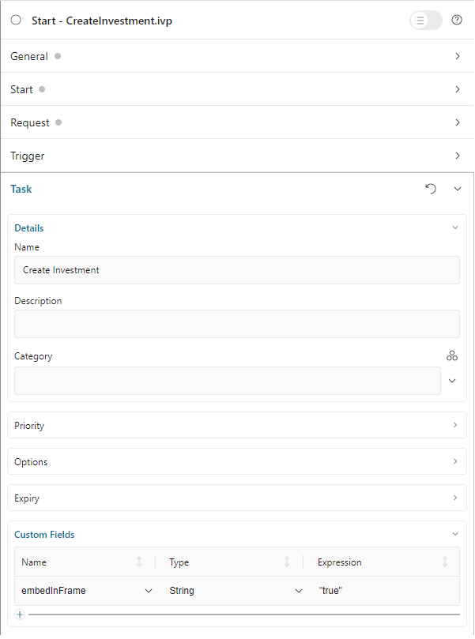
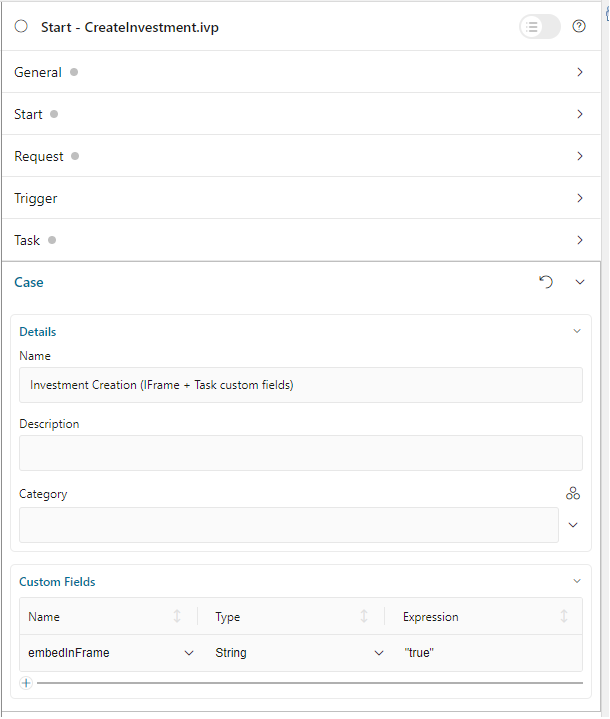

.. _iframe-in-portal-ja:

ポータルの IFrame
************************************

タスクを開始する際にプロジェクトと **ポータル** を分離して、移行の手間を低減したいですか？
それには、この章が役に立ちます。

**ポータル** 8 から、プロセス／タスクを IFrame 内で開始できる新しい機能を導入しました。つまり、 **ポータル** に依存せずに HTML ダイアログを設計できます。
デフォルトでは、HTML ダイアログは、IFrame 内で自動的にレンダリングされます。

.. _iframe-usage-ja:

IFrame で使用するテンプレート
========================================================

（コアによって提供され、Freya テーマを使用する） ``frame-10`` テンプレートを使用します。  
これらのテンプレートは、レスポンシブデザインを完全にサポートします。

使用方法
===============================

.. important::
	デフォルトでは、すなわち設定がない場合、プロセス／タスクは IFrame 内で開始されます。

以下の手順に従って、IFrame アプローチを使用します。
 
#. **HTML ダイアログの独立性**

   HTML ユーザーダイアログが **ポータル** に依存していないことを確認します。デザイナーの ``frame-_x_`` テンプレートまたはカスタムテンプレートを使用できます。 
   **ポータル** は自動的にテンプレートを IFrame 内でレンダリングします。

#. **設定レベル**  
   カスタム動作が必要な場合は、IFrame 内でタスクが開くように、以下のいずれかのレベルで設定します。

   - **タスクレベル**：カスタムタスクフィールドの ``embedInFrame`` フィールドを設定します。

     - ``true``：IFrame 内で開始
     - ``false``：IFrame 内で開始しない
     - ケースまたはエンジンレベルの設定を使用する場合は、未設定のままにします。

     |task-embedInFrame|

   - **ケースレベル**：ケースのカスタムフィールドの ``embedInFrame`` 文字列フィールドを設定します。

     - ``true``: IFrame 内で開始
     - ``false``：IFrame 内で開始しない
     - エンジンレベルの設定を使用する場合は、未設定のままにします。

     |case-embedInFrame|

   - **エンジンレベル**：

     **ポータル管理者** は、ポータル設定の ``Portal.EmbedInFrame`` の値を設定して、すべてのタスクが IFrame 内で開始するように設定できます。  
      :ref:`update-portal-settings-ja` を参照してください。

.. _iframe-configure-template-ja:

テンプレートの設定
================================

**ポータル** では、以下のオプションを使用して、テンプレートを設定できます。

#. 作業中のタスクの名前とアイコン。  
#. プロセスチェーンの設定。  
   （参照： :ref:`components-portal-components-process-chain-ja` ）  
#. ケースの詳細およびその他のアクションの表示／非表示。

テンプレートのパラメーター
---------------------------------------------

このテンプレートでは、以下のパラメーターが利用可能です。

**タスクの詳細**

- ``taskName``：タスク名のカスタムテキスト。
- ``taskIcon``：タスクのアイコン（Streamline または Awesome フォントを使用）。
- ``isHideTaskName``：true に設定されている場合は、タスク名を非表示にします。

**ケース情報**

- ``caseId``：ケース情報ダイアログに表示されるケースの ID。
- ``isHideCaseInfo``：true に設定されている場合は、 ``情報の表示`` ボタンを非表示にします。

**プロセスステップ**

- ``currentProcessStep``：プロセスの現在のステップ（インデックスまたはステップ名）。
- ``processSteps``：プロセスステップのリストまたは JSON。
- ``isShowAllSteps``：true に設定されている場合は、すべてのステップを大画面に表示します。
- ``processChainDirection``：プロセスチェーンの向き（ ``VERTICAL`` または ``HORIZONTAL``）。
- ``processChainShape``：プロセスチェーンの形状（ ``LINE`` または ``CIRCLE``）。

**タスクアクション**

- ``isHideTaskAction`` true に設定されている場合は、タスクアクションボタンを非表示にします。
- ``isWorkingOnATask``：タスクが現在作業中かどうかを示します。ページから離れる際に警告を表示するのに有用です。 
  

**その他**

- ``announcementInvisible``：通知を非表示にします。
- ``isCardFrame``：カードスタイルのコンテナ内に IFrame のコンテンツを表示します。
- ``viewName``：カスタムパンくずリストの表示を定義します。

設定方法
---------------------------------

以下のいずれかの方法で UI を設定できます。

.. note::
       パラメーターを受け渡す前にサニタイジングすることを推奨します。

#. **IFrameTaskConfigコンポーネントの使用** （推奨）

   .. code-block:: xml

      <h:body>
         <ui:composition template="/layouts/frame-10.xhtml">
            ...
            <ic:com.axonivy.portal.components.IFrameTaskConfig 
               taskName="Approve Investment" 
               taskIcon="si si-bulb"
               isHideTaskName="false"
               caseId="123456"
               isHideCaseInfo="false"
               currentProcessStep="0"
               processSteps='["Create Investment Request", "Approve Investment Request"]'
               isShowAllSteps="true"
               processChainDirection="VERTICAL"
               processChainShape="LINE"
               isHideTaskAction="true"
               isWorkingOnATask="false"
               announcementInvisible="false"
               isCardFrame="true"
               viewName="TASK_DETAIL"
            />
            ...
         </ui:composition>
      </h:body>

#. **JavaScript の使用**

   .. code-block:: xml

      <h:body>
         <ui:composition template="/layouts/frame-10.xhtml">
            ...
            
            ...
         </ui:composition>
      </h:body>

タスクの詳細の設定
--------------------------------
タスク名、アイコンなどのタスクの詳細をカスタマイズできます。 

**パラメーター**：
   - ``taskName``：タスク名のカスタムテキスト。
   - ``taskIcon``：Streamline または Awesome フォントの使用（ `si si-arrow-right` など）
   - ``isHideTaskName``：タスク名を非表示にするには、 ``true`` に設定します。初期値は ``false`` です。

**例：**

.. code-block:: xml

   <h:body>
      <ui:composition template="/layouts/frame-10.xhtml">
         ...
         <ic:com.axonivy.portal.components.IFrameTaskConfig
            taskName="Approve Investment"
            taskIcon="si si-bulb"
            isHideTaskName="false"
         />
         ...
      </ui:composition>
   </h:body>

ケース情報の設定
-----------------------------
ケースの詳細を表示する方法、「情報の表示」ボタンを表示するかどうかをカスタマイズします。

**パラメーター**：
   - ``caseId``：情報ダイアログに表示するケースの ID。
   - ``isHideCaseInfo``：「情報の表示」ボタンを非表示にするには、 ``true`` に設定します。
     初期値は ``false`` です。

**例：**

.. code-block:: xml

   <h:body>
      <ui:composition template="/layouts/frame-10.xhtml">
         ...
         <ic:com.axonivy.portal.components.IFrameTaskConfig
            caseId="123456"
            isHideCaseInfo="false"
         />
         ...
      </ui:composition>
   </h:body>

タスクアクションの設定
-------------------------------------------------
タスク関連のボタンとアクションの表示設定と動作を制御します。

**パラメーター**：
   - ``isHideTaskAction`` タスクアクションボタンを非表示にするには、 ``true`` に設定します。 
     初期値は ``false`` です。
   - ``isWorkingOnATask``：タスクがアクティブかどうかを示します。 
     ページから離れる際に警告を表示するのに有用です。初期値は ``true`` です。

**例：**

.. code-block:: xml

   <h:body>
      <ui:composition template="/layouts/frame-10.xhtml">
         ...
         <ic:com.axonivy.portal.components.IFrameTaskConfig
            isHideTaskAction="true"
            isWorkingOnATask="true"
         />
         ...
      </ui:composition>
   </h:body>

その他のオプションの設定
--------------------------------------
追加の設定は、要素のレイアウトと表示設定に影響を及ぼすことがあります。

**パラメーター**：
   - ``announcementInvisible``：通知を非表示にするには、 ``true`` に設定します。 
     初期値は ``false`` です。
   - ``isCardFrame``：カードスタイルのコンテナ内に IFrame のコンテンツを表示するには、 ``true`` に設定します。 
     
   - ``viewName``：カスタムパンくずリストの表示。設定可能な値： 
     ``HOME, PROCESS, TASK, TASK_DETAIL, CASE_DETAIL, CASE, TECHNICAL_CASE, RELATED_TASK, 
     USER_PROFILE, ABSENCES_MANAGEMENT, DASHBOARD_CONFIGURATION, EDIT_DASHBOARD_DETAILS, 
     PROCESS_VIEWER, PORTAL_MANAGEMENT, NOTIFICATION``.

**例：**   

.. code-block:: xml

   <h:body>
      <ui:composition template="/layouts/frame-10.xhtml">
         ...
         <ic:com.axonivy.portal.components.IFrameTaskConfig
            announcementInvisible="false"
            isCardFrame="true"
            viewName="TASK_DETAIL"
         />
         ...
      </ui:composition>
   </h:body>

表示情報の設定
----------------------------------------

``情報の表示`` ボタンをクリックすると、 **ポータル** のモーダルダイアログに実行中のケースの詳細が表示されます。

``情報の表示`` のオプション

   - ``caseId``：モーダルダイアログに表示するケースのケース ID。
   - ``isHideCaseInfo``： ``情報の表示`` ボタンを非表示にします。

.. csv-table::
  :file: documents/available_show_information_options.csv
  :widths: 20 50
  :header-rows: 1
  :class: longtable

IFrameTaskConfig を使用した例：

.. code-block:: xml

   <h:body>
      <ui:composition template="/layouts/frame-10.xhtml">
         ...
         <ic:com.axonivy.portal.components.IFrameTaskConfig 
            caseId="123456"
         />
         ...
      </ui:composition>
   </h:body>

プロセスステップの設定
----------------------------------------

``プロセスステップ`` では、ステップのリストからレイアウト、形状まで、さまざまなオプションを設定できます。

``プロセスステップ`` のオプション

.. csv-table::
  :file: documents/available_process_steps_options.csv
  :widths: 20 50
  :header-rows: 1
  :class: longtable

.. note::

       ``processSteps`` パラメーターを定義するときは、必ずこの JSP 機能タグを ``xmlns:fn="http://xmlns.jcp.org/jsp/jstl/functions"`` HTML ダイアログに追加してください。
       

IFrameTaskConfig を使用した例：

.. code-block:: xml

   <h:body>
      <ui:composition template="/layouts/frame-10.xhtml">
         ...
         <ic:com.axonivy.portal.components.IFrameTaskConfig 
            currentProcessStep="0"
            processSteps='["Create Investment Request", "Approve Investment Request"]'
            processChainDirection="VERTICAL"
            processChainShape="LINE"
         />
         ...
      </ui:composition>
   </h:body>

その他のオプション
----------------------------------------

オプションは、機能とレイアウトに影響を及ぼすことがあります。

.. csv-table::
  :file: documents/available_other_options.csv
  :widths: 20 50
  :header-rows: 1
  :class: longtable

IFrameTaskConfig を使用した例：

.. code-block:: xml

   <h:body>
      <ui:composition template="/layouts/frame-10.xhtml">
         ...
         <ic:com.axonivy.portal.components.IFrameTaskConfig 
            isHideTaskAction="true"
            isWorkingOnATask="false"
            announcementInvisible="false"
            isCardFrame="true"
         />
         ...
      </ui:composition>
   </h:body>

開発者へのヒント
===================================

プロジェクトにタスクを完了しないナビゲーションボタン（キャンセルなど）が含まれる場合は、HTML ダイアログでユーザーを所定のページ（アプリケーションホーム、タスクリスト、プロセスリストなど）にリダイレクトしてください。

.. |case-list-template| image:: ../../screenshots/case/case-key-information.png
.. |task-list-template| image:: ../../screenshots/task/task-key-information.png
.. |task-name-template| image:: ../../screenshots/layout-template/task-template.png

