.. _introduction-ja:

はじめに
********************

ポータル開発者ガイドは、ユーザーのニーズに合わせてポータルをセットアップ、設定、カスタマイズするための情報を提供します。

.. _introduction-new-and-note-worthy-12.0-ja:

12 の新機能と注目すべき変更点
----------------------------------------------------

`リリース 12.0 <https://dev.axonivy.com/news/12.0>`__.で詳細情報を確認してください。

.. _introduction-new-and-note-worthy-11.2-ja:

11 の新機能と注目すべき変更点
--------------------------------------

`リリース 11.3 <https://dev.axonivy.com/news/11.3>`__、 `リリース 11.2 <https://dev.axonivy.com/news/11.2>`__、 `リリース 11.1 <https://dev.axonivy.com/news/11.1>`__ で詳細情報を確認してください。

.. _introduction-new-and-note-worthy-10.0-ja:

10 の新機能と注目すべき変更点
----------------------------------------------

リリース 10 の注目点は、ポータルのユーザーがそれぞれのニーズに合わせてポータルを設定し、|ivy| プラットフォームのさまざまなユースケースにポータルを適合させることができる新しい方法の完成です。

その一環として、ポータルのダッシュボードのデザインが一新されました。エンドユーザーは、ポータルを自分のワークベンチとしてカスタマイズし、プロセスやタスクの操作、プロセスの進捗状況のレポーティング、ワークロードの管理を行うことができます。テーマ全体の更新により、ダークモードに対応しました。これにより、ポータルの外観がさらにモダンになりました。

|new-dashboard|

ポータルのダッシュボードに以下が追加されました。

- 公開用ダッシュボードと権限
- ユーザーがニーズに合わせてカスタマイズできる個人用ダッシュボード
- フィルターと並べ替え機能を備えた、設定可能なタスク、ケース、プロセス開始リストなどの標準ウィジェット
- 既存のプロセスをダッシュボードに直接統合できるカスタムウィジェット
- カスタムタスクフィールド、カスタムケースフィールドでも利用可能なカスタムフィルターと並べ替え機能
- カスタム画像とメッセージを含むウェルカムウィジェット

また、ポータルの以下の要素が向上しました。

- パスワード回復フローによる紛失したパスワードの自動リセット
- 新しいパスワードの複雑さに関する規則と検証によるパスワードの安全性の向上
- 高度な不在管理による代理人、代理ロールの完全な透明性の確保
- ユーザー固有の詳細設定による通知、言語、書式の設定
- 設定可能なケースの詳細ページ
- 見やすく、ダッシュボード間の移動が容易な新しいメニュー
- すべてのダイアログでのカスタムアバターの表示

ポータルは、エンドユーザーだけでなく、開発者向けにも更新されました。

- ポータルのプロジェクトが portal と portal-components の 2 つのプロジェクトに整理されました。
- |ivy| のコアがマルチアプリに対応し、ポータルを使用した複数のアプリケーションの表示が簡単になりました。
- ポータルのポータルテンプレートでサポートされる、iframe によるプロセスとポータルの分離により、マルチアプリケーションへの対応が可能になりました。
- ダイアログテンプレートで、終了イベントのユーザーの転送、iframe テンプレートからのポータルの操作などのポータル機能を利用できるようになりました。
- portal-components プロジェクトで、documents-component などのコンポーネントや、|ivy| プロジェクトで再利用可能なユーザーチューザーを利用できるようになりました。

新しいウェルカムウィジェット
^^^^^^^^^^^^^^^^^^^^^^^^^^^^^^^^^^^^^^^^^^^^^^^^^^^^^^^^^^

新しいウェルカムウィジェットは、現地時間に合わせた挨拶文をユーザーに表示します。より親しみやすいように、さらに多くの CI/CD 要素をポータルに追加し、自分好みにすることができます。

|new-welcome-widget|

|

モダンな外観の |ivy| Portal 9.4。詳細については、:ref:`introduction-new-and-note-worthy-9.4-ja` を参照してください。

- ようこそ画面
- ダッシュボードウィザード
- 新しいポータルテーマ Freya
- パスワード検証の変更

|ivy| Portal 9.3 の個人用ダッシュボード。詳細については、:ref:`introduction-new-and-note-worthy-9.3-ja` を参照してください。

- カスタマイズ可能なダッシュボード
- デフォルトのウィジェット
- カスタムウィジェット
- 調整可能なプロセスリストの外観

|ivy| Portal 9.2 の UX の向上について。:ref:`introduction-new-and-note-worthy-9.2-ja` を参照してください。

- パスワードを忘れた場合の機能の強化
- タスクとケースのエクスポートの簡素化
- デザインが一新されたプロセスリスト
- タスクおよびケースの詳細ページのドラッグ＆ドロップウィジェットの追加
- ユーザー固有の詳細設定

.. _introduction-new-and-note-worthy-9.4-ja:

9.4 の新機能と注目すべき変更点
----------------------------------------------------

ようこそ画面
^^^^^^^^^^^^^^^^^^^^^^^^^^^^^^

第一印象は重要です。また、素晴らしいユーザーエクスペリエンスは、エンドユーザーの興味とやる気を引き出します。
そこで考案されたのが、新しい設定可能なウェルカムウィジェットダッシュボードです。

|dashboard-light-mode|

独自のようこそ画像を表示し、独自のスタイルでパーソナライズされたメッセージを添付し、設定可能なダッシュボードに埋め込むことが可能です。

ダークモードに対応した Freya テーマ
^^^^^^^^^^^^^^^^^^^^^^^^^^^^^^^^^^^^^^^^^^^^^^^^^^^^^^^^^^^^^^^^^^^^

この方向性でのもう 1 つの変更点が、新しい UI テーマへのアップグレードです。最新のトレンドとデザインパターンを PrimeFaces の新しい `Freya <https://www.primefaces.org/freya/>`__ テーマに取り入れました。
さらに、|ivy| Portal 全体をダークモードで使用できるようになりました。

|dashboard-dark-mode|

ダークモードのカラースキームは、見た目が美しく、目にも優しいのが特徴です。エンドユーザーは、必要に応じて、ライトモードとダークモードを切り替えることができます。

ダッシュボード設定ウィザード
^^^^^^^^^^^^^^^^^^^^^^^^^^^^^^^^^^^^^^^^^^^^^^^^^^^^^^^^^^^

ウィザードで、|ivy| Portal のすべてのダッシュボードを好みに合わせて設定できるようになりました。

|dashboard-configuration-wizard|

個人用ダッシュボードと公開用ダッシュボードを作成、管理できます。大幅に簡素化、強化されたウィザードで、これらのダッシュボードを作成できます。 
また、ダッシュボードを自由に並べ替えることも可能です。

|dashboard-configuration-wizard-create|

ウィザードで手順を 1 つずつ進みながら、新しいダッシュボードを作成できます。ウィザードには、私たちの経験に基づいて事前定義されたテンプレートが用意されています。

パスワード検証
^^^^^^^^^^^^^^^^^^^^^^^^^^^^^^^^^^^^^^^^^^^

パスワードポリシーは、企業ごとに異なります。|ivy| Portal では、その事実に十分に配慮しました。

パスワード検証は、|ivy-engine| で管理されるユーザーにのみ適用されます。ユーザーを外部 ID プロバイダー（IDP）からインポートする場合、その IDP がパスワードとパスワードポリシーを管理します。

|password-validation|

ポータルの管理者は、パスワード検証を有効または無効にすることができます。また、以下の基準を自由に定義できます。

    - 文字数の最小値
    - 小文字の最小数
    - 大文字の最小数
    - 数値の最小数
    - 特殊文字の最小数

.. _introduction-new-and-note-worthy-9.3-ja:

9.3 の新機能と注目すべき変更点
----------------------------------------------------------

カスタマイズ可能なダッシュボード
^^^^^^^^^^^^^^^^^^^^^^^^^^^^^^^^^^^^^^^^^^^^^^^^^^^^^^^^^^^
エンドユーザーは、自由にレイアウトを選び、デフォルトの列を有効／無効にし、カスタム列を追加できます。

|customizable-dashboard|

この機能により、異なるフィルターオプションによる複数のタスクリストが可能になります。
例えば、HR タスクを Finance タスクから分離することで、概要が分かりやすくなり、透明性も高まります。

デフォルトのウィジェット
^^^^^^^^^^^^^^^^^^^^^^^^^^^^^^^^^^^^^^
|ivy| Portal には、プロセスの開始、タスクリスト、ケースリストのデフォルトのウィジェットが用意されています。

|default-widgets|

プロセス、タスク、ケースは、ビジネスプロセスの自動化やワークフローの管理において非常に重要です。|ivy| Portal のこれらの標準ウィジェットは、そのまますぐに使えます。

|default-widgets-configuration|

それぞれの設定は直感的で分かりやすく、きめ細かな設定が可能です。

カスタムウィジェット
^^^^^^^^^^^^^^^^^^^^^^^^^^^^^^^^^^^^^^^^^^^^^^^^^^^^
個性は重要です。エンドユーザーは、簡単にダッシュボードでカスタムウィジェットを作成できます。

|custom-widgets|

以下の 2 つのタイプのウィジェットが利用可能です。

- |ivy| プロセス
- 外部 URL

外部 URL は、対応するウェブサイトをダッシュボードに埋め込みます。この機能を利用して、エンタープライズコンテンツ管理システムやナレッジサイトを統合できます。

|ivy| プロセスをウィジェットの要素として指定し、プロセスをカスタムダッシュボードに直接表示します。

調整可能なプロセスリストの外観
^^^^^^^^^^^^^^^^^^^^^^^^^^^^^^^^^^^^^^^^^^^^^^^^^^^^^^^^^^^^^^^

画像、グリッド、コンパクトモードを切り替えて、利用可能なプロセスを表示します。

|adjustable-look-for-process-list|

「百聞は一見に如かず」このことわざは、ビジネスプロセスにも当てはまります。エンドユーザーの要件は満たさなければなりません。プロセスの開始が画像に対応したことで、美しい外観になり、素早く、目的を持って作業できます。

.. _introduction-new-and-note-worthy-ja:

.. _introduction-new-and-note-worthy-9.2-ja:

9.2 の新機能と注目すべき変更点
------------------------------------------------------------------

.. _introduction-new-and-note-worthy-task-case-details-configuration-ja:

タスク／ケースの詳細の設定
^^^^^^^^^^^^^^^^^^^^^^^^^^^^^^^^^^^^^^^^^^^^^^^^^^^^^^^

タスク／ケースの詳細の構成が整えられ、ユーザーはウィジェットをドラッグ＆ドロップできます。変数による設定も可能です（JSON ファイル）。

パスワードを忘れた場合の機能の強化
^^^^^^^^^^^^^^^^^^^^^^^^^^^^^^^^^^^^^^^^^^^^^^^^^^^^^^^^
ユーザーは、|ivy| Portal に統合された標準的なパスワードのリセット機能を使用して、簡単にパスワードをリセットできます。

|login-screen|
|send-email-screen|

タスクとケースのエクスポートの簡素化
^^^^^^^^^^^^^^^^^^^^^^^^^^^^^^^^^^^^^^^^^^^^^^^^^^^^^^^^
私たちはユーザーの声に耳を傾けます。特定のリストを |ivy| Portal からエクスポートして、Microsoft Excel でさらに分析を行いたいというリクエストがビジネスユーザーから寄せられていました。
これからは、どのリストでもワンクリックでエクスポートできます。

|task-key-information|

デザインが一新されたプロセスリスト
^^^^^^^^^^^^^^^^^^^^^^^^^^^^^^^^^^^^^^^^^^^^^^^^^^^^^^^
「木を見て森を見ず」になっていませんか。もう大丈夫です。新しいグリッド表示に切り替えて、もっと分かりやすくプロセスリストを表示できます。

|portal-process-grid-view-page|

タスクおよびケースの詳細ページのドラッグ＆ドロップウィジェットの追加
^^^^^^^^^^^^^^^^^^^^^^^^^^^^^^^^^^^^^^^^^^^^^^^^^^^^^^^^^^^^^^^^^^^^^^^^^^^^^^^^^^^^^^^^
詳細を知っているのはユーザーだけです。ドラッグ＆ドロップウィジェットを使用して、タスクまたはケースの詳細ページのスタイルを変更できます。独自のコンテンツで自分だけの詳細ページを作成しましょう。プログラミングは必要ありません。

|detailed-task-information|

|case-details|

ユーザー固有の詳細設定
^^^^^^^^^^^^^^^^^^^^^^^^^^^^^^^

|ivy| Portal にも個性を。ユーザーは、プロセス作業を最適化し、|ivy| Portal を独自のテイストでカスタマイズできます。

|my-profile-save|

新しいオーバーライド方法
^^^^^^^^^^^^^^^^^^^^^^^^^^^^^^^^^^^^^^^^^^^^^^^^^^

ポータルは、サブプロセスのオーバーライドの代わりに HTML ダイアログのオーバーライドを使用して、カスタマイズを行います。

ユーザーとロールの選択コンポーネント
^^^^^^^^^^^^^^^^^^^^^^^^^^^^^^^^^^^^^^^^^^^^^^^^^^^^^^^^^^^^^

ユーザーとロールの選択が必要な場合、自分で行う代わりに、ポータルのコンポーネントを使用できます。詳細については、:ref:`components-portal-components-user-selection-ja` と :ref:`components-portal-components-role-selection-ja` を参照してください。

9.1 の新機能と注目すべき変更点
---------------------------------------

マイプロフィール
^^^^^^^^^^^^^^^^^^^^^^^^^

マイプロフィールでも、言語の設定やメールの設定を行うことができます。また、要件に合わせてポータルを設定可能な一般設定も用意されています。

|my-profile|

新しい不在管理
^^^^^^^^^^^^^^^^^^^^^^^^^^^^^^^^^^

UI が新しくなり、ユーザーは自分のタスクの恒久的な代行者や一時的な代行者を選択できます。

|absence|

.. _introduction-new-and-note-worthy-further-improvement-ja:

その他の改良点
^^^^^^^^^^^^^^^^^^^^

ケースオーナーが有効な場合、ケースリストやタスクの分析に含まれるケースをオーナーでフィルタリングできます。

.. |my-profile| image:: ../../screenshots/my-profile/my-profile.png
.. |absence| image:: ../../screenshots/settings/absence.png
.. |login-screen| image:: ../../screenshots/login/login-form.png
.. |send-email-screen| image:: ../../screenshots/forgot-password/send-email-screen.png
.. |task-key-information| image:: ../../screenshots/task/task-key-information.png
.. |portal-process-grid-view-page| image:: ../../screenshots/process/portal-process-grid-view-page.png
.. |detailed-task-information| image:: ../../screenshots/task-detail/detailed-task-information.png
.. |case-details| image:: ../../screenshots/case-detail/case-details.png
.. |my-profile-save| image:: ../../screenshots/my-profile/my-profile.png
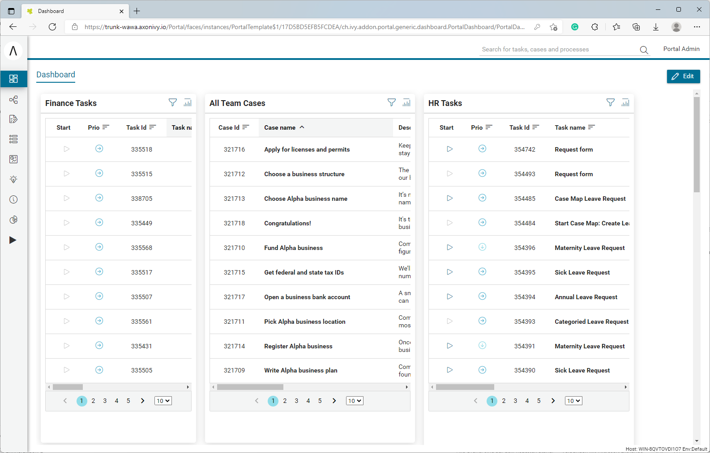
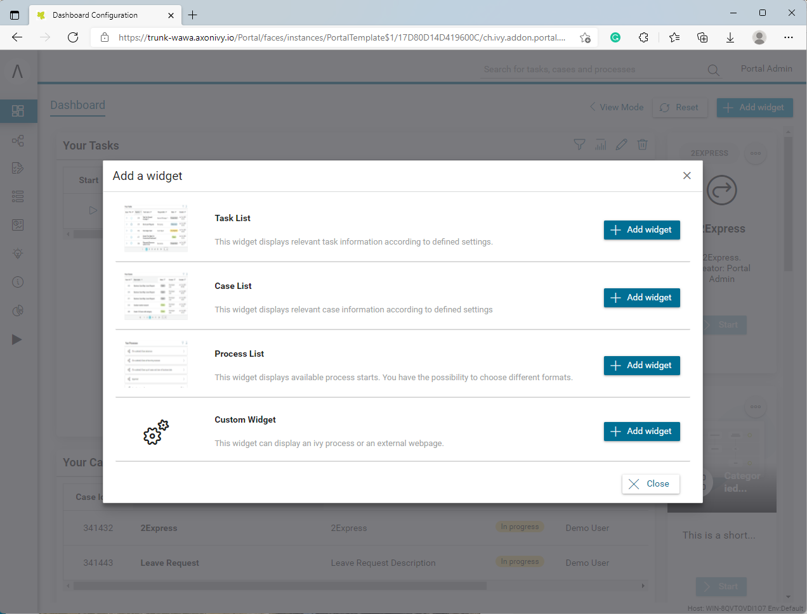
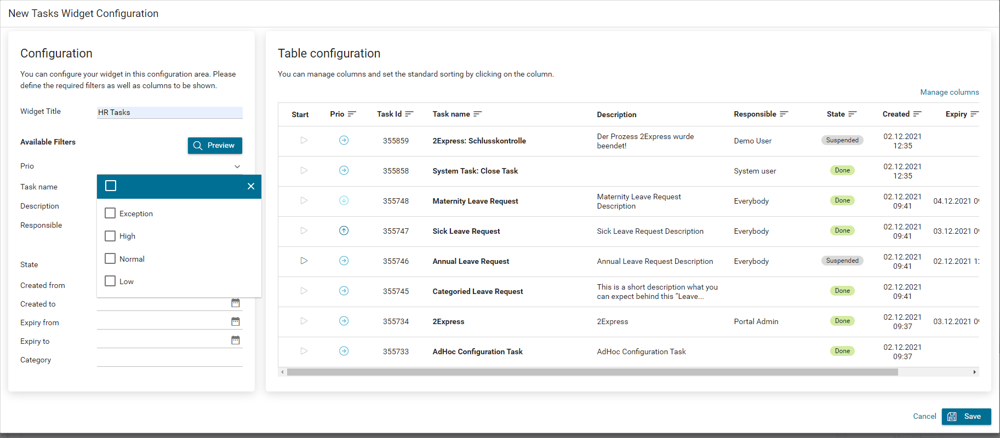
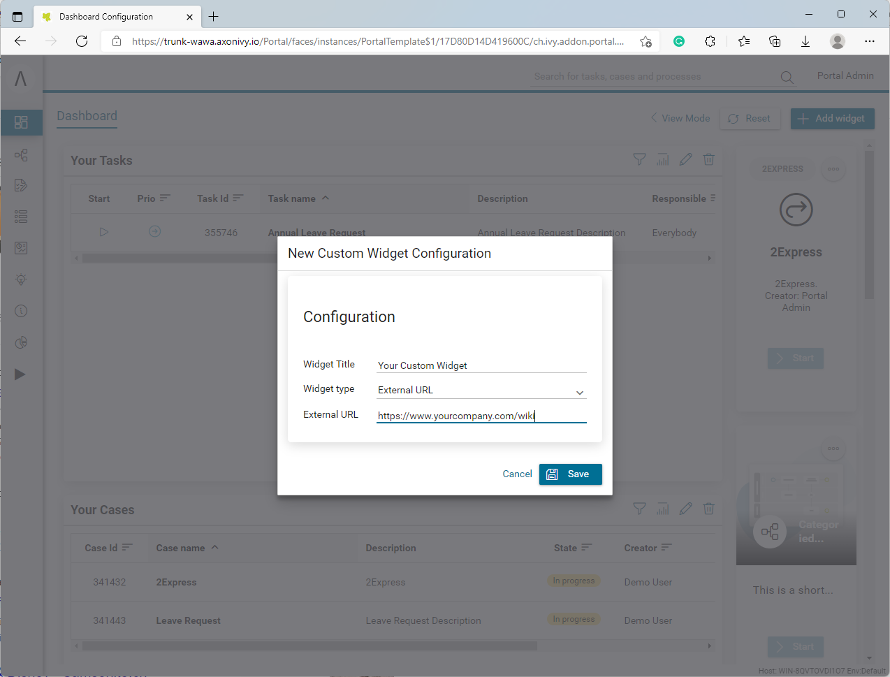
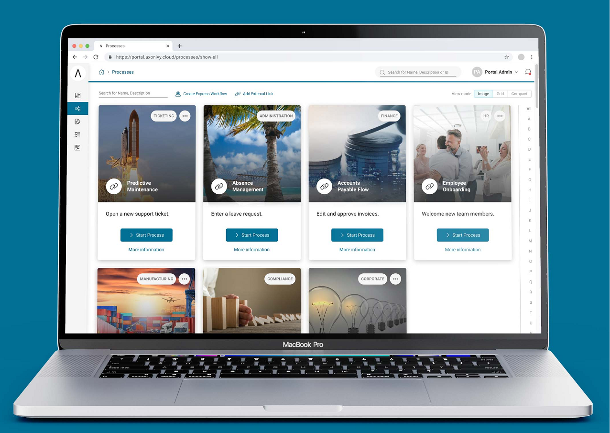
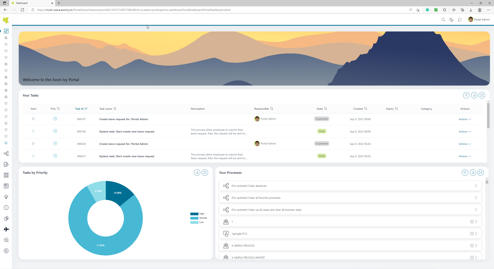
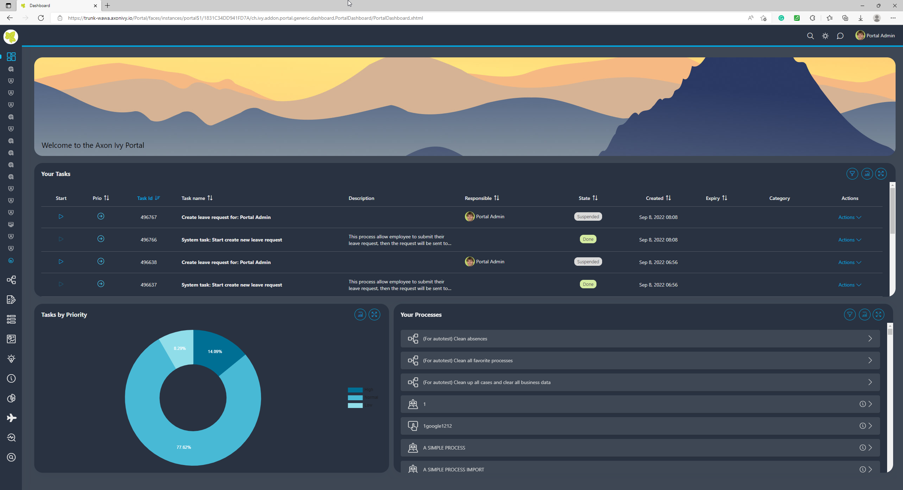
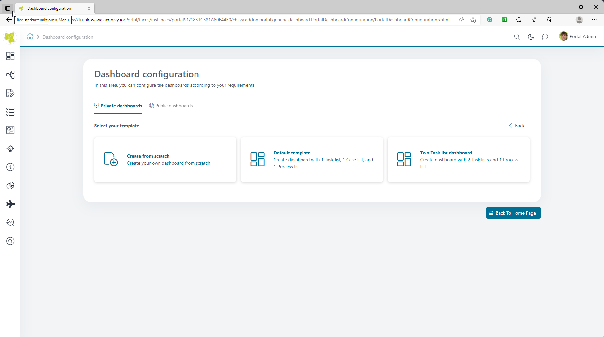
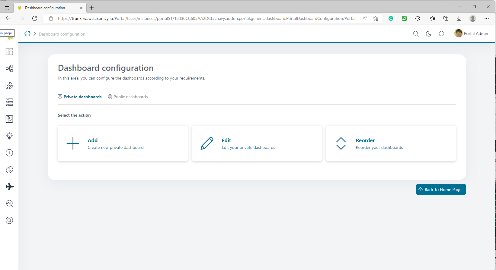
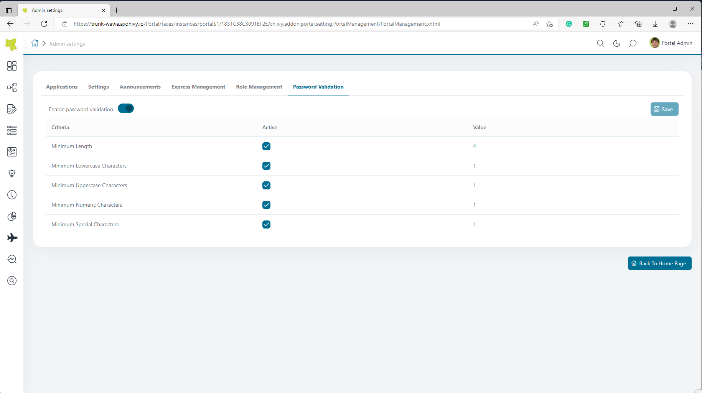
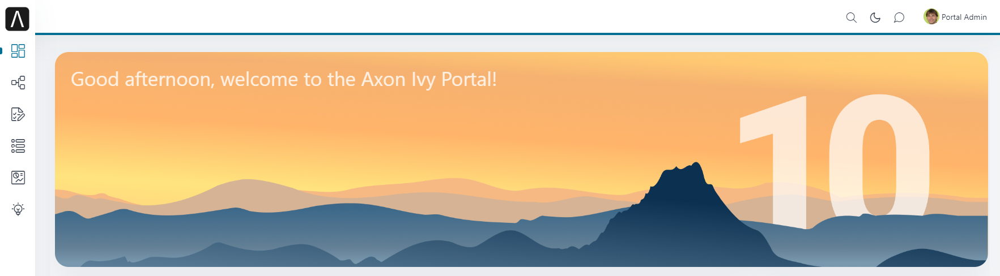
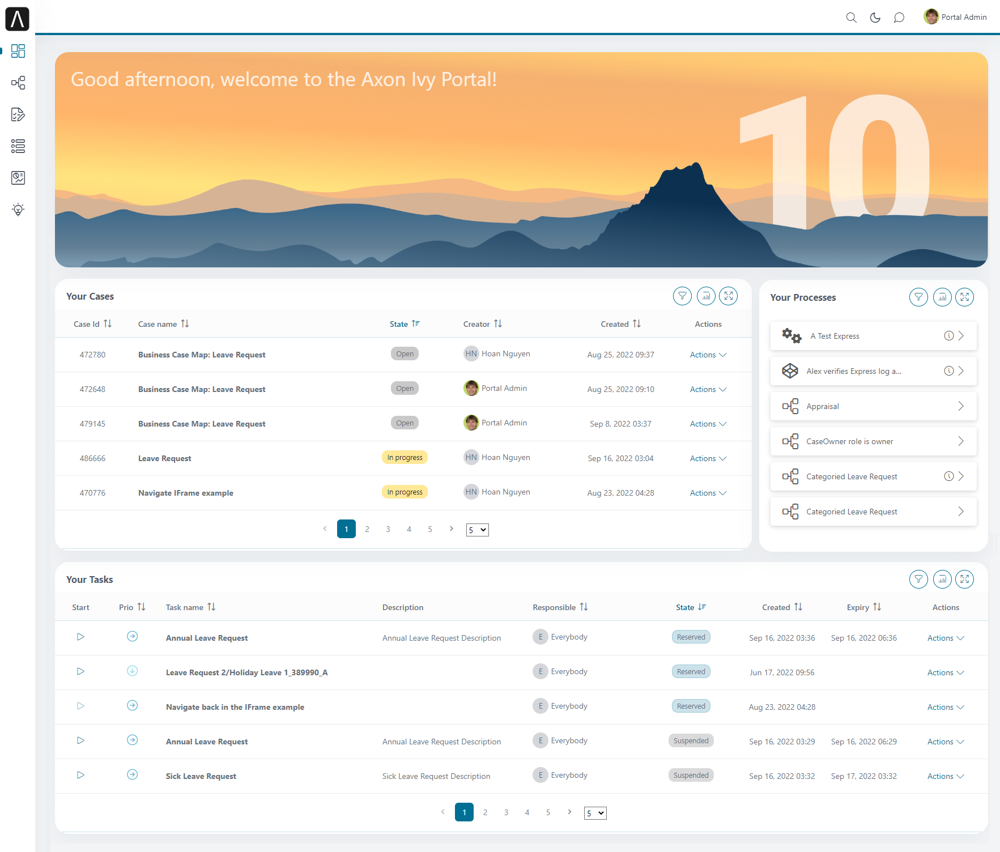
