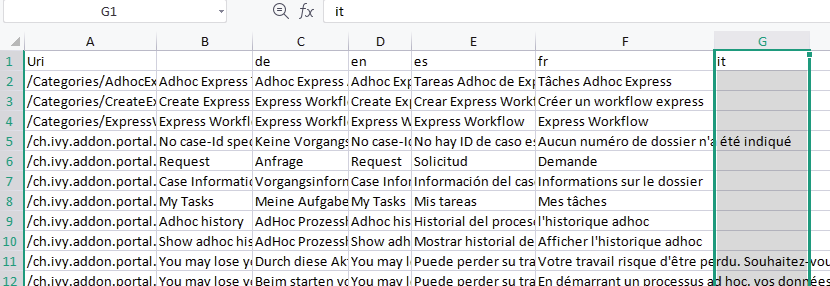

.. _settings-ja:

.. raw:: html

    

設定
********

このセクションでは、ポータルのロール、権限などの設定について取り上げます。

|portal-header|

.. _settings-admin-settings-ja:

ポータル設定の実行
===================================

ポータル設定を手動で行う方法については、:ref:`update-portal-settings-ja` を参照してください。

ポータル設定は、:dev-url:`変数 </doc/|version|/designer-guide/configuration/variables.html>` として格納されます。

開発において、デザイナーの再起動後にポータルの設定を行うのは、かなり退屈な作業です。
対象となる設定の ``portal/config/variables.yaml`` の変数を更新します。

これにより、デザイナーを再起動せずに済みます。

.. _settings-language-ja:

言語設定
=================

新しい言語をポータルに追加するには、以下を行う必要があります。

-  ポータルのすべての CMS エントリを Excel ファイルにエクスポートします。
-  このファイルの最後に新しい列を 1 つ追加し、新しい言語のロケール（例えば、イタリア語の場合は ``it`` ）をその新しい列の最初のセルに追加します。サポートされるロケールについては、 `Javaがサポートするロケール <https://www.oracle.com/java/technologies/javase/jdk11-suported-locales.html>`_ を参照してください。

   |export-cms|

-  すべての CMS エントリに新しい言語の翻訳を追加します。
-  Excel ファイルをインポートします。
-  ポータルを再展開します。

ロールの設定
==================

.. csv-table:: 
   :file: tables/portal-roles.csv
   :widths: 30, 70
   :header-rows: 1

.. _settings-permission-settings-ja:

権限の設定
===================

:dev-url:`エンジンコックピット </doc/|version|/engine-guide/reference/engine-cockpit/security.html>` で権限を設定します。
セキュリティ領域の「PortalPermissions」グループにこれらすべての権限があります。

タスクの権限
-------------------------
- ノートの追加

   ユーザーには次の権限が必要です：:bdg-ref-warning:`🔑TaskCaseAddNote <TaskCaseAddNote>`

- 委任

   ユーザーが委任できるようになるには、:bdg-ref-warning:`🔑TaskDisplayDelegateAction <TaskDisplayDelegateAction>`、:bdg-ref-warning:`🔑TaskWriteActivator <TaskWriteActivator>` 権限が必要です。
   

   ユーザーが自分のタスクやグループのタスクを委任するには、:bdg-ref-warning:`🔑TaskWriteActivatorOwnTasks <TaskWriteActivatorOwnTasks>` 権限が必要です。
   この権限は PortalPermissions グループに属します。
   Everybody ロールには自動的に割り当てられません。

   .. important::
      - ユーザーが処理可能なタスクのみ委任できます。タスクの状態が CREATED、DONE、DESTROYED、RESUMED、FAILED の場合は委任できません。
      - タスクは、現在のユーザーがそのタスクを実行している場合のみ、別のユーザーに委任できます。

- リセット

   ユーザーがリセットアクションを表示するには、次の権限が必要です：
   :bdg-ref-warning:`🔑TaskDisplayResetAction <TaskDisplayResetAction>`.

   To reset tasks, the user needs permission:
   :bdg-ref-warning:`🔑TaskResetOwnWorkingTask <TaskResetOwnWorkingTask>` or
   :bdg-ref-warning:`🔑TaskResetReadyForJoin <TaskResetReadyForJoin>` or
   :bdg-ref-warning:`🔑TaskReset <TaskReset>`.

   .. important::
      RESUMED、PARKED、READY_FOR_JOIN、FAILED のいずれかの状態にあるタスクにのみ有効です。
      

- 削除

   ユーザーがタスクの削除アクションを表示するには、次の権限が必要です：
   :bdg-ref-warning:`🔑TaskDestroy <TaskDestroy>`.

   .. important::
      タスクの削除は、タスクの状態が DESTROYED または DONE でない場合のみ有効です。
      

- 予約

   ユーザーが予約アクションを表示するには、次の権限が必要です：
   :bdg-ref-warning:`🔑TaskDisplayReserveAction <TaskDisplayReserveAction>`.

   ユーザーがタスクを予約するには、次の権限が必要です：
   :bdg-ref-warning:`🔑TaskParkOwnWorkingTask <TaskParkOwnWorkingTask>`.

   .. important::
      タスクが CREATED、RESUMED、SUSPENDED のいずれかの状態にある場合のみ、予約が可能です。
      

- 説明の変更

   ユーザーには次の権限が必要です：
   :bdg-ref-warning:`🔑TaskWriteDescription <TaskWriteDescription>`.

   .. important::
      終了したタスクは変更できません。そのため、タスクの状態は次の値以外とします：
      DONE, DESTROYED, FAILED.

- 期限の変更

   ユーザーには次の権限が必要です：
   :bdg-ref-warning:`🔑TaskWriteExpiryTimestamp <TaskWriteExpiryTimestamp>`.

   .. important::
      有効期限を変更するには、タスクは次の状態以外とします：
      DONE, DESTROYED, FAILED.

- 優先度の変更

   ユーザーには次の権限が必要です：
   :bdg-ref-warning:`🔑TaskWriteOriginalPriority <TaskWriteOriginalPriority>`.

   .. important::
      タスクの優先度を変更するには、タスクは次の状態以外とします：
      DONE, DESTROYED, FAILED.

- 追加のオプションの表示

   ユーザーが追加のアクションを表示するには、次の権限が必要です：
   :bdg-ref-warning:`🔑TaskDisplayAdditionalOptions <TaskDisplayAdditionalOptions>`.

ケースの権限
---------------------------------

- ノートの追加

   ユーザーには次の権限が必要です：:bdg-ref-warning:`🔑TaskCaseAddNote <TaskCaseAddNote>`

- 削除

   ユーザーには次の権限が必要です：:bdg-ref-warning:`🔑CaseDestroy <CaseDestroy>`

   .. important::
      ケースの状態は RUNNING でなければなりません。

- 説明の変更

   ユーザーには次の権限が必要です：:bdg-ref-warning:`🔑CaseWriteDescription <CaseWriteDescription>`

   .. important::
      ケースの状態は DESTROYED 以外とします。

- ケースの関連タスクを参照してください。

   ユーザーが関連するタスクアクションを表示するには、次の権限が必要です：
   :bdg-ref-warning:`🔑ShowAllTasksOfCase <ShowAllTasksOfCase>`.

   ユーザーが関連するタスクを表示するには、次の権限が必要です：
   :bdg-ref-warning:`🔑TaskReadOwnCaseTasks <TaskReadOwnCaseTasks>` or :bdg-ref-warning:`🔑TaskReadAll <TaskReadAll>`.

   .. important::
      ケースの状態は DESTROYED 以外とします。

- 詳細の表示リンクの表示

   ユーザーには次の権限が必要です：:bdg-ref-warning:`🔑ShowCaseDetails <ShowCaseDetails>` この権限は、Everybody ロールには自動的に割り当てられません。
   

.. note::
      通常ユーザーには、ユーザーが作業可能なタスクとケースのみ表示されます。

      管理者は、アプリケーションのすべてのタスク／ケースを表示できます。必要な権限は、:bdg-ref-warning:`🔑TaskReadAll <TaskReadAll>`、:bdg-ref-warning:`🔑CaseReadAll <CaseReadAll>` です。
      

      管理者は、アプリケーションのすべてのワークフローを操作できます。

      管理者は、アプリケーションのすべてのワークフローを作成、更新、削除できます。

      通常ユーザーは、自分が作成したワークフローを更新、削除し、自分に割り当てられたタスクを操作できます。
      

.. _settings-permission-settings-others-ja:

その他の権限
-----------------------------

.. csv-table:: 
   :file: tables/portal-other-permissions.csv
   :widths: 20, 50, 30
   :header-rows: 1

.. _settings-virus-scanning-setting-ja:

ウイルススキャンの設定
============================================

PrimeFaces には、 `VirusTotal <https://www.virustotal.com/>`_ を使用するインターフェースがあらかじめ実装されています。
`VirusTotal <https://www.virustotal.com/>`_ を有効にするには、 `VirusTotalのウェブサイト <https://www.virustotal.com/>`_ でコミュニティアカウントを作成する必要があります。

アカウントの作成後、API キーを受け取ります。
API キーを設定するには、configuration/web.xml ファイルに次のスニペットを追加します。

   .. code-block:: xml

      <context-param>
      <param-name>primefaces.virusscan.VIRUSTOTAL_KEY</param-name>
      <param-value>PUT YOUR API KEY HERE</param-value>
      </context-param>

   ..

web XML ファイルで context-param を設定すると、ウイルススキャンが自動的に有効になります。
ウイルススキャンを無効にしたい場合は、 ``portal/config/variables.yaml`` の ``EnableVirusScanner`` 変数を ``false`` に変更します。

参照： `How to check if uploaded files contain a virus <https://community.axonivy.com/d/144-how-to-check-if-a-uploaded-files-contain-a-virus/>`_ .

.. warning::
   ウイルスチェックを行うファイルが VirusTotal にアップロードされます。外部ネットワークや国外にあるサーバーにアプリケーションのデータを格納しない場合は、この設定を省略してもよいでしょう。
   
   

変数
=========

以下の変数は、キーと値の組み合わせで格納されます。これらはエンジンコックピットで編集する必要があります。

.. csv-table:: 
   :file: tables/portal-variables.csv
   :widths: 30, 20, 50
   :header-rows: 1

設定
-------------

これらの変数は JSON 形式で格納されます。これらはコックピットで編集できます。ポータルの管理者設定の UI を使用することも可能です。

ポータルの通知
^^^^^^^^^^^^^^^^^^^^^^^^^^^
ポータルの標準的な通知は、一般情報（ダウンタイム、変更など）に使用されます。
ポータルのすべてのユーザーにこのメッセージを表示できます。

ファイル名： ``variables.Portal.Announcement.json``

データモデル：

.. code-block:: javascript

   {
       "contents": [
           {
               "language": "en",
               "value": "The announcement content in English"
           }
       ],
       "enabled": false
   }

-  ``contents``：サポートされる言語のリストと各言語のコンテンツ

   -  ``language``： ``en``、 ``de``、 ``es``、 ``fr`` などの言語コード
   -  ``value``：その言語の通知コンテンツ

-  ``enabled``：通知のステータス。true の場合、通知を表示します。

ポータルにリンクされるサードパーティーのアプリケーション
^^^^^^^^^^^^^^^^^^^^^^^^^^^^^^^^^^^^^^^^^^^^^^^^^^^^^^^^^^^^^^^^^^^^^^^^^^^
以下の JSON ファイルでカスタムメニュー項目を定義できます。カスタムメニュー項目は、左側のメニューに表示されます。

ファイル名： ``variables.Portal.ThirdPartyApplications.json``

データモデル：

.. code-block:: javascript

   [
      {
         "id": "284352a58c7a48a2b64be8a946857c7a",
         "displayName": "{\"de\":\"AxonIvy ger\",\"en\":\"AxonIvy\"}",
         "menuIcon": "fa-group",
         "menuOrdinal": 1,
         "name": "{\"de\":\"AxonIvy ger\",\"en\":\"AxonIvy\"}",
         "link": "https://developer.axonivy.com/download"
      }
   ]

- ``id``：サードパーティーのアプリケーションの ID 番号。自動生成される UUID になります。
  
- ``displayName``：左側のメニューに表示されるアプリの表示名。
  複数言語をサポートしています。
- ``menuIcon``：左側のメニューに表示されるアプリアイコンのスタイルクラス。
- ``menuOrdinal``：アプリのインデックス。左側のメニューのメニュー項目を並べ替えるのに使用されます。
- ``name``：サードパーティーのアプリの名前。
- ``link``：サードパーティーのアプリのURL。

.. _portal-statistic-charts-ja:

ポータルの統計チャート
^^^^^^^^^^^^^^^^^^^^^^^^^^^^^^^^^^^^^^^^^^^^^^^^
ポータルダッシュボードの :ref:`統計ウィジェット <portal-statistic-widget-ja>` で使用できるすべての統計チャートのフィルターロジック、外観などの設定を定義できます。

ファイル名： ``variables.Portal.ClientStatistic.json``

データモデル：

.. code-block:: javascript

   [
      {
         "id": "1",
         "aggregates": "priority",
         "filter": "businessState:OPEN IN_PROGRESS,canWorkOn",
         "chartTarget": "TASK",
         "chartType": "pie",
         "names": [
               {
                  "locale": "de",
                  "value": "Aufgaben nach Prioritäten"
               },
               {
                  "locale": "en",
                  "value": "Tasks by Priority"
               },
               {
                  "locale": "fr",
                  "value": "Tâches par Priorité"
               },
               {
                  "locale": "es",
                  "value": "Tareas por Prioridad"
               }
         ],
         "descriptions": [
               {
                  "locale": "de",
                  "value": "Dieses Kreisdiagramm zeigt alle Aufgaben nach Priorität an."
               },
               {
                  "locale": "en",
                  "value": "This pie chart displays all tasks by priority."
               },
               {
                  "locale": "fr",
                  "value": "Ce diagramme à secteurs affiche toutes les tâches par priorité."
               },
               {
                  "locale": "es",
                  "value": "Este gráfico circular muestra todas las tareas por prioridad."
               }
         ],
         "icon": "si si-analytics-pie-2",
         "refreshInterval": 300
      }
   ]

- ``id``：統計チャートの ID。
- ``aggregates``：バケット（グループ）集計またはメトリック集計を行う集計クエリ。
- ``filter``：統計チャートのフィルター条件。複数の条件がサポートされています。
  なお、フィルターによっては、チャートのタイプと互換性がない場合があります。
  
- ``chartTarget``：チャートのターゲットとして使用したいエンティティのタイプ。ivy ワークフローの主なエンティティのタイプをサポートしています。
   
   ``TASK``：Ivy のタスク

   ``CASE``：Ivy のケース

- ``names``：チャートの複数言語の表示名
- ``descriptions``：チャートの複数言語の説明
- ``icon``：各ウィジェットのアイコン。ポータルは、Streamline アイコンと FontAwesome アイコンをサポートします。
- ``refreshInterval``：統計チャートの更新間隔（秒単位）
- ``chartType``：UI に表示したいチャートのタイプ。以下の 4 つのタイプがあります。
   
   ``pie``：円グラフ

   |pie-chart|

   ``bar``：棒グラフ

   |bar-chart|

   ``line``：折れ線グラフ

   |line-chart|

   ``number``：ラベル付きの数値表
   
   |number-chart|

``棒`` グラフ、 ``折れ線`` グラフ、 ``数値`` 表については、さらに以下のフィールドが必要です。

- ``barChartConfig``： ``棒`` グラフを設定する場合に必要なフィールド。チャートのタイプが ``bar`` の場合に追加してください。 

   - ``xTitles``：X 軸の複数言語の表示タイトル
   - ``yTitles``：Y 軸の複数言語の表示タイトル
   - ``yValue``：Y 軸に時間を表示したい場合は、このフィールドに **時間** の値を追加します。

- ``lineChartConfig``： ``折れ線`` グラフを設定する場合に必要なフィールド。チャートのタイプが ``line`` の場合に追加してください。

   - ``xTitles``：X 軸の複数言語の表示タイトル
   - ``yTitles``：Y 軸の複数言語の表示タイトル

- ``numberChartConfig``： ``数値`` 表を設定する場合に必要なフィールド。チャートのタイプが ``number`` の場合に追加してください。

   - ``suffixSymbol``：数値の隣に表示されるアイコン。ポータルは、Streamline アイコンと FontAwesome アイコンをサポートします。
   
.. _portal-process-external-link-ja:

ポータルのプロセスの外部リンク
^^^^^^^^^^^^^^^^^^^^^^^^^^^^^^^^^^^^^^^^^^^^^^^^^^^^^^^^^^^^^
ポータルの標準的な外部リンクは、以下のファイルで定義されます。

ファイル名： ``variables.Portal.Processes.ExternalLinks.json``

データモデル：

.. code-block:: javascript

   [
      {
         "id": "01322912db224658a222804802844a7b",
         "version": "10.0.9",
         "name": "Download latest |ivy|",
         "link": "https://developer.axonivy.com/download",
         "creatorId": 2,
         "icon": "fa-paperclip",
         "description": "https://developer.axonivy.com/download",
         "imageContent": "<your-image-data-as-base64>",
         "imageLocation": "/com/axonivy/portal/ExternalLink/dd91ec84-c5aa-4202-aeea-4500fbd394ef",
         "imageType": "jpeg",
         "permissions": [
            "Everybody"
         ]
      }
   ]

- ``id``：UUID で自動生成されるリンクの ID
- ``version``：json のバージョン
- ``name``：リンクの表示名
- ``link``：リンクの URL
- ``creatorId``：リンクを作成したユーザーの ID。ユーザーは、作成した外部リンクを任意のケースで表示して開始できます。
- ``icon``：リンクのアイコンのスタイルクラス。
- ``description``：リンクの説明
- ``imageContent``：プロセスの画像の base64 データ形式。この値が有効な場合は、物理ファイルに変換されます。展開時に外部リンクの画像を設定する場合は、 ``imageContent`` を定義するだけで済みます。
- ``imageLocation``：プロセスの画像の場所。この画像はアプリケーションの CMS に格納されます。基本的にはエンジンで処理されます。
- ``imageType``：プロセスの画像の拡張子。基本的にはエンジンで処理されます。
- ``permissions``：該当するロールを持つユーザーは、外部リンクを表示して開始できます。定義されない場合のデフォルトのロールは Everybody です。

.. |portal-header| image:: ../../screenshots/settings/user-settings.png
.. |global-settings| image:: ../../screenshots/settings/global-settings.png
.. |global-setting-edit| image:: ../../screenshots/settings/edit-global-settings.png
.. |select-admin-settings| image:: ../../screenshots/settings/select-admin-settings.png

.. _Task Aggregation and Filter: https://developer.axonivy.com/api-browser?configUrl=https%3A%2F%2Fdeveloper.axonivy.com%2Fdoc%2F11.3%2Fopenapi%2Fconfig.json&urls.primaryName=default#/workflow/stats_1 
.. _Case Aggregation and Filter: https://developer.axonivy.com/api-browser?configUrl=https%3A%2F%2Fdeveloper.axonivy.com%2Fdoc%2F11.3%2Fopenapi%2Fconfig.json&urls.primaryName=default#/workflow/stats
   
.. |pie-chart| image:: ../../screenshots/statistic/tasks-by-prior-pie-chart.png
.. |bar-chart| image:: ../../screenshots/statistic/tasks-by-prior-bar-chart.png
.. |number-chart| image:: ../../screenshots/statistic/tasks-by-prior-number-chart.png
.. |line-chart| image:: ../../screenshots/statistic/completed-cases-chart.png

