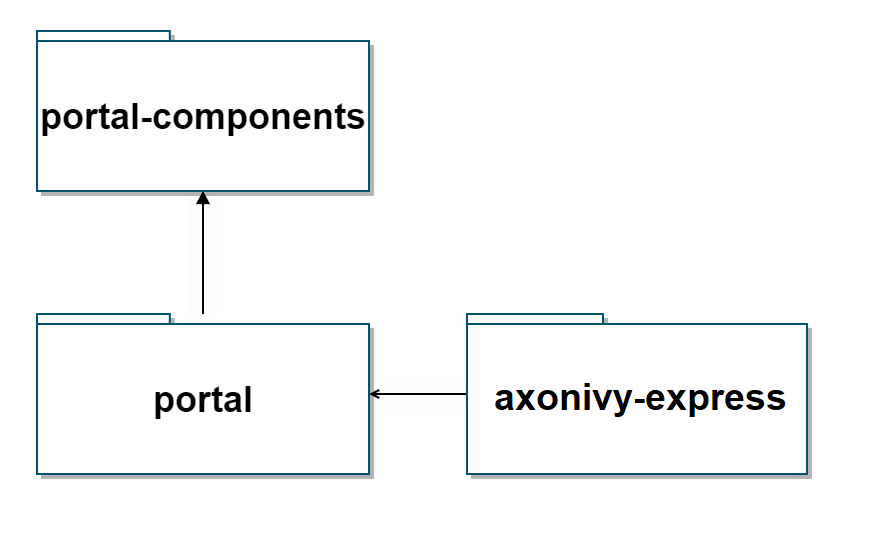

.. _architecture:

Architecture
************

.. _architecture-portal-process-modules-structure:

.. important:: 
      The css styles, java methods, etc., which are not documented, are
      only used internally in Portal. Don't use them because they can be
      changed in next versions.

Currently Portal system contains the following modules: PortalStyle, PortalKit, PortalTemplate, AxonIvyExpress. AxonIvyExpress is the only optional module, other modules are mandatory.

|process-module-structure|

.. _architecture-portalkit:

PortalKit
==========

Contains set of UI components. This module contains set of JSF Ivy
Component to provide user the usages to work with Ivy Process Data such
as: task, case, absence... , styles CSS and JavaScript file for
component and theme library. This is the most important module that user
needs to use Portal. This module also contains AdminSettings component
that is used to configure Portal.

.. _architecture-portal-style:

PortalStyle
============

Contains definition of styles that can be overridden/customized later.
Portal supports users to customize various colors of the layout
such as: background color, text color, border color, button color,
focus/hover color by providing a lot of variables.

.. note:: 

      This module is prepared for process developers to override and keep
      customer styles by editing SCSS files.

.. _architecture-portal-template:

PortalTemplate
===============

Provides default portal's templates and pages. This module contains
templates page for Portal's user to use as composition, then they will
have supporting features such as : top menu, application menu, user
menu. It also contains some start process links to default page such as
: Portal home, Portal task list, Portal case list... . Portal's user is
advised to depend on this module to use Portal easily.

.. _architecture-axonivy-express:

AxonIvyExpress
================

The idea is that user can create his own process and can manage it
easily, it gives users more flexibility when working with Portal.

This project is an extended project from PortalTemplate. It provides:

-  Ability to create his/her own workflow

-  Tools to create and modify the web form for his workflow

