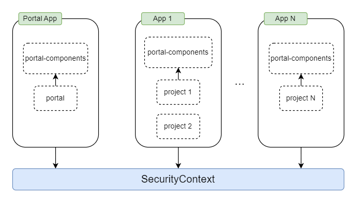

.. _architecture:

Architecture
************

.. important::
      The CSS styles, Java methods, etc. which are not explicitly documented are
      only used internally in Portal. Don't use them because they can be
      changed in future versions.

.. _multi-app-structure:

Basically, you can deploy both the Portal and Projects into one application. This makes sense for simple applications. However, migration can be difficult with this approach. So we recommend deploying the Portal and your projects into separate applications.

The Portal multi applications
=============================

The Portal and Projects using it should be deployed in different applications but in the same security context.

|multi-app-structure|

.. _architecture-portal-process-modules-structure:

The Portal App consists of the following modules: portal-components, portal.

|process-module-structure|

.. warning:: We highly recommend running only one portal per security context.

.. _architecture-portal-components:

portal-components
=================

**Contains a set of public UI components**

This module contains Ivy components such as User Selection, Role Selection,
Document Table, Process Chain, Process History, and Process Viewer,... These components provide the public API for the portal, but are independent
of the modules portal. You can use them in your own applications.

.. _architecture-portal:

portal
======

**Contains portal specific UI components, templates and pages**

The module ``portal`` provides a set of specific UI components that you need
to use and administer (or manage) the portal, templates for developer and portal pages.

The templates offer features like top
menu, application menu and user menu. It also contains start process links to
default pages like Portal home, Portal task list, Portal case list etc..

.. |process-module-structure| image:: images/process-module-structure.png
