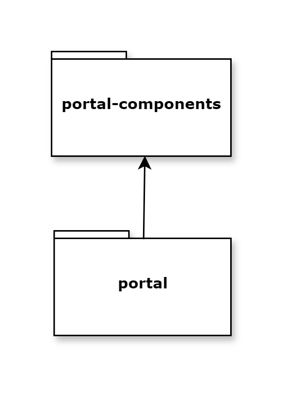

.. _architecture:

Architecture
************

.. important::
   The CSS styles, Java methods, etc. that are not explicitly documented are internal to the Portal. 
   Do not rely on them, as they may change in future versions.

Overview
========

Portal provides a modular architecture designed for flexibility and maintainability. Understanding how Portal integrates with your applications is essential for successful implementation.

.. table::
   :widths: 30 70

   +---------------------------+---------------------------------------------------------------+
   | Architecture Component    | Purpose                                                       |
   +===========================+===============================================================+
   | **Multi-App Setup**       | Separates Portal from custom apps for easier upgrades         |
   +---------------------------+---------------------------------------------------------------+
   | **portal-components**     | Public UI components and APIs for reuse                       |
   +---------------------------+---------------------------------------------------------------+
   | **portal**                | Portal-specific UI, templates, and pages                      |
   +---------------------------+---------------------------------------------------------------+

Deployment Strategy
===================

You can deploy Portal in two ways:

**Single Application (Simple Setup)**

- Portal and your projects in one application
- Acceptable for simple setups or prototyping
- More complex upgrades and migrations

**Multi-Application (Recommended)**

- Portal and your projects in separate applications
- Same security context required
- Easier upgrades and maintenance
- Better separation of concerns

.. tip::
   We strongly recommend the multi-application setup for production environments.

.. _multi-app-structure:

The Portal Multi-Application Setup
===================================

The recommended deployment architecture separates Portal from your custom applications while keeping them in the same security context.

**Deployment Structure:**

- **Application 1**: Portal + portal-components (Portal application)
- **Application 2**: Your custom project + portal-components (Your application)

Both applications depend on portal-components to reuse Portal UI components, but only Application 1 contains the Portal core functionality.

**Key Benefits:**

- **Independent Upgrades**: Update Portal without affecting your applications
- **Clear Boundaries**: Separate Portal functionality from business logic
- **Easier Maintenance**: Troubleshoot and maintain components independently
- **Better Testing**: Test Portal updates in isolation before deployment

|multi-app-structure|

.. warning:: 
   Run only one Portal per security context. Multiple Portal instances in the same security context are not supported.

.. _architecture-portal-process-modules-structure:

Portal Module Structure
=======================

The Portal application consists of two main modules:

.. table::
   :widths: 25 35 40

   +-------------------------+--------------------------------+--------------------------------------------+
   | Module                  | Type                           | Purpose                                    |
   +=========================+================================+============================================+
   | **portal-components**   | Public components and APIs     | Reusable UI components for any app         |
   +-------------------------+--------------------------------+--------------------------------------------+
   | **portal**              | Portal-specific implementation | Portal UI, templates, and pages            |
   +-------------------------+--------------------------------+--------------------------------------------+

|process-module-structure|

.. _architecture-portal-components:

portal-components
=================

**Public UI Components and APIs**

This module provides reusable components that are independent of the Portal core:

**Available Components:**

- **User Selection**: Choose users from the system
- **Role Selection**: Select roles and permissions
- **Document Table**: Display and manage documents
- **Process Chain**: Visualize process relationships
- **Process Viewer**: View process flow diagrams
- **Security Member Name and Avatar**: Display user information

**Key Characteristics:**

- Independent of Portal implementation
- Can be used in any Axon Ivy application
- Provides public Java APIs
- Supports Freya and Serenity themes

.. tip::
   Use portal-components in your custom applications to maintain consistent UI patterns.

.. _architecture-portal:

portal
======

**Portal-Specific Implementation**

This module contains Portal's core functionality:

**Included Features:**

- **Portal UI Components**: Specialized components for Portal pages
- **Portal Templates**: HTML Dialog templates for developers
- **Portal Pages**: Task lists, case lists, dashboards, process lists
- **Navigation Menus**: Top menu, application menu, user menu
- **Admin Features**: Settings, configuration, user management

**Template Features:**

- Consistent navigation across Portal and custom processes
- Automatic handling of Portal context
- Integration with Portal security
- Standardized look and feel

.. note::
   Portal templates allow your custom processes to seamlessly integrate with the Portal user experience.

Security Integration
====================

Portal integrates with Axon Ivy's security system to provide authentication, authorization, and permission-based access control across all Portal features.

**Security Architecture:**

Portal leverages Ivy's built-in security infrastructure and extends it with Portal-specific permissions:

- **Authentication & Authorization**: Portal uses Ivy's security system for user authentication and role-based authorization
- **Shared Security Context**: All applications within the same security context share users, roles, and sessions
- **Extended Permissions**: Portal adds specific permissions for dashboard management, task operations, case handling, and administrative functions
- **Permission Groups**: Portal organizes permissions into logical groups (General, Task, Case, Absence/Substitute, Statistics)

**Multi-Application Security:**

In a multi-app deployment, security works across applications:

- Users authenticate once and access Portal and custom apps
- Permissions granted in one app apply to all apps in the same security context
- Portal displays tasks and cases from all applications based on user permissions
- Custom apps inherit Portal's security templates when using Portal components

**Key Security Features:**

.. list-table::
   :widths: 30 70
   :header-rows: 1

   * - Feature
     - Description
   * - **Role-Based Access**
     - Control Portal features by assigning permissions to roles
   * - **Portal Permissions**
     - Additional permissions for Portal-specific features (dashboards, widgets, process lists)
   * - **Security Members**
     - Support for users, roles, and groups in permission configuration
   * - **Permission Inheritance**
     - Child roles inherit permissions from parent roles
   * - **External Security Systems**
     - Compatible with LDAP, Active Directory, and custom security providers

.. tip::
   For detailed permission configuration and management, refer to the Portal User Guide's security and admin settings sections.

.. warning::
   All applications using Portal must be in the same security context. Cross-context access is not supported.

Integration with Custom Applications
=====================================

**How Portal Works with Your Applications:**

#. **Separate Deployment**: Deploy Portal and your apps as separate applications

#. **Shared Security Context**: Both applications share the same security context for unified authentication and authorization

#. **Add Portal Dependency**: To use Portal components in your custom application, add portal-components as a project dependency in your ``pom.xml``

#. **Portal Components**: Import and use Portal UI components in your dialogs and pages

#. **Portal Templates**: Use Portal's HTML Dialog templates in your processes

#. **Public APIs**: Call Portal APIs from your code (navigation, task management, etc.)

#. **Process Integration**: Start your processes from Portal's process list or custom dashboards

**Communication Flow:**

- Portal displays tasks from all applications in the same security context
- Your processes can use Portal templates for consistent UI
- Portal components can be embedded in your custom pages
- Both applications share user sessions and permissions

.. |multi-app-structure| image:: images/multi-app-structure.png
