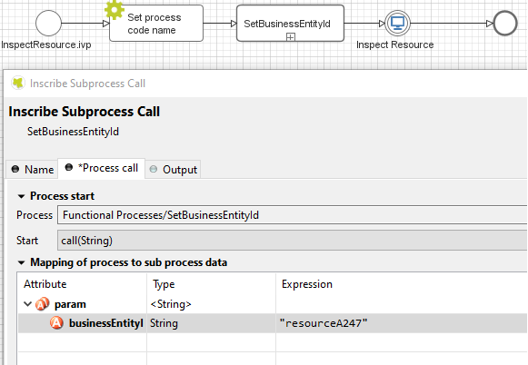

.. _components-additional-component:

Additional Components
=====================

.. _components-additional-component-process-history:

Process history
---------------

.. _components-additional-component-process-history-introduction:

Introduction
^^^^^^^^^^^^

-  This component is a part of ``portal-component`` project, which is independent from Portal. You don't need to import Portal projects to use it.
-  This component is a lazy loading list which displays all business cases
   of a business entity in your application. You can include this component
   everywhere:

   In a page

   |process-history-example|

   In a dialog

   |process-history-dialog-example|

.. note:: 

      If you use this component in Portal, redirect to case details page when clicking on a row line.

.. _components-additional-component-process-history-how-to-use:

How to use
^^^^^^^^^^

First you need to link the cases to the business entity. Call the
subprocess ``SetCaseBusinessEntity`` in the process which need to be
linked and input an identifier unique to your business entity. The
subprocess will set the id to the additional property
"CASE_BUSINESS_ENTITY_PROPERTY" of the business case.

|set-business-entity-id-sub-process|

Include the process history component into your page:

.. code-block:: html

		<ic:com.axonivy.portal.component.ProcessHistory businessEntityId="alpha" />

The value of the attribute ``businessEntityId`` must match the id input
into the subprocess in the first step.

Attributes of this component:

.. csv-table::
  :file: documents/additional-components/process_history_component_attributes.csv
  :header-rows: 1
  :class: longtable
  :widths: 1 1 1 3

.. note:: 

      If you use this component in a dialog, you must run this script
      ``processHistory.setup();`` when the dialog is shown. For example:

.. code-block:: html

   <p:dialog widgetVar="process-history-dialog" id="process-history-dialog" width="800" height="500" resizable="false"
      header="Process history of Beta Company" modal="true" onShow="processHistory.setup();">
      <ic:com.axonivy.portal.component.ProcessHistory businessEntityId="beta" chunkSize="10" scrollHeight="400" />
   </p:dialog>

Please refer to ``ProcessHistoryExample`` process in ``portal-component-example`` project for more details how to use Process History without Portal.

Please refer to ``ProcessHistoryComponent`` process in  ``portal-developer-examples`` for more details how to customize Process History with Portal.

If you want to customize its style,
please refer to :ref:`Styles Customization <components-additional-components-styles-customization>`
for more details.

.. important:: 
   
      If your process has a Trigger component or sends a signal to start
      another process with the option "Attach to Business Case that
      triggered this process" selected, the current case of the process
      will become a technical case and will not be loaded into the process
      history list. In this case you need to call the
      SetBusinessEntityId
      subprocess after the first Trigger or signal sending step.

.. _components-additional-components-migrate-from-old-process-history:

Migrate from Deprecated Process History
^^^^^^^^^^^^^^^^^^^^^^^^^^^^^^^^^^^^^^^

#. Replace the code in HTML files: ``ic:ch.ivy.addon.portal.component.ProcessHistory`` to ``ic:com.axonivy.portal.component.ProcessHistory``.

#. Consider updating value of new attributes ``showCasesOfOwner`` and ``dateTimePattern`` by your business.

#. From the project you want to use the new component, override the subprocess ``OpenCaseDetailsHook.mod``.

#. If your application using Portal without IFrame:
   
   - Copy content of the subprocess ``OpenPortalCaseDetails.mod`` in ``PortalTemplate`` project to the overrided subprocess ``OpenCaseDetailsHook.mod``.

#. If your application using Portal with IFrame:
   
   - Set attribute ``isOpenInFrame`` to ``true``.
   
   - Modify the subprocess ``OpenCaseDetailsHook.mod`` to generate ``caseDetailsUrl``. Process History component will navigate to this URL when user click on case item.
   
   - Please refer to subprocess ``OpenCaseDetailsHookOverride.mod`` in ``PortalExamples`` project to see how to generate this link from Portal.
.. _components-additional-component-task-analysis:

Task Analysis
-------------

.. _components-additional-component-task-analysis-introduction:

Introduction
^^^^^^^^^^^^

Task Analysis component of Portal provides features for the user's own permission StatisticAnalyzeTask in PortalTaskPermissions refer to 
:dev-url:`Security section in
Cockpit </doc/nightly/engine-guide/tool-reference/engine-cockpit/security.html>`
to analyze  not only tasks but also cases. These features are:

#. Set of filters for both tasks and cases which allow user to filter
   and to find tasks, cases more better. More, user can create and
   manage their own filter set for future usage.

#. Dynamic result table with lots of information for both task and case.

#. Support export result as Excel files (currently we only support .xlsx
   extension).

|task-analysis|

.. _components-additional-component-task-analysis-how-to-use:

How to use
^^^^^^^^^^

Task Analysis component is integrated into Statistic widget. You can use
this component directly when open Statistic widget. If you want to use
this component, you only have to redirect to Task Analysis component
with following code:

.. code-block:: java

      import ch.ivy.addon.portal.generic.navigation.PortalNavigator;
      import java.util.HashMap;
      import javax.faces.context.FacesContext;

      String taskAnalysisUrl = PortalNavigator.buildUrlByKeyword("showTaskAnalysis.ivp", "Start Processes/PortalStart/showTaskAnalysis.ivp", new HashMap());
      FacesContext.getCurrentInstance().getExternalContext().redirect(taskAnalysisUrl);

.. _components-additional-component-process-chain:

Process Chain
-------------

.. _components-additional-components-process-chain-introduction:

Introduction
^^^^^^^^^^^^

-  This component is a part of ``portal-component`` project, which is independent from Portal. You don't need to import Portal projects to use it.
-  Process Chain component of Portal provides features for users to know
   status of all steps in a process: the step's working, these steps are
   done, these steps are not done. These features are:

   -  Support to display all working steps or display only helpful steps as begin, last, current, previous current, next current steps.

   -  Support to change the shape of process chain: circle or line.

   -  Support to change the direction of process chain: horizontal or vertical.

|process-chain|

.. _components-additional-component-process-chain-how-to-use:

How to use
^^^^^^^^^^

Process Chain component can be integrated in any widget by including
this component into a page. In order to use this component in a page,
include this component to this page with following code:

.. code-block:: html

      <ic:com.axonivy.portal.component.ProcessChain id="process-chain-circle-horizontal" componentId="component-circle-horizontal" shape="CIRCLE" direction="HORIZONTAL"
         isShowAllSteps="false" actualStepIndex="0" steps="#{['Step 1','Step 2','Step 3','Step 4','Step 5','Step 6','Step 7','Step 8','Step 9']}" />

Please refer to ``ProcessChainExample`` process in ``portal-component-example`` project for more details.

.. important:: 

   - Must set value for ``actualStepIndex`` parameter. This is current step index.
   - Must set value for ``steps`` parameter. This is list of working steps.

Attributes of this component:

.. csv-table::
  :file: documents/additional-components/process_chain_component_attributes.csv
  :header-rows: 1
  :class: longtable
  :widths: 1 1 1 3

If you want to customize its style,
please refer to :ref:`Styles Customization <components-additional-components-styles-customization>`
for more details.

.. _components-additional-components-migrate-from-old-process-chain:

Migrate from Deprecated Process Chain
^^^^^^^^^^^^^^^^^^^^^^^^^^^^^^^^^^^^^

- Replace the code in HTML files: ``ch.ivy.addon.portalkit.singleapp.process.ProcessChain`` to ``ic:com.axonivy.portal.component.ProcessChain``.

.. _components-additional-component-global-growl:

Global growl
------------

.. _components-additional-component-global-growl-introduction:

Introduction
^^^^^^^^^^^^

This component is a global growl introduced in BasicTemplate, you can
use it to display your messages in Portal.

.. code-block:: html

    <p:growl id="portal-global-growl" widgetVar="portal-global-growl" for="portal-global-growl-message" escape="false" showDetail="true" />

Display growl after finishing a task
^^^^^^^^^^^^^^^^^^^^^^^^^^^^^^^^^^^^

After a task is finished, growl message appears as default via the
``Portal.DisplayMessageAfterFinishTask`` Portal variable.

|example-global-growl-finished-task|

.. _components-additional-component-global-growl-display-growl-after-finish-task:

Display growl after leaving a task
^^^^^^^^^^^^^^^^^^^^^^^^^^^^^^^^^^

If ``Portal.DisplayMessageAfterFinishTask`` Portal variable is true, growl message will be displayed after a task is left.

|example-global-growl-cancelled-task|

.. _components-additional-component-global-growl-display-growl-after-cancel-task:

Customization global growl message for task not using IFrame
^^^^^^^^^^^^^^^^^^^^^^^^^^^^^^^^^^^^^^^^^^^^^^^^^^^^^^^^^^^^

For each task, you can turn it off or override it. Firstly, when you
submit form to interact task, you need to put the ``overridePortalGrowl``
key to flash object with any value

::

   Flash flash = FacesContext.getCurrentInstance().getExternalContext().getFlash();
   flash.put("overridePortalGrowl", true);
   flash.setRedirect(true);

It's enough if you want to turn it off. To override the message, add
``facesMessage`` to this component. You can customize for each action as finish or cancellation a task.

::

   import ch.ivy.addon.portal.generic.navigation.PortalNavigator;
   import javax.faces.context.Flash;
   import javax.faces.context.FacesContext;
   import javax.faces.application.FacesMessage;
   
   FacesMessage message = new FacesMessage("Task is done successfully", ivy.cms.co("/ch.ivy.addon.portalkit.ui.jsf/common/linkToCaseDetails", 
   	[PortalNavigator.buildPortalCaseDetailsUrl(ivy.case.getBusinessCase().getId())]));
   FacesContext.getCurrentInstance().addMessage("portal-global-growl-message", message);
   
   Flash flash = FacesContext.getCurrentInstance().getExternalContext().getFlash();
   flash.put("overridePortalGrowl", true);
   flash.setRedirect(true);
   flash.setKeepMessages(true);

Customization global growl message for task using IFrame
^^^^^^^^^^^^^^^^^^^^^^^^^^^^^^^^^^^^^^^^^^^^^^^^^^^^^^^^

If ``Portal.DisplayMessageAfterFinishTask`` Portal variable is true, before a task is finished/left, you can trigger displaying
customized message after task is finished/left by calling below API:

::

   import ch.ivy.addon.portalkit.publicapi.PortalGlobalGrowInIFrameAPI;

   PortalGlobalGrowInIFrameAPI api = new PortalGlobalGrowInIFrameAPI();
   api.displayCustomizedMessage("Your customized message");

Please refer to GlobalGrowl Start Process in portal-developer-examples project for more details.

.. _components-additional-component-document-table:

.. _components-additional-components-document-table:

Document table
--------------

- This component is case document table with the features: upload, download and delete.
- This component is a part of ``portal-component`` project, which is independent from Portal. You don't need to import Portal projects to use it.

|document-table|

You can override the ``GetDocumentItems``, ``UploadDocumentItem``,
``DeleteDocumentItem``, ``DownloadDocumentItem`` sub processes to extend these
features, and add more columns, remove default columns in document
table.

Code Example:

.. code-block:: html

   <h:form id="form">
      <ic:com.axonivy.portal.component.DocumentTable id="document-table-component"
         allowedUploadFileTypes="doc,docx,xls,xlsx,xlsm,csv,pdf,ppt,pptx,txt"
         typeSelectionItems="#{documentTableExampleBean.documentTypes}">
         <f:facet name="componentHeader">
            <h2>This is customized document table component header</h2>
         </f:facet>
         <p:column headerText="Creator" styleClass="document-creator-column">
            <h:outputText id="creator" value="#{document.creation.userName}" title="#{document.creation.userName}" />
         </p:column>
         <p:column headerText="Created time" styleClass="document-created-column">
            <h:outputText id="created-time" value="#{document.creation.timestamp}" title="#{document.creation.timestamp}" />
         </p:column>
         <p:column headerText="Customer" styleClass="document-customer-column">
            <h:outputText id="customer" value="#{document.customer}" title="#{document.customer}" />
         </p:column>
         <f:facet name="componentFooter">
            <h2>This is customized document table component footer</h2>
         </f:facet>
      </ic:com.axonivy.portal.component.DocumentTable>
   </h:form>

Refer to the ``DocumentTableExample`` process in ``portal-component-example`` project for more details.

Attributes of this component:

.. csv-table::
  :file: documents/additional-components/document_table_component_attributes.csv
  :header-rows: 1
  :class: longtable
  :widths: 1 1 1 3

.. _components-additional-components-migrate-from-old-document-table:

Migrate from Deprecated Document Table
^^^^^^^^^^^^^^^^^^^^^^^^^^^^^^^^^^^^^^

1. Replace the code in HTML files: ``ic:ch.ivy.addon.portalkit.component.document.DocumentTable`` to ``ic:com.axonivy.portal.component.DocumentTable``.
2. Consider updating value of new attributes ``enableScriptCheckingForUploadedDocument``, ``enableVirusScannerForUploadedDocument`` and ``allowedUploadFileTypes`` by your business.
3. Override sub processes if you want and adapt your business accordingly.

   +-----------------------------------+--------------------------+
   | New sub process                   | Deprecated sub process   |
   +===================================+==========================+
   | GetDocumentItems                  | GetDocumentList          |
   +-----------------------------------+--------------------------+
   | UploadDocumentItem                | UploadDocument           |
   +-----------------------------------+--------------------------+
   | DeleteDocumentItem                | DeleteDocument           |
   +-----------------------------------+--------------------------+
   | DownloadDocumentItem              | DownloadDocument         |
   +-----------------------------------+--------------------------+

.. note::
   You can remove redundant overridden configurations, sub processes and data classes
   such as GetDocumentListOverride, UploadDocumentOverride, ...
   If you don't remove it, no problem.

.. _components-additional-components-user-selection:

User Selection
--------------

Introduction
^^^^^^^^^^^^

-  This component is used for choosing a user from a user list defined by a role name list.
   If you don't define role name list, all users will be loaded. 
   It includes 1 label, 1 autocomplete and 1 message element to display message related to that autocomplete element.
-  This component is a part of ``portal-component`` project, which is independent from Portal. You don't need to import Portal projects to use it.

How to use
^^^^^^^^^^

You can include this component to any page. This component supports 2 styles of displaying a label.

1. Default style

|user-selection|

Code example:

.. code-block:: html

   <ic:com.axonivy.portal.component.UserSelection componentId="default-user-autocomplete"
      selectedUser="#{data.selectedUser}" label="Default user selection"
      isRequired="true" labelPanelStyleClass="ui-g-6 ui-md-6 ui-sm-12"
      autoCompleteStyleClass="width-100" autoCompletePanelStyleClass="ui-g-6 ui-sm-12" />

2. Floating label

|user-selection-floating-label|

Code example:

.. code-block:: html

   <ic:com.axonivy.portal.component.UserSelection componentId="all-user-autocomplete"
      hightlight="false" selectedUser="#{data.selectedUserForExcludingUsers}"
      label="Loading users (exclude gm1, gm2, admin)" autoCompleteStyleClass="width-100"
      autoCompletePanelStyleClass="ui-g-12 floating-label-margin-top"
      excludedUsernames="#{data.excludedUsernames}" floatingLabel="true" />

.. tip::
   Autocomplete element of user selection component allows inserting children and ajax event (Refer to ``UserSelection.xhtml`` in ``portal-component`` project).
   Any child in UserSelection component will be re-parented into this autocomplete at the point of ``insertChildren`` tag.
   We introduce a facet named ``event`` for autocomplete so that ajax event can be nested.

For example: 

I want to display user in dropdown list with format <Full name> (<username>) and when I select a user, a message will be displayed.

|user-selection-with-children-and-ajax-event|

|user-selection-component-ajax-expand|

.. code-block:: html

   <ic:com.axonivy.portal.component.UserSelection id="item-select-event-component"
      componentId="item-select-event-for-user-selection" floatingLabel="true"
      fromRoleNames="#{data.definedRoleNames}" label="Demonstrate facet and children"
      selectedUser="#{data.selectedUserForInsertChildren}"
      autoCompleteStyleClass="width-100"
      autoCompletePanelStyleClass="ui-g-12 floating-label-margin-top">
      <p:column>
         <h:outputText value="#{user.displayName} (#{user.name})" />
      </p:column>
      <f:facet name="event">
         <p:ajax event="itemSelect" listener="#{logic.showSelectedUser}"
            update="#{p:component('item-select-event-for-user-selection-message')}" />
      </f:facet>
   </ic:com.axonivy.portal.component.UserSelection>

Please refer to ``UserSelectionExample.xhtml`` in ``portal-component-example`` project for more details.

Attributes of this component:

.. csv-table::
  :file: documents/additional-components/user_selection_component_attributes.csv
  :header-rows: 1
  :class: longtable
  :widths: 1 1 1 3

.. _components-additional-components-migrate-from-old-user-selection:

Migrate from Deprecated User Selection
^^^^^^^^^^^^^^^^^^^^^^^^^^^^^^^^^^^^^^

1. Replace the code in HTML files: ``ic:ch.ivy.addon.portalkit.component.UserSelection`` to ``ic:com.axonivy.portal.component.UserSelection``.
2. Use ``com.axonivy.portal.component.dto.UserDTO`` instead of ``ch.ivy.addon.portalkit.dto.UserDTO``.

.. note:: If you stored ch.ivy.addon.portalkit.dto.UserDTO class in your database, you must update it manually.

.. _components-additional-components-role-selection:

Role Selection
--------------

Introduction
^^^^^^^^^^^^

-  This component is used for choosing a role from a role list defined by a role name list.
   If you don't define role name list, all roles will be loaded.
   It includes 1 label, 1 autocomplete and 1 message element to display message related to that autocomplete element.
-  This component is a part of ``portal-component`` project, which is independent from Portal. You don't need to import Portal projects to use it.

How to use
^^^^^^^^^^

You can include this component to any page. This component supports 2 styles of displaying a label.

1. Default style

|role-selection|

Code example:

.. code-block:: html

      <ic:com.axonivy.portal.component.RoleSelection
         componentId="role-from-defined-role-autocomplete"
         fromRoleNames="#{data.definedRoleNames}"
         selectedRole="#{data.selectedRoleForDefinedRoles}"
         isRequired="true"
         label="Roles from defined role names"/>

2. Floating label

|role-selection-floating-label|

Code example:

.. code-block:: html

      <ic:com.axonivy.portal.component.RoleSelection
         componentId="floating-label-and-exclude-role-autocomplete" hightlight="false"
         selectedRole="#{data.selectedRole}"
         label="Loading with all roles (exclude CaseOwner, GeneralManager)"
         excludedRolenames="#{data.excludedRoleNames}"
         isRequired="true" floatingLabel="true" />

.. tip::
   Autocomplete element of role selection component allows inserting children and ajax event (Refer to ``RoleSelection.xhtml`` of ``portal-component`` project).
   Any child in RoleSelection component will be re-parented into this autocomplete at the point of ``insertChildren`` tag.
   We introduce a facet named ``event`` for autocomplete so that ajax event can be nested.

For example: 

I want to display role in dropdown list with format <Display Name> (<Member Name>) and when I select a role, a message will be displayed.

|role-selection-with-children-and-ajax-event|

|role-selection-component-ajax-expand|

.. code-block:: html

      <ic:com.axonivy.portal.component.RoleSelection
         id="item-select-event-component"
         componentId="item-select-event-for-role-selection"
         fromRoleNames="#{data.definedRoleNames}"
         selectedRole="#{data.selectedRoleForInsertChildren}"
         label="Demonstrate facet and children"
         autoCompleteStyleClass="width-100"
         autoCompletePanelStyleClass="ui-g-12 floating-label-margin-top"
         isRequired="true" floatingLabel="true">
         <p:column>
            <h:outputText value="#{role.getDisplayName()} (#{role.getMemberName()})" />
         </p:column>
         <f:facet name="event">
            <p:ajax event="itemSelect" listener="#{logic.showSelectedRole}"
               update="#{p:component('item-select-event-for-role-selection-message')}" />
         </f:facet>
      </ic:com.axonivy.portal.component.RoleSelection>

Please refer to ``RoleSelectionExample.xhtml`` in ``portal-component-example`` project for more details.

Attributes of this component:

.. csv-table::
  :file: documents/additional-components/role_selection_component_attributes.csv
  :header-rows: 1
  :class: longtable
  :widths: 1 1 1 3

.. _components-additional-components-migrate-from-old-role-selection:

Migrate from Deprecated Role Selection
^^^^^^^^^^^^^^^^^^^^^^^^^^^^^^^^^^^^^^
1. Replace the code in HTML files: ``ic:ch.ivy.addon.portalkit.component.RoleSelection`` to ``ic:com.axonivy.portal.component.RoleSelection``.
2. Use ``com.axonivy.portal.component.dto.RoleDTO`` instead of ``ch.ivy.addon.portalkit.dto.RoleDTO``.

.. note:: If you stored ch.ivy.addon.portalkit.dto.RoleDTO class in your database, you must update it manually.

.. _components-additional-portal-dialog-with-icon:

Portal dialog with icon
-----------------------

Introduction
^^^^^^^^^^^^

This decorator is used to display dialog with big icon and header in the middle, and below is dialog content.

How to use
^^^^^^^^^^

.. code-block:: html

      <ui:decorate template="/layouts/decorator/portal-dialog-with-icon.xhtml">
         <ui:param name="id" value="destroy-task-confirmation-dialog" />
         <ui:param name="widgetVar" value="destroy-task-dialog" />
         <ui:param name="appendTo" value="@(body)" />
         <ui:param name="iconClass" value="icon ivyicon-delete-1" />
         <ui:param name="iconStyleClass" value="portal-dialog-error-icon" />
         <ui:param name="dialogContent" value="#{ivy.cms.co('/ch.ivy.addon.portalkit.ui.jsf/taskList/destroyTaskMessage')}" />
         
         <ui:define name="dialogFooter">
            <p:commandLink value="#{ivy.cms.co('/ch.ivy.addon.portalkit.ui.jsf/common/cancel')}"
               onclick="PF('destroy-task-dialog').hide();" styleClass="u-mar-right-15"/>
            <p:commandButton id="confirm-destruction" value="#{ivy.cms.co('/ch.ivy.addon.portalkit.ui.jsf/common/destroy')}"
               icon="#{visibilityBean.generateButtonIcon('icon ivyicon-remove')}"
               actionListener="#{logic.destroyTask(task)}"
               oncomplete="PF('destroy-task-dialog').hide()"
               update="#{cc.clientId}:task-detail-general-container"
               process="@this"/>
         </ui:define>
      </ui:decorate>

Please refer to ``PortalDialogExample.xhtml`` in ``portal-developer-examples`` for more examples.

This decorator provide 2 custom sections:

- ``dialogFooter``: you have to define this section, it contains footer of dialog.
- ``dialogContentSection``: this is optional, if you want to use your custom style for your dialog content, please define this section.

Parameters of this decorator:

.. csv-table::
  :file: documents/additional-components/portal_dialog_decorator.csv
  :header-rows: 1
  :class: longtable
  :widths: 20 10 25 45

Portal cronjob trigger
----------------------
Portal provides a helpful bean ``ch.ivy.addon.portalkit.util.CronByGlobalVariableTriggerStartEventBean`` using the Quartz framework which help trigger cron job by global variable. The global variable should contains the cron job Pattern, to trigger to process on the right time.

There is a online `Cron Maker <http://www.cronmaker.com>`_ could help you to create your own cron job pattern.

.. _components-additional-components-styles-customization:
Styles Customization
--------------------

This customization only supports for new components of ``portal-component`` project.

How to customize
^^^^^^^^^^^^^^^^

1. You have to add a new css file to your resources and import it into your template.
   
   Code Example:

   .. code-block:: html

      <ui:composition template="/layouts/basic-8.xhtml">
         <ui:define name="title">test</ui:define>
         <ui:define name="content">
            <ic:com.axonivy.portal.component.ProcessHistory businessEntityId="alpha" chunkSize="12" scrollHeight="600" />
            <h:outputStylesheet name="layouts/styles/process-history-customize.css" />
         </ui:define>
      </ui:composition>

   .. note::
      You must let ``<h:outputStylesheet />`` below the component to override defined styles.

2. Within this file you can override some styles. For example, the \--process-history-description-text-color:

   .. code-block:: html

      :root {
         --process-history-description-text-color: red;
      }

List of css variables that you can override:
^^^^^^^^^^^^^^^^^^^^^^^^^^^^^^^^^^^^^^^^^^^^

1. Process Chain:
^^^^^^^^^^^^^^^^^

.. csv-table::
  :file: documents/additional-components/css_variables/process_chain.csv
  :header-rows: 1
  :class: longtable
  :widths: 2 1 2

2. Process History:
^^^^^^^^^^^^^^^^^^^

.. csv-table::
  :file: documents/additional-components/css_variables/process_history.csv
  :header-rows: 1
  :class: longtable
  :widths: 2 1 2

.. |process-history-example| image:: ../../screenshots/components/process-history-example.png
.. |process-history-dialog-example| image:: ../../screenshots/components/process-history-dialog-example.png

.. |task-analysis| image:: ../../screenshots/components/task-analysis.png
.. |process-chain| image:: ../../screenshots/components/process-chain.png
.. |example-global-growl-finished-task| image:: ../../screenshots/components/example-global-growl-finished-task.png
.. |example-global-growl-cancelled-task| image:: ../../screenshots/components/example-global-growl-cancelled-task.png
.. |document-table| image:: ../../screenshots/components/document-table.png
.. |user-selection| image:: ../../screenshots/components/user-selection-component.png
.. |user-selection-floating-label| image:: ../../screenshots/components/user-selection-component-floating-label.png
.. |user-selection-with-children-and-ajax-event| image:: ../../screenshots/components/user-selection-component-ajax-event-selected-message.png
.. |user-selection-component-ajax-expand| image:: ../../screenshots/components/user-selection-component-ajax-expand.png
.. |role-selection| image:: ../../screenshots/components/role-selection-component-from-defined-role.png
.. |role-selection-floating-label| image:: ../../screenshots/components/role-selection-component-floating-label-and-exclude-role.png
.. |role-selection-with-children-and-ajax-event| image:: ../../screenshots/components/role-selection-component-ajax-event-selected-message.png
.. |role-selection-component-ajax-expand| image:: ../../screenshots/components/role-selection-component-ajax-expand.png