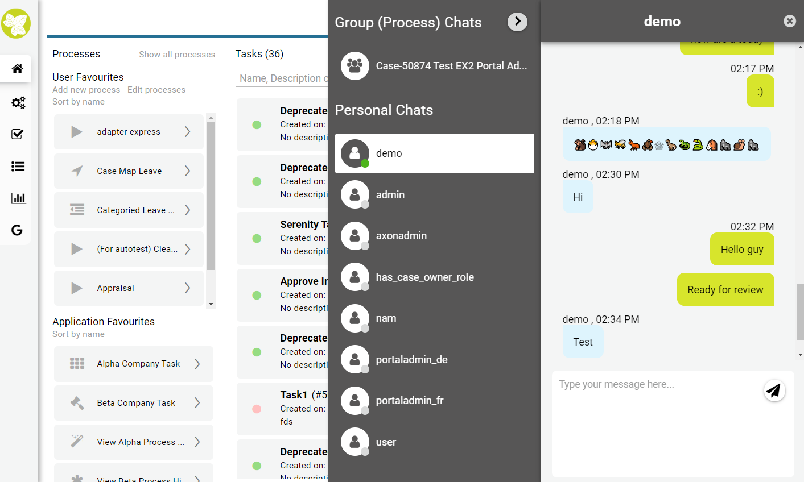

.. _components-portal-chat:

Portal chat
===========

.. _components-portal-chat-chat-feature:

Chat feature
------------

|chat|

.. _components-portal-chat-information:

Information
-----------

- To use chat, refer to :ref:`portal-chat`

- Chat feature is reimplemented from Axon Ivy 7.4.

- If browsers access Portal through a reverse proxy Nginx, set Portal setting **CHAT_RESPONSE_TIMEOUT** a number less than Nginx timeout to make chat work properly.

- Each tab uses one long-polling request for chat. Browsers limit the number of long-polling request for one domain, max number could be six or more.

  To handle this limitation, Portal introduces Portal setting **CHAT_MAX_CONNECTION**, default value is 3. If fourth tab is open, chat in one inactive tab will be deactivated.

  If you select deactivated chat tab again, all chat information will be refreshed and chat is activated again, then chat in another tab will be deactivated.

- Group chat supports some customizations, refer to :ref:`Group chat customization <customization-group-chat>` for more details.

- If your system uses an additional **Valve**, then we recommend adding the support async in the ``Context.xml`` file, this file is available in :dev-url:`File Reference </doc/8.0.28/engine-guide/configuration/files/context-xml.html>`.

  .. code-block:: html

    <Context>
      <Valve className="..." asyncSupported="true" />
    </Context>

.. _components-portal-chat-limitation:

Limitation of current Portal chat
---------------------------------

Portal chat does not support cross application chat. That means users are
able to chat with other users in the current application, but they cannot chat
with users in other application.

