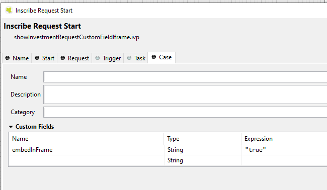
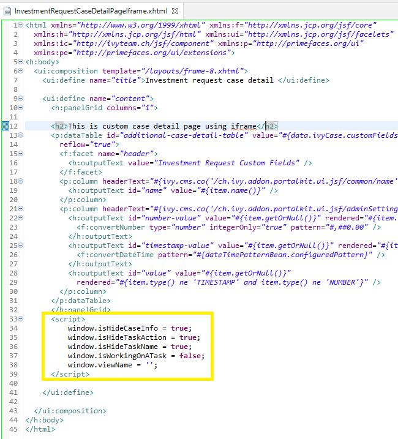
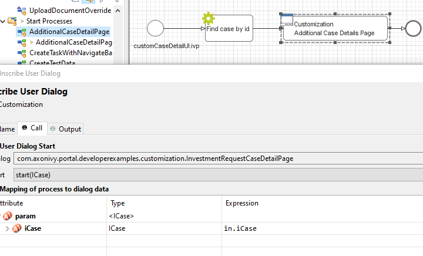
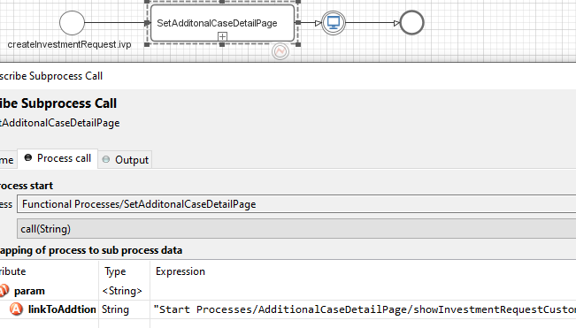

.. _customization-additionalcasedetailspage:

Additional Case Detail Page
============================

.. _customization-additionalcasedetailspage.introduction:

Introduction
------------

The Additional Case detail page shows all custom fields of a case. It is opened
by clicking on ``Show business details`` in Case detail.

You can customize this page for each case by providing a relative URL to case.

.. _customization-additionalcasedetailspage.customization:

Customization
-------------

#. Create a new Additional Case details UI and a start process that will display
   the new UI.

   |customization-additional-case-details-page|

#. When creating a task, store the URL of the start process in the custom field
   ``CUSTOMIZATION_ADDITIONAL_CASE_DETAILS_PAGE``  of the associated case. You
   may use the ``SetAdditonalCaseDetailPage.p.json`` callable process, and input the
   friendly URL of this process as a parameter.

   |set-additonal-case-detail-page-callable-process|

#. If your custom Additional Case details page uses an IFrame, you need to set some additional
   Window properties on your page: 

   - window.isHideCaseInfo = true;
   - window.isHideTaskAction = true;
   - window.isHideTaskName = true;
   - window.isWorkingOnATask = false;
   - window.viewName = '';

   |customization-additional-case-details-page-iframe|

   In your custom start process, create a custom string field name for the case named ``embedInFrame``, value ``true``

   |start-case-details-page-iframe|

