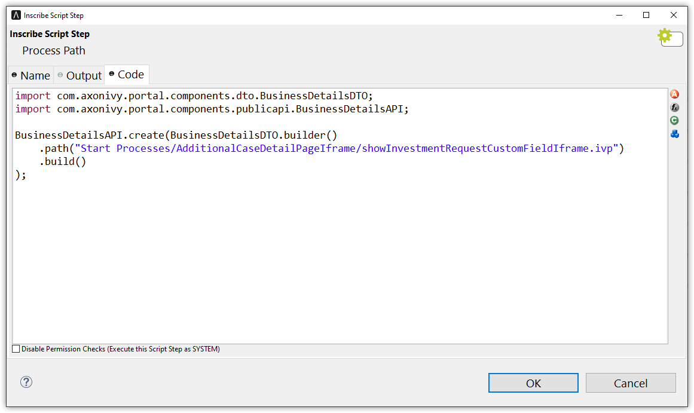

.. _customization-additionalcasedetailspage:

Additional Case Detail Page
============================

.. _customization-additionalcasedetailspage.introduction:

Introduction
------------

The Additional Case detail page shows all custom fields of a case. It is opened
by clicking on ``Show business details`` in Case detail.

You can customize this page for each case by providing a relative URL to case.

And there are two ways to customize. 

.. _customization-additionalcasedetailspage.customization:

Customization
-------------

#. Create a new Additional Case details UI and a start process that will display
   the new UI.

   |customization-additional-case-details-page|

#. When creating a task, store the URL of the start process in the custom ``TEXT`` field 
   ``businessDetails``  of the associated case. There are 2 ways to set an URL:

   .. admonition:: Use subprocess SetAdditonalCaseDetailPage.p.json in portal-components

         Use the ``SetAdditonalCaseDetailPage.p.json`` callable process, and input the friendly URL of this process as a parameter.
         
         |set-additonal-case-detail-page-callable-process|

   .. admonition:: Use public api

         Create Case Detail by using API ``ch.ivy.addon.portalkit.publicapi.BusinessDetailsAPI.create(BusinessDetailsBuilder)``
            
            - To build an external URL
               ``BusinessDetailsBuilder().iCase(ICase).URL(external_url).isFullPath(true)``
            - To build an internal process URL
               ``BusinessDetailsBuilder().iCase(ICase).URL(process_path)``
         For more detail, please refer to javadoc Public API
         |customize-case-detail-with-public-api|

#. If your custom Additional Case details page uses an IFrame, you need to set some additional
   Window properties on your page: 

   - window.isHideCaseInfo = true;
   - window.isHideTaskAction = true;
   - window.isHideTaskName = true;
   - window.isWorkingOnATask = false;
   - window.viewName = '';

   |customization-additional-case-details-page-iframe|

   In your custom start process, create a custom string field name for the case named ``embedInFrame``, set value to 
   
   	- ``true``: start inside IFrame 
   	- ``false``: not start inside IFrame 

   |start-case-details-page-iframe|

Permission Setting
-------------
Configure permissions in the :dev-url:`Engine Cockpit
</doc/|version|/engine-guide/reference/engine-cockpit/security.html>`. In the security area, open PortalPermissions -> PortalCasePermissions -> ShowCaseDetails.

Or search "ShowCaseDetails" in permisions search bar.

.. |start-case-details-page-iframe| image:: images/additional-case-details-page/start-case-details-page-iframe.png
.. |customization-additional-case-details-page-iframe| image:: images/additional-case-details-page/customization-additional-case-details-page-iframe.png
.. |customization-additional-case-details-page| image:: images/additional-case-details-page/customization-additional-case-details-page.png
.. |set-additonal-case-detail-page-callable-process| image:: images/additional-case-details-page/set-additonal-case-detail-page-callable-process.png

