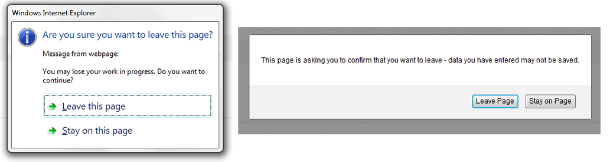

.. _customization-build-your-own-portal:

Build Your Own Portal
=====================

.. _customization-build-your-own-portal-build-your-own-portal-using-portal-kit:

Build Your Own Portal Using Portalkit
-------------------------------------

#. Create a new project that depends on ``PortalTemplate``.

#. Create new home page

   - Create a new ``HTML Dialog`` for your home page and then use ``ui:composition`` to define the template you use in it. If you want to keep the look of the default homepage, choose ``DefaultHomePageTemplate``.

     .. tip:: Find more information about templates at :ref:`Layout templates <components-layout-templates>`.
     ..

     .. warning::
        * Portal uses some template files in the folder ``"webContent/layouts"``
          in the Portal Template project. Do not create files with the same
          path and name in your project as they can override the Portal
          files.
        * Using the deprecated DefaultHomePageTemplate will result in the user having the legacy dashboard.

   - Create a new ``Start process`` named ``DefaultApplicationHomePage.ivp`` and connect to ``User Dialog`` for your home page.

   - Run your application, start your newly created process and see result.

     |custom-portal-home|

     .. tip:: Your new homepage is the default Portal homepage. You can
               customize it. Reference at :ref:`Portal home <customization-portal-home>`.

#. Set category for tasks

   To categorize tasks, set values for ``Category`` field. Task category
   can be multi-level if it is separated by slash ``/`` signs, as below.

   |task-category-config|

#. How to use feature warning on closing browser/tab

   Sometimes when users are working on a task, if they close tab,
   browser or refresh page then they may lose their current work. It's a
   good idea to ask users to verify that they truly want to proceed with
   the action they just invoke. To use this feature, add
   ``WarnOnClosingBrowserTab`` component to the page you want to be
   affected.

   .. code-block:: html

     <ic:ch.ivy.addon.portalkit.feature.WarnOnClosingBrowserTab confirmMessage="You may lose your work in progress. Do you want to continue?" />

   ..

   Depending on browser, content of ``confirmMessage`` and names of buttons may vary.

   |warn-on-closing-browser-tab|

   .. tip::

        Normally, when using this component, actions that user invoked outside Portal
        area like closing tab/browser, refreshing page, clicking on a link on
        bookmark bar of browser will cause browser to display a confirmation dialog.
        That might cause the feature work incorrectly. Actions that lead to
        navigation that user invoke inside Portal area like clicking on a
        link/button, submitting a form will not display any confirmation popup. In
        some cases, user might use javascript to navigate to another page, for
        example: set value for ``window.location.href`` or call
        ``location.reload()``. If that happens, add this to your javascript function:
        ``showConfirmDialogBeforeUnload = false;``

.. |custom-portal-home| image:: ../../screenshots/dashboard/legacy-dashboard.png
.. |task-category-config| image:: images/build-your-own-portal/task-category-config.png

