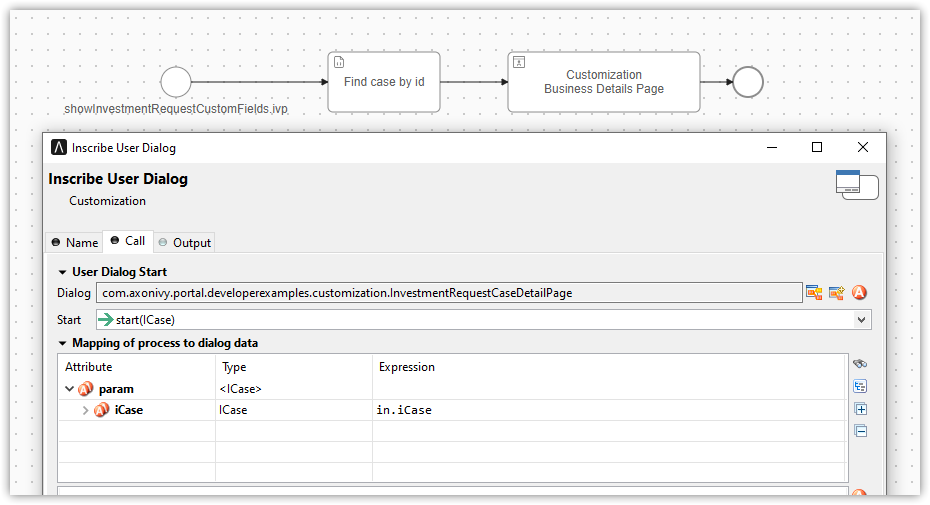

.. _customization-businessdetailspage:

Business Details Page
=====================

.. _customization-additionalcasedetailspage.introduction:

Introduction
------------

The Business Details page shows all custom fields of a case. It is opened
by clicking on ``Business details`` in Case detail.

You can modify this page for each case by providing a relative URL to the case.

.. _customization-additionalcasedetailspage.customization:

How to
------

#. Create a new business details page UI and a start process that will display
   the new UI.

   |customization-business-details-page|

#. Store path of the start process just created above when creating a task. There are 2 ways to perform this:
   
   * Use the ``SetBusinessDetailsPage.p.json`` callable process, and pass the friendly URL of this process as a parameter.

      |set-business-details-page-callable-process|

   * Use public API ``ch.ivy.addon.portalkit.publicapi.BusinessDetailsAPI.create(String)`` or ``ch.ivy.addon.portalkit.publicapi.BusinessDetailsAPI.create(BusinessDetailsDTO)``. See the Public API section for more details.

      |customize-business-details-with-public-api|

      .. tip:: 
         The business details page also supports external links in case the business details site is outside of |ivy|.
         You can replace the path with any URL. The Portal will take care of the rest. E.g., ``BusinessDetailsAPI.create("https://google.com")``

Customization
-------------
-  If your custom Business Details page uses an IFrame, you may want to set some additional
   Window properties on your page: 

   - window.isHideCaseInfo = true;
   - window.isHideTaskAction = true;
   - window.isHideTaskName = true;
   - window.isWorkingOnATask = false;
   - window.viewName = '';

   |customization-business-details-page-iframe|

-  Using the Public API, you can control whether the business details page will start inside IFrame or not by setting the ``BusinessDetailsDTO.builder().isEmbedInFrame(Boolean)`` value to 
   
   	- ``true``: start inside IFrame (default value)
   	- ``false``: not start inside IFrame

-  You can also customize the ``ICase`` value. By default, the API will get ``ICase`` from ``Ivy.wfCase()``. Modify it using ``BusinessDetailsDTO.builder().iCase(ICase)``

   |start-business-details-page-iframe|

- Behind the scene, the API will set the path for the ``String`` custom field ``businessDetails``. If you do a deep customization, follow the steps below:

   - Use API ``ProcessStartAPI.findRelativeUrlByProcessStartFriendlyRequestPath(String)`` to find the process path.
   - Set process path to a customfield in your specific case ``Ivy.wfCase().customFields().stringField("businessDetails").set(your-process-path-url)``

Permission Setting
------------------

Configure permissions in the :dev-url:`Engine Cockpit
</doc/|version|/engine-guide/reference/engine-cockpit/security.html>`. In the security area, open PortalPermissions -> PortalCasePermissions -> ShowCaseDetails.

Or search :bdg-ref-warning:`🔑ShowCaseDetails <ShowCaseDetails>` in the permissions search bar. By default, this permission is set to ``true`` for role ``Everybody``.

.. |start-business-details-page-iframe| image:: images/business-details-page/start-business-details-page-iframe.png
.. |customization-business-details-page-iframe| image:: images/business-details-page/customization-business-details-page-iframe.png

.. |set-business-details-page-callable-process| image:: images/business-details-page/set-business-details-page-callable-process.png
.. |customize-business-details-with-public-api| image:: images/business-details-page/customize-business-details-with-public-api.png