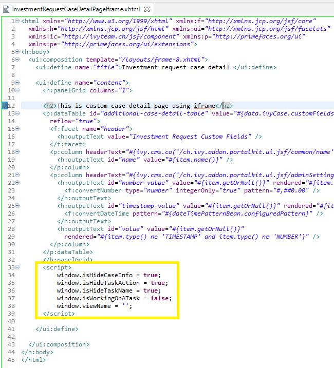
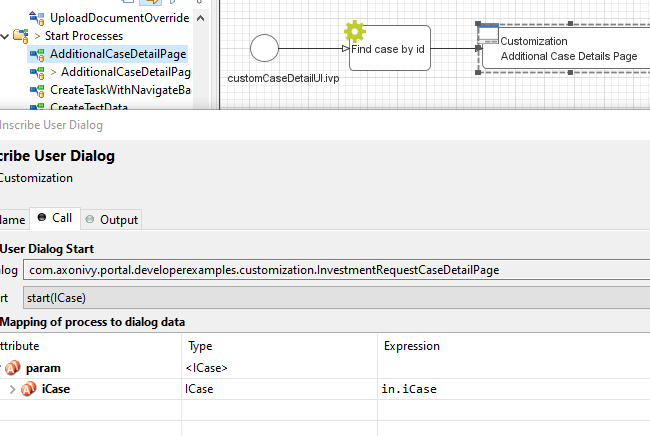
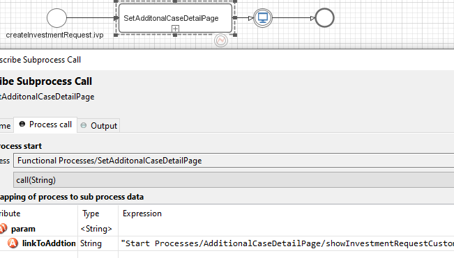
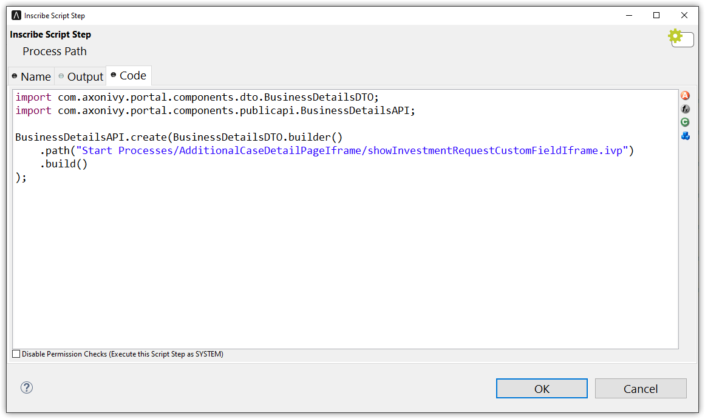

.. _customization-businessdetailspage:

Business Details Page
============================

.. _customization-additionalcasedetailspage.introduction:

Introduction
------------

The Business Details page shows all custom fields of a case. It is opened
by clicking on ``Business details`` in Case detail.

You can modify this page for each case by providing a relative URL to the case.

.. _customization-additionalcasedetailspage.customization:

How to
-------------

#. Create a new business details page UI and a start process that will display
   the new UI.

   |customization-additional-case-details-page|

#. Store path of start process just created above when creating a task. There are 2 ways to perform this:
   
   * Use the ``SetBusinessDetailsPage.p.json`` callable process, and pass the friendly URL of this process as a parameter.

      |set-additonal-case-detail-page-callable-process|

   * Use public API ``ch.ivy.addon.portalkit.publicapi.BusinessDetailsAPI.create(String)`` or ``ch.ivy.addon.portalkit.publicapi.BusinessDetailsAPI.create(BusinessDetailsDTO)``. See the Public API for more detail.

      |customize-case-detail-with-public-api|

      .. tip:: 
         Public API also supports external links in case the business detail site is outside of Axon Ivy.    
         You can replace the path value with any URL then Portal will take care of the rest. Eg: ``BusinessDetailsAPI.create("https://google.com")``

Customization
-------------
-  If your custom Additional Case details page uses an IFrame, you may want to set some additional
   Window properties on your page: 

   - window.isHideCaseInfo = true;
   - window.isHideTaskAction = true;
   - window.isHideTaskName = true;
   - window.isWorkingOnATask = false;
   - window.viewName = '';

   |customization-additional-case-details-page-iframe|

-  By using Public API, you can control business detail page will start inside IFrame or not, set ``.isEmbedInFrame(Boolean)`` value to 
   
   	- ``true``: start inside IFrame (default value)
   	- ``false``: not start inside IFrame

-  You can also customize ``ICase`` value, by default the API will get ``ICase`` from ``Ivy.wfCase()``. Modify it by ``.iCase(ICase)``

   |start-business-details-page-iframe|

- Behind the scene, the API will set path value for ``String`` custom field ``businessDetails``. So in case of deep customization, follow below steps:

   - Use API ``ProcessStartAPI.findRelativeUrlByProcessStartFriendlyRequestPath(String)`` to find process path.
   - Set process path to a customfield in your specific case ``Ivy.wfCase().customFields().stringField("businessDetails").set(your-process-path-url)``

Permission Setting
------------------

Configure permissions in the :dev-url:`Engine Cockpit
</doc/|version|/engine-guide/reference/engine-cockpit/security.html>`. In the security area, open PortalPermissions -> PortalCasePermissions -> ShowCaseDetails.

Or search "ShowCaseDetails" in permissions search bar.

.. |start-business-details-page-iframe| image:: images/business-details-page/start-business-details-page-iframe.png

