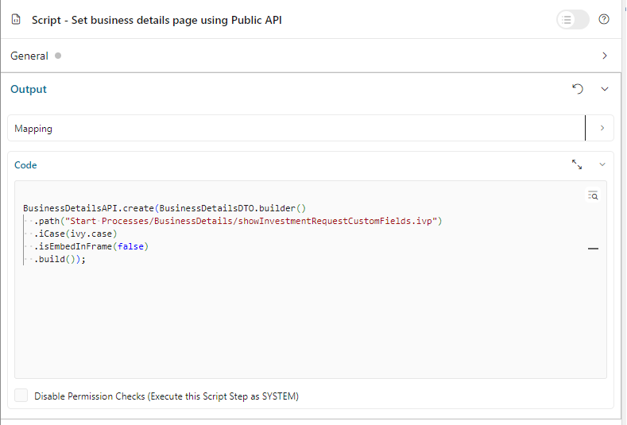
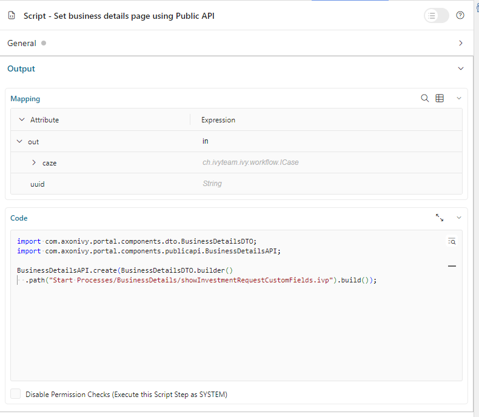
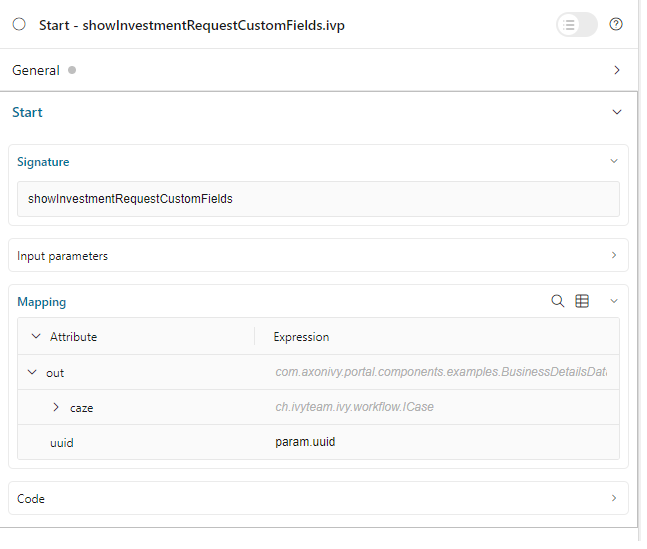

.. _customization-businessdetailspage:

Business Details Page
=====================

.. _customization-additionalcasedetailspage.introduction:

Introduction
------------

The default business details page shows all custom fields of a case. It is opened
by clicking on ``Business details`` in the case details page.

Portal supports customzing this page for each case.

.. _customization-additionalcasedetailspage.customization:

How to customize the business details page
------------------------------------------

#. Create a business details process. In this process, create a request start that has the parameter ``caseId``. The idea is when clicking on ``Business details`` in case details page,
Portal will call this process and pass the case ID as parameter `caseId`. Create a UI for business details page in this process.
   |customization-business-details-page-start-request|

#. Store the :dev-url:`IWebStartable ID </docs/|version|/public-api/ch/ivyteam/ivy/workflow/start/IWebStartable.html#getId()>` 
of the process to the string custom field ``businessDetails`` of the case. There are two ways to perform this:
   
   * Use the ``SetBusinessDetailsPage.p.json`` callable process, and pass the IWebStartable ID of the business details process as a 
   parameter. To make it more flexible, Portal supports passing the end part of IWebStartable ID as the parameter 
   but you need to make sure only one process in the security context has IWebStartable ID ending with the parameter.

      |set-business-details-page-callable-process|

   * Use public API ``ch.ivy.addon.portalkit.publicapi.BusinessDetailsAPI.create(String)`` or ``ch.ivy.addon.portalkit.publicapi.BusinessDetailsAPI.create(BusinessDetailsDTO)``. See the Public API section for more details.

      |customize-business-details-with-public-api|

      .. tip:: 
         The business details page also supports external links in case the business details site is outside of |ivy|.
         You can replace the path with any URL. Portal will take care of the rest. E.g., ``BusinessDetailsAPI.create("https://google.com")``

Customization
-------------
-  If your custom Business Details page uses an IFrame, you may want to set some additional
   Window properties on your page: 

   - window.isHideCaseInfo = true;
   - window.isHideTaskAction = true;
   - window.isHideTaskName = true;
   - window.isWorkingOnATask = false;
   - window.viewName = '';

   |customization-business-details-page-iframe|

-  Using the Public API, you can control whether the business details page will start inside IFrame or not by setting the ``BusinessDetailsDTO.builder().isEmbedInFrame(Boolean)`` value to 
   
   	- ``true``: start inside IFrame (default value)
   	- ``false``: not start inside IFrame

-  You can also customize the ``ICase`` value. By default, the API will get ``ICase`` from ``Ivy.wfCase()``. Modify it using ``BusinessDetailsDTO.builder().iCase(ICase)``

   |start-business-details-page-iframe|

- Behind the scenes, the API will set the path for the string custom field ``businessDetails``. If you do a deep customization, 
you can find the IWebStartable ID of the business details process, add URL query string then set it to the string custom 
field ``businessDetails`` of the case.

.. note::

   - Ensure the new UI aligns with the overall design and functionality requirements of your application.

   - Test the integration thoroughly to confirm that the case information is accurately passed and displayed.

   - When using external links, verify that the links are secure and accessible from your application environment.

Permission Setting
------------------

Configure permissions in the :dev-url:`Engine Cockpit
</doc/|version|/engine-guide/reference/engine-cockpit/security.html>`. In the security area, open PortalPermissions -> PortalCasePermissions -> ShowCaseDetails.

Or search :bdg-ref-warning:`🔑ShowCaseDetails <ShowCaseDetails>` in the permissions search bar. By default, this permission is set to ``true`` for role ``Everybody``.

.. |customization-business-details-page-iframe| image:: images/business-details-page/customization-business-details-page-iframe.png
.. |set-business-details-page-callable-process| image:: images/business-details-page/set-business-details-page-callable-process.png

