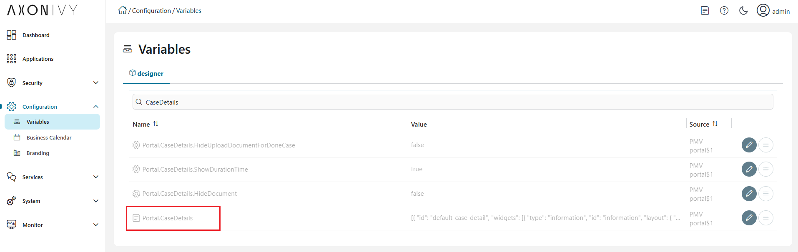

.. _customization-case-item-details:

Case Item Details
=================

CaseItemDetails is a built-in component of the Portal that contains the case
information which users can interact with. To show additional required case
information, the Portal supports customizing the CaseItemDetails.

Each CaseItemDetails contains

- **CaseItemGeneralInformation** ``1``
- **CaseItemDetailsDocuments** ``2``
- **CaseItemDetailsRelatedCases** ``3``
- **CaseItemDetailsRelatedTasks** ``4``
- **CaseItemDetailsHistories** ``5``
-  Case Details custom panel: ``caseItemDetailCustomTop``,
   ``caseItemDetailCustomMiddle``, ``caseItemDetailCustomBottom``

|case-standard-1|

|case-standard-2|

.. important:: All visible widgets are configured in :ref:`variable Portal.CaseDetails<case-details-configuration-variable>`

.. _case-details-configuration-variable:

How to Configure Widgets in Case Details
----------------------------------------

-  Settings of all visible widgets on the Case Details page are saved in the **variable Portal.CaseDetails**.
-  In the Engine Cockpit, an administrator can configure widgets in the variable **Portal.CaseDetails** on the Settings page.
   |edit-variable-portal-case-details|

-  The default configuration includes five widgets:

   .. code-block:: javascript
      
         [
            {
               "id": "default-case-detail",
               "widgets": [
                  {
                     "type": "information",
                     "id": "information",
                     "layout": {
                        "w": 6,
                        "h": 8,
                        "x": 0,
                        "y": 0
                     }
                  },
                  {
                     "type": "document",
                     "id": "document",
                     "layout": {
                        "w": 6,
                        "h": 8,
                        "x": 6,
                        "y": 0
                     }
                  },
                  {
                     "type": "technicalCase",
                     "id": "technicalCase",
                     "layout": {
                        "w": 12,
                        "h": 6,
                        "x": 0,
                        "y": 8
                     }
                  },
                  {
                     "type": "relatedTask",
                     "id": "relatedTask",
                     "layout": {
                        "w": 12,
                        "h": 6,
                        "x": 0,
                        "y": 14
                     }
                  },
                  {
                     "type": "history",
                     "id": "history",
                     "layout": {
                        "w": 12,
                        "h": 6,
                        "x": 0,
                        "y": 20
                     }
                  }
               ]
            }
         ]                                                       

   -  The structure of each Case Details layout is saved in variable **Portal.CaseDetails**:

      ``id``: ID of layout.

      ``widgets``: definition of widgets in layout.

      ``filters``: conditions to determine which cases are eligible to use the layout. There are two types of case filters:
      
      -  ``categories`` (case categories)
      -  ``states`` (case business states).

         Refer to :dev-url:`Case business states </doc/|version|/public-api/ch/ivyteam/ivy/workflow/caze/CaseBusinessState.html>` for
         available case business states.

   -  The structure of each widget inside the case details layout is stored in variable **Portal.CaseDetails**:

      ``id``: ID of widget.

      ``type``: type of widget, there are 6 types: 
      -  ``information``
      -  ``document``
      -  ``technicalCase``
      -  ``relatedTask``
      -  ``history``
      -  ``custom``.

      ``layout``: defines the UI styling of the widget.

         ``x``: HTML DOM Style ``left`` is computed as ``x / 12 * 100%``.

         ``y``: HTML DOM Style ``top`` is computed as ``y / 12 * 100%``.

         ``w``: HTML DOM Style ``width`` is computed as ``60 * w + 20 * (width - 1)``.

         ``h``: HTML DOM Style ``height`` is computed as ``60 * h + 20 * (height - 1)``.

         ``styleClass`` (optional): add CSS Classes to HTML DOM.

         ``style`` (optional): add inline style to HTML DOM.

      ``data`` (for custom widget): data for custom widget, refer to :ref:`Show custom widgets <customization-case-item-details-how-to-override-ui-custom-body>`

   .. important::

      - **Do not change** ``type`` and ``id`` of widgets.
      - You can change ``x``, ``y``, ``w`` and ``h`` to update size and position of widgets.
      - ``x``, ``y``, ``w`` and ``h`` have to be **integers**.
      - ``x + w`` must **not be larger** than **12**.
      - We support all case business states in filter type ``states``.

.. _customization-case-item-details-how-to-override-ui-custom-body:

Show custom widgets
-------------------

For the custom widget, we have a new node is ``data`` inside of case details widget. The structure of ``data`` on each custom widget will be:

   - ``type``: type of custom widget panel, there are 3 types: ``caseItemDetailCustomTop``, ``caseItemDetailCustomMiddle``, ``caseItemDetailCustomBottom``.

   - ``url``: URL for external website

   - ``processPath``: the user-friendly request path of the Ivy process which will be displayed in custom widget

   - ``params``: parameters for the Ivy process above, each parameter can be defined as follows:

      - Key name that will be the parameter name for the Ivy process above. Note: don't use ``caseId``.

      - The key value for the case has to start with ``case.``. Supported are two values: ``case.id``, ``case.category``.

      - Key value for case custom fields: must start with ``case.customFields.``, followed by custom field name.

      - Other key values will be treated as a hard coded value.

.. tip:: 
      To quickly understand how the JSON of custom case details looks like.
   
      - Refer to ``variables.Portal.CaseDetails.json`` file in ``portal-developer-examples/resources/files`` project.
      - Copy to the corresponding application folder located in the designer.

          - e.g: AxonIvyDesigner/configuration/applications/designer.

      - Create some destroyed case or start the process ``Start Processes/CaseDetailsCustomWidgetExample/CreateEventTest.ivp`` in ``portal-developer-examples`` project.
      - Go to the homepage.
      - And then go to case details to check the new custom layout.
   
      About how to configure Variables, refer to :dev-url:`|ivy| Variables </doc/|version|/designer-guide/configuration/variables.html>`
   

Adding New Custom Panels
^^^^^^^^^^^^^^^^^^^^^^^^

The following two steps are necessary to add new custom panels:

#. The **Engine Administrator** has to configure the variable :ref:`Portal.CaseDetails<case-details-configuration-variable>`
   on the Cockpit Page to add custom widgets.

   .. _case-details-custom-configuration-variable-example:

   -  This is an example **Portal.CaseDetails** configuration that includes three custom widgets:

      .. code-block:: javascript

         [
            {
               "id": "default-case-detail",
               "widgets": [
                  {
                     "type": "information",
                     "id": "information",
                     "layout": {
                        "w": 6,
                        "h": 8,
                        "x": 0,
                        "y": 0
                     }
                  },
                  {
                     "type": "document",
                     "id": "document",
                     "layout": {
                        "w": 6,
                        "h": 8,
                        "x": 6,
                        "y": 0
                     }
                  },
                  {
                     "type": "history",
                     "id": "history",
                     "layout": {
                        "w": 12,
                        "h": 6,
                        "x": 0,
                        "y": 8
                     }
                  },
                  {
                     "type": "custom",
                     "id": "customTop",
                     "layout": {
                        "x": 0,
                        "y": 14,
                        "w": 12,
                        "h": 6
                     },
                     "data": {
                        "type": "caseItemDetailCustomTop"
                     }
                  },
                  {
                     "type": "custom",
                     "id": "customMiddle",
                     "layout": {
                        "x": 0,
                        "y": 20,
                        "w": 12,
                        "h": 6
                     },
                     "data": {
                        "type": "caseItemDetailCustomMiddle"
                     }
                  },
                  {
                     "type": "custom",
                     "id": "customBottom",
                     "layout": {
                        "x": 0,
                        "y": 26,
                        "w": 12,
                        "h": 6
                     },
                     "data": {
                        "type": "caseItemDetailCustomBottom"
                     }
                  }
               ]
            }
         ]
         
#. To customize case details using an **IFrame**, you have to define one of the following two input parameters in the ``data`` node:

   -  ``url`` if you want to use an external URL.

   -  ``processPath`` if you want to use an Ivy process start. You may
      predefine parameters for the process by adding ``params`` to the ``data``
      node.

      .. important::
         Use only one of ``processPath`` or ``url``.

      Here is an example of a customized case details page using an external URL:

      .. code-block:: javascript

         [
            {
               "id": "case-detail",
               "widgets": [
                  {
                  "type": "information",
                  "id": "information",
                  "layout": {
                     "x": 0,
                     "y": 0,
                     "w": 6,
                     "h": 8
                  }
                  },
                  {
                  "type": "custom",
                  "id": "customURL",
                  "layout": {
                     "x": 6,
                     "y": 0,
                     "w": 6,
                     "h": 8
                  },
                  "data": {
                     "url": "https://www.axonivy.com/"
                  }
                  }
               ]
            }
         ]
      ..

      Result:

      |case-customized-iframe-url|

      The following example shows a customized case details page using an ivy
      process start. Please refer to the ``CaseDetailsCustomWidgetExample`` process
      in ``portal-developer-examples`` for details.

      .. code-block:: javascript

         [
            {
               "id": "case-detail",
               "widgets": [
                  {
                     "type": "information",
                     "id": "information",
                     "layout": {
                        "x": 0,
                        "y": 0,
                        "w": 6,
                        "h": 8
                  }
                  },
                  {
                     "type": "history",
                     "id": "history",
                     "layout": {
                        "x": 6,
                        "y": 0,
                        "w": 6,
                        "h": 8
                  }
                  },
                  {
                  "type": "custom",
                  "id": "customIvyProcess",
                  "layout": {
                     "x": 0,
                     "y": 6,
                     "w": 12,
                     "h": 8
                  },
                  "data": {
                     "processPath": "Start Processes/CaseDetailsCustomWidgetExample/startReview.ivp",
                     "params": {
                        "startedCaseId": "case.id",
                        "startedCaseCategory": "case.category",
                        "investmentId": "1573111",
                        "investmentDescription": "case.customFields.investmentDescription"
                     }
                  }
                  }
               ]
            }
         ]
      ..

      Provide case custom fields:

      |case-customized-iframe-process-custom-field|

      Map parameters to process data:

      |case-customized-iframe-process-input-mapping|

      Result:

      |case-customized-iframe-process|

.. |case-standard-1| image:: ../../screenshots/case-detail/customization/case-standard-1.png
.. |case-standard-2| image:: ../../screenshots/case-detail/customization/case-standard-2.png

.. |case-customized-iframe-url| image:: ../../screenshots/case-detail/customization/case-customized-iframe-url.png
.. |case-customized-iframe-process-custom-field| image:: images/case-details/Review-Request-Start.png
.. |case-customized-iframe-process-input-mapping| image:: images/case-details/Mapping-ReviewRequest-Start.png
.. |case-customized-iframe-process| image:: ../../screenshots/case-detail/customization/case-customized-iframe-process.png

