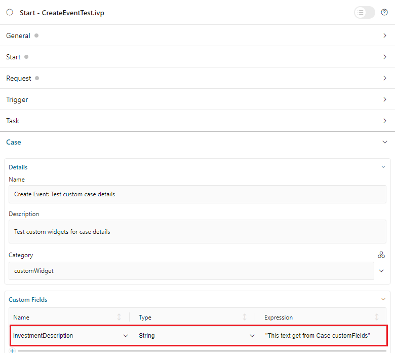
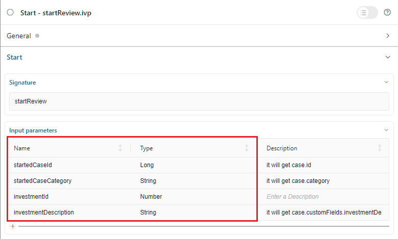

.. _customization-case-item-details:

Case item details
=================

CaseItemDetails is a built-in component of Portal which contains the
case info which users can interact with. In order to show needed case's
information, Portal supports overriding concept for CaseItemDetails.

Each CaseItemDetails contains

- **CaseItemGeneralInformation** ``1``

- **CaseItemDetailsDocuments** ``2``

- **CaseItemDetailsRelatedCases** ``3``

- **CaseItemDetailsRelatedTasks** ``4``

- **CaseItemDetailsHistories** ``5``

-  Case details custom panel: ``caseItemDetailCustomTop``,
   ``caseItemDetailCustomMiddle``, ``caseItemDetailCustomBottom``

|case-standard-1|

|case-standard-2|

.. important:: All visible widgets will be configured in :ref:`Global Variable Portal.CaseDetails<case-details-configuration-variable>`

.. _case-details-configuration-variable:

How to configure widgets in case details
----------------------------------------

-  Settings of all visible widgets on case details page are saved in **Global Variable Portal.CaseDetails**.
-  Cockpit Administrator can configure widgets via global variable **Portal.CaseDetails** on Cockpit settings page.
   |edit-variable-portal-task-case-details|

-  Default configuration includes 5 widgets.

   .. code-block:: html

    [{
       "id": "default-case-detail",
       "widgets": [{
             "type": "information",
             "id": "information",
             "layout": {
                "w": 6, "h": 8, "x": 0, "y": 0
               }
          }, {
             "type": "document",
             "id": "document",
             "layout": {
                "w": 6, "h": 8, "x": 6, "y": 0
               }
          }, {
             "type": "technicalCase",
             "id": "technicalCase",
             "layout": {
                "w": 12, "h": 6, "x": 0, "y": 8
               }
          }, {
             "type": "relatedTask",
             "id": "relatedTask",
             "layout": {
                "w": 12, "h": 6, "x": 0, "y": 14
               }
          }, {
             "type": "history",
             "id": "history",
             "layout": {
                "w": 12, "h": 6, "x": 0, "y": 20
               }
            }
          ]
       }
    ]

   -  Structure of each case details layout in variable **Portal.CaseDetails**:

      ``id``: ID of layout.

      ``widgets``: definition of widgets in layout.

      ``filters``: conditions to determine which cases able to use the layout. There are 2 types of filter:
      ``categories`` (case categories), ``states`` (case states).

   -  Structure of each widget inside case details layout in variable **Portal.CaseDetails**:

      ``id``: ID of widget.

      ``type``: type of widget, there are 6 types: ``information``, ``document``, ``technicalCase``, ``relatedTask``, ``history``, ``custom``.

      ``layout``: definition of the UI styling of the widget.

         ``x``: HTML DOM Style ``left`` will be calculated by formula ``x / 12 * 100%``.

         ``y``: HTML DOM Style ``top`` will be calculated by formula ``y / 12 * 100%``.

         ``w``: HTML DOM Style ``width`` will be calculated by formula ``60 * w + 20 * (width - 1)``.

         ``h``: HTML DOM Style ``height`` will be calculated by formula ``60 * h + 20 * (height - 1)``.

         ``styleClass`` (optional): add CSS Classes to HTML DOM.

         ``style`` (optional): add inline style to HTML DOM.

      ``data`` (for custom widget): data for custom widget, refer to :ref:`Show custom widgets <customization-case-item-details-how-to-override-ui-custom-body>`

   .. important::
      - **Do not change** ``type`` and ``id`` of widgets.
      - You can change ``x``, ``y``, ``w`` and ``h`` to update size and position of widgets.
      - ``x``, ``y``, ``w`` and ``h`` must be **integers**.
      - ``x + w`` must **not be larger** than **12**.
      - We support all case states for filter type ``states``.

   .. _customization-case-item-details-how-to-override-ui:

How to custom Case details UI
-----------------------------

Refer to ``portal-developer-examples`` project for examples.

#. Introduce an |axon-ivy| project which has ``PortalTemplate`` as a
   required library.

#. To customize case detail, you must customize Portal Home first.
   Refer to :ref:`Customize Portal
   home <customization-portal-home>` to set new home
   page.

#. Copy the ``PortalStart`` process from ``PortalTemplate`` to your
   project. Point PortalHome element to your custom home page in
   previous step. This process is new home page and administrator should
   register this link by Portal's Admin Settings.

#. Use :dev-url:`Axon Ivy HtmlOverride wizard </doc/nightly/designer-guide/how-to/overrides.html?#override-new-wizard>` to override ``CaseInformation`` HTML dialog.

#. After the above steps were done, you can override **Case details UI elements**
   by some options below:

   - To show/hide, please using ``showItemDetailsHeader`` and ``showItemBackButton`` code. For more details, please refer to
     :ref:`Show/Hide components <customization-case-details-how-to-override-ui-show-hidden-ui>`.

   - And to show a new elements in ``CaseInformation`` customized, please refer to :ref:`Show custom widgets <customization-case-item-details-how-to-override-ui-custom-body>`
     code.

.. _customization-case-details-how-to-override-ui-show-hidden-ui:

Show/Hide components by keywords
--------------------------------

Refer to the ``ui:param`` tag list in ``CaseInformation.xhtml`` of
PortalTemplate. In case, we want to show/hide any elements on
CaseItemDetails, we should override value of ``ui:param``

List valid parameters:

-  ``ui:param name="showItemDetailsHeader" value="true"`` to show/hide case header, by default it's true, you should set as
   ``false`` if you set **alwaysShowDetails** for **CaseItem**.

-  ``ui:param name="showItemBackButton" value="true"`` to show/hide back button, by default it's true.

.. _customization-case-item-details-how-to-override-ui-custom-body:

Show custom widgets
-------------------

For the custom widget, we have a new node is ``data`` inside of case details widget. The structure of ``data`` on each custom widget will be:

   - ``type``: type of custom widget panel, there are 3 types: ``caseItemDetailCustomTop``, ``caseItemDetailCustomMiddle``, ``caseItemDetailCustomBottom``.

   - ``url``: URL for external website

   - ``processStart``: relative link to the ivy process which will be displayed in custom widget

   - ``params``: paramters for ivy process above, each parameter can be defined as follows:

      - Key name that will be parameter name for ivy process above. Note: don't use ``caseId``.

      - Key value for case: must start with ``case.``. Support 2 values: ``case.id``, ``case.category``.

      - Key value for case custom fields: must start with ``case.customFields.``, follow by custom field name.

      - Other key value will be treated as hard code value.

.. tip:: 
      To quickly understand how the JSON of custom case details looks like.
   
      - Refer to ``variables.Portal.CaseDetails.json`` file in ``portal-developer-examples/resources/files`` project.
      - Copy to the corresponding application folder located in the designer.

          - e.g: AxonIvyDesigner/configuration/applications/designer.

      - Create some destroyed case or start the process ``Start Processes/CaseDetailsCustomWidgetExample/CreateEventTest.ivp`` in ``portal-developer-examples`` project.
      - Go to the example homepage by the process ``Start Processes/ExamplePortalStart/DefaultApplicationHomePage.ivp``.
      - And then go to case details to check the new custom layout.
   
      About how to configure Variables, refer to :dev-url:`Axon Ivy Variables </doc/nightly/designer-guide/configuration/variables.html>`
   

Adding new custom panels
^^^^^^^^^^^^^^^^^^^^^^^^

There are two steps for adding new custom panels.

#. **Cockpit admin** must configure global variable :ref:`Portal.CaseDetails<case-details-configuration-variable>`
   on Cockpit Page to add custom widgets.

   .. _case-details-custom-configuration-variable-example:

   -  Example **Portal.CaseDetails** with including 3 custom widgets configuration:

      .. code-block:: html

         [{
            "id": "default-case-detail",
            "widgets": [{
                  "type": "information",
                  "id": "information",
                  "layout": {
                     "w": 6, "h": 8, "x": 0, "y": 0
                  }
               }, {
                  "type": "document",
                  "id": "document",
                  "layout": {
                     "w": 6, "h": 8, "x": 6, "y": 0
                  }
               }, {
                  "type": "history",
                  "id": "history",
                  "layout": {
                     "w": 12, "h": 6, "x": 0, "y": 8
                  }
               }, {
                  "type": "custom",
                  "id": "customTop",
                  "layout": {
                     "x": 0, "y": 14, "w": 12, "h": 6
                  },
                  "data" : {
                     "type": "caseItemDetailCustomTop"
                  }
               }, {
                  "type": "custom",
                  "id": "customMiddle",
                  "layout": {
                     "x": 0, "y": 20, "w": 12, "h": 6
                  },
                  "data" : {
                     "type": "caseItemDetailCustomMiddle"
                  }
               }, {
                  "type": "custom",
                  "id": "customBottom",
                  "layout": {
                     "x": 0, "y": 26, "w": 12, "h": 6
                  },
                  "data" : {
                     "type": "caseItemDetailCustomBottom"
                   }
                }
             ]
           }
        ]

#. Refer to the ``caseItemDetailCustom*`` section in ``CaseInformation.xhtml`` of PortalTemplate.

   -  We need to define ``ui:define`` with a valid name such as
      ``caseItemDetailCustomTop``, ``caseItemDetailCustomMiddle`` and
      ``caseItemDetailCustomBottom``.

   -  Add your custom code into tags above.

   -  Finally, your custom widget will be displayed in :ref:`CaseItemDetails <customization-case-item-details>` page.

   -  Below is example code for adding custom widgets to case details

   .. code-block:: html

      <!--!!!!!!!!!!!!!!!!!!!!!!!!!!!!!!!!!!!!!!!!!!!!!!!!!!!!!!!!!!!!!!!!!!!!!!!!!!!!!!!!!!!!!!!!!!!!!!!!!!!!!!!!!!!!!!!!!!!!!!!!!!!!!!!
         !!!! START: AREA SHOULD BE CUSTOMIZED !!!!!!!!!!!!!!!!!!!!!!!!!!!!!!!!!!!!!!!!!!!!!!!!!!!!!!!!!!!!!!!!!!!!!!!!!!!!!!!!!!!!!!!!!!!!!
         !!!!!!!! START: TO SHOW /HIDDEN ANY SECTIONS OF CASE DETAILS, YOU CAN TURN TRUE/FALSE FOR BELOW PARAMETERS !!!!!!!!!!!!!!!!!!!!!!!!
         !!!!!!!!!!!!!!!!!!!!!!!!!!!!!!!!!!!!!!!!!!!!!!!!!!!!!!!!!!!!!!!!!!!!!!!!!!!!!!!!!!!!!!!!!!!!!!!!!!!!!!!!!!!!!!!!!!!!!!!!!!!!!!!!!!!
         Attribute showItemDetailsHeader: To show the header of case details. By default it's true
         !!!!!!!! END SHOW /HIDDEN SECTIONS !!!!!!!!!!!!!!!!!!!!!!!!!!!!!!!!!!!!!!!!!!!!!!!!!!!!!!!!!!!!!!!!!!!!!!!!!!!!!!!!!!!!!!!!!!!!!!-->

      <ui:param name="id" value="#{cc.clientId}" />
      <ui:param name="showItemDetailsHeader" value="#{cc.attrs.showItemDetailsHeader}" />
      <ui:param name="descriptionComponentToUpdate" value="#{cc.attrs.descriptionComponentToUpdate}" />
      <ui:param name="isWorkingOnTask" value="#{cc.attrs.isWorkingOnTask}" />

      <!--!!!!!!!!!!!!!!!!!!!!!!!!!!!!!!!!!!!!!!!!!!!!!!!!!!!!!!!!!!!!!!!!!!!!!!!!!!!!!!!!!!!!!!!!!!!!!!!!!!!!!!!!!!!!!!!!!!!!!!!!!!!!!!!
         !!!!!!!! START: TO ADD YOUR CUSTOMIZATION CODE ON THE CASE DETAILS PAGE, WE PROVIDE 3 SECTIONS AS BELOW HELP YOU CAN DO IT !!!!!!!!
         !!!!!!!!!!!!!!!!!!!!!!!!!!!!!!!!!!!!!!!!!!!!!!!!!!!!!!!!!!!!!!!!!!!!!!!!!!!!!!!!!!!!!!!!!!!!!!!!!!!!!!!!!!!!!!!!!!!!!!!!!!!!!!!!-->

      <ui:define name="caseItemDetailCustomTop">
         <h:panelGroup styleClass="ui-g-12" layout="block">
            

               

               <h:outputText value="This is custom panel on top section" />
               

               

               

               <h1>This is custom content on top</h1>
               
Custom height to auto

               
Custom font size to 1.6rem

               

            

         </h:panelGroup>
      </ui:define>

      <ui:define name="caseItemDetailCustomMiddle">
         <h:panelGroup styleClass="ui-g-12" layout="block">
            

               

               <h:outputText value="This is custom panel on middle section" />
               

               

               

               <h1>This is custom content on middle</h1>
               
Custom height to auto

               
Custom font size to 1.6rem

               

            

         </h:panelGroup>
      </ui:define>

      <ui:define name="caseItemDetailCustomBottom">
         <h:panelGroup styleClass="ui-g-12" layout="block">
            

               

               <h:outputText value="This is custom panel on bottom section" />
               

               

               

               <h1>This is custom content on bottom</h1>
               
Custom height to auto

               
Custom font size to 1.6rem

               

            

         </h:panelGroup>
      </ui:define>

      <!-- !!!!!!!! END ADD YOUR CUSTOMIZATION !!!!!!!!!!!!!!!!!!!!!!!!!!!!!!!!!!!!!!!!!!!!!!!!!!!!!!!!!!!!!!!!!!!!!!!!!!!!!!!!!!!!!!!-->
      <!-- !!!! END: AREA SHOULD BE CUSTOMIZED!!!!!!!!!!!!!!!!!!!!!!!!!!!!!!!!!!!!!!!!!!!!!!!!!!!!!!!!!!!!!!!!!!!!!!!!!!!!!!!!!!!!!!!!-->

   ..

   -  In additional, we have a full flexibility page if we use ``ui-g-*``
      class to define the width of panel

#. To customize case details use **IFrame**, please make sure

   -  Must input parameter ``url`` in ``data`` node if you want to use external URL.

   -  Must input parameter ``processStart`` in ``data`` node if you want to use ivy start process. And you can predefine parameter for the process via ``params`` in ``data`` node.

      .. important::
         If you input ``processStart``, don't input ``url``. You can only use one of them.

      Customized case details using external URL:

      .. code-block:: html

         [
            {
            "id": "case-detail",
            "widgets": [
               {
                  "type": "information",
                  "id": "information",
                  "layout": {
                     "x": 0, "y": 0, "w": 6, "h": 8
                  }
               },
               {
                  "type": "custom",
                  "id": "customURL",
                  "layout": {
                     "x": 6, "y": 0, "w": 6, "h": 8
                  },
                  "data" : {
                      "url": "https://www.axonivy.com/"
                  }
               }
             ]
          }
        ]
      ..

      Result:

      |case-customized-iframe-url|

      Customized case details using ivy process start, please refer to ``CaseDetailsCustomWidgetExample`` process in ``portal-developer-examples`` for more details

      .. code-block:: html

       [{
            "id": "case-detail",
            "widgets": [
               {
                  "type": "information",
                  "id": "information",
                  "layout": {
                     "x": 0, "y": 0, "w": 6, "h": 8
                  }
               },
               {
                  "type": "history",
                  "id": "history",
                  "layout": {
                     "x": 6, "y": 0, "w": 6, "h": 8
                  }
               },
               {
                  "type": "custom",
                  "id": "customIvyProcess",
                  "layout": {
                     "x": 0, "y": 6, "w": 12, "h": 8
                  },
                  "data": {
                     "processStart": "Start Processes/CaseDetailsCustomWidgetExample/startReview.ivp",
                     "params": {
                        "startedCaseId": "case.id",
                        "startedCaseCategory": "case.category",
                        "investmentId": "1573111",
                        "investmentDescription": "case.customFields.investmentDescription"
                     }
                  }
               }
             ]
           }
        ]
      ..

      Provide case custom fields:

      |case-customized-iframe-process-custom-field|

      Map parameters to process data:

      |case-customized-iframe-process-input-mapping|

      Result:

      |case-customized-iframe-process|

.. |case-standard-1| image:: ../../screenshots/case-detail/customization/case-standard-1.png
.. |case-standard-2| image:: ../../screenshots/case-detail/customization/case-standard-2.png
.. |edit-variable-portal-task-case-details| image:: images/customization/edit-variable-portal-task-case-details.png
.. |case-customized-iframe-url| image:: ../../screenshots/case-detail/customization/case-customized-iframe-url.png

.. |case-customized-iframe-process| image:: ../../screenshots/case-detail/customization/case-customized-iframe-process.png

