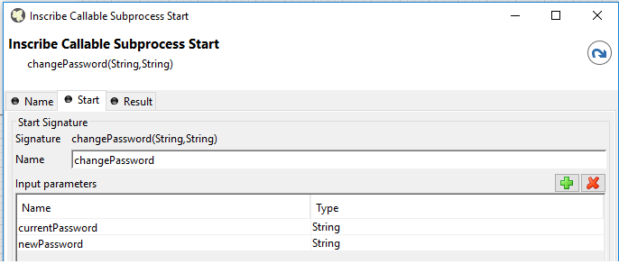
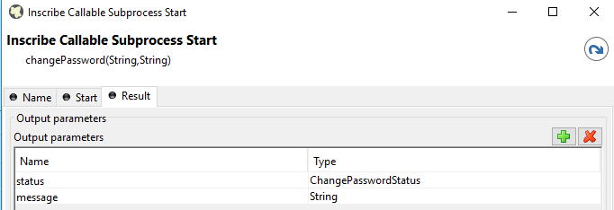
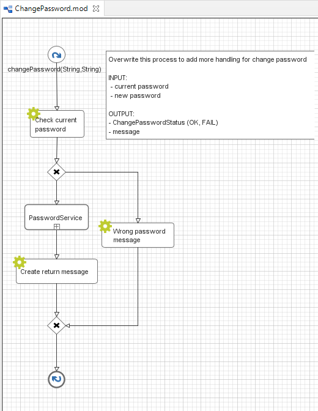

.. _customization-change-password-process:

Change password process
=======================

.. _customization-change-password-process-introduction:

Introduction
------------

In Portal, the ``Change password process`` allows users to change their current
password. You can customize this process, e.g. to check new passwords against
leaked passwords databases when the user changes his password.

.. _customization-change-password-process-customization:

Customization
-------------

Create a callable subprocess in your project with the signature
``changePassword(String,String)``. Make sure that this signature is unique in
your application. It has to return an enumeration ``ChangePasswordStatus`` and the
``message`` to be shown to the user. You can override this process in ``portal``.

|change-password-process|

|change-password-input|

|change-password-output|

