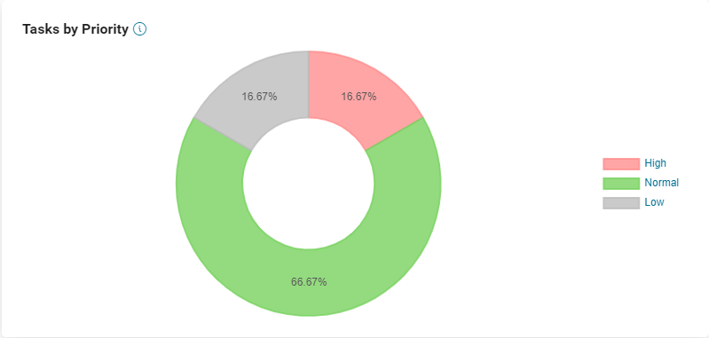

.. _customization-default-chart-colors:

Default Chart Color
*******************

.. _customization-default-chart-colors-introduction:

Introduction
------------

In Portal, you can customize the default background chart , data labels and legend color.

|default-chart-color|

.. _override-Statistic-colors:

Customization
-------------

You can override chart, data label, and legend colors by re-defining the values of the variables in ``custom.css`` below:

Statistic chart Task by priority
================================
 - ``--chart-label-default-exception-priority-color`` to override label color of exception priority task
 - ``--chart-label-default-high-priority-color`` to override label color of high priority task
 - ``--chart-label-default-normal-priority-color`` to override label color of normal priority task
 - ``--chart-label-default-low-priority-color`` to override label color of low priority task
 - ``--chart-default-exception-priority-color`` to override background color of exception priority task
 - ``--chart-default-high-priority-color`` to override background color of high priority task
 - ``--chart-default-normal-priority-color`` to override background color of normal priority task
 - ``--chart-default-low-priority-color`` to override background color of low priority task

Statistic chart Case by state
=============================
 - ``--chart-label-default-created-case-color`` to override label color of created case
 - ``--chart-label-default-running-case-color`` to override label color of running case
 - ``--chart-label-default-done-case-color`` to override label color of done case
 - ``--chart-label-default-failed-case-color`` to override label color of failed case
 - ``--chart-default-created-case-color`` to override background color of created case
 - ``--chart-default-running-case-color`` to override background color of running case
 - ``--chart-default-done-case-color`` to override background color of done case
 - ``--chart-default-failed-case-color`` to override background color of failed case

Statistic chart Processed cases in time period
==============================================
 - ``--chart-label-default-created-case-finish-task-color`` to override label color of created case
 - ``--chart-label-default-running-case-finish-task-color`` to override label color of running case
 - ``--chart-label-default-done-case-finish-task-color`` to override label color of done case
 - ``--chart-label-default-failed-case-finish-task-color`` to override label color of failed case
 - ``--chart-default-created-case-finish-task-color`` to override background color of created case
 - ``--chart-default-running-case-finish-task-color`` to override background color of running case
 - ``--chart-default-done-case-finish-task-color`` to override background color of done case
 - ``--chart-default-failed-case-finish-task-color`` to override background color of failed case

Statistic chart Done cases in time period
=========================================
 - ``--chart-label-default-created-case-finish-time-color`` to override label color of created case
 - ``--chart-label-default-running-case-finish-time-color`` to override label color of running case
 - ``--chart-label-default-done-case-finish-time-color`` to override label color of done case
 - ``--chart-label-default-failed-case-finish-time-color`` to override label color of failed case
 - ``--chart-default-created-case-finish-time-color`` to override background color of created case
 - ``--chart-default-running-case-finish-time-color`` to override background color of running case
 - ``--chart-default-done-case-finish-time-color`` to override background color of done case
 - ``--chart-default-failed-case-finish-time-color`` to override background color of failed case

Statistic chart Elapsed time of done case
=========================================
 - ``--chart-label-default-elapsed-time-color`` to override label color of elapsed time of done cases
 - ``--chart-default-elapsed-time-color`` to override background color of elapsed time of done cases

Statistic chart Task by expiry
==============================
 - ``--chart-label-default-task-expiried-color`` to override label color of expired task
 - ``--chart-label-default-task-today-color`` to override label color of today task
 - ``--chart-label-default-task-week-color`` to override label color of this week task
 - ``--chart-label-default-task-month-color`` to override label color of this month task
 - ``--chart-label-default-task-year-color`` to override label color of this year task
 - ``--chart-default-task-expiried-color`` to override background color of expired task
 - ``--chart-default-task-today-color`` to override background color of today task
 - ``--chart-default-task-week-color`` to override background color of this week task
 - ``--chart-default-task-month-color`` to override background color of this month task
 - ``--chart-default-task-year-color`` to override background color of this year task
 - ``--chart-default-task-expiried-today-before-8-color`` to override background color of expired tasks today before 8th
 - ``--chart-default-task-expiried-today-8-color`` to override background color of expired tasks today 8th
 - ``--chart-default-task-expiried-today-9-color`` to override background color of expired tasks today 9th
 - ``--chart-default-task-expiried-today-10-color`` to override background color of expired tasks today 10th
 - ``--chart-default-task-expiried-today-11-color`` to override background color of expired tasks today 11th
 - ``--chart-default-task-expiried-today-12-color`` to override background color of expired tasks today 12th
 - ``--chart-default-task-expiried-today-13-color`` to override background color of expired tasks today 13th
 - ``--chart-default-task-expiried-today-14-color`` to override background color of expired tasks today 14th
 - ``--chart-default-task-expiried-today-15-color`` to override background color of expired tasks today 15th
 - ``--chart-default-task-expiried-today-16-color`` to override background color of expired tasks today 16th
 - ``--chart-default-task-expiried-today-17-color`` to override background color of expired tasks today 17th
 - ``--chart-default-task-expiried-today-after-18-color`` to override background color of expired tasks today after 18th
 - ``--chart-default-task-expiried-mon-color`` to override background color of expired tasks week on Monday
 - ``--chart-default-task-expiried-tue-color`` to override background color of expired tasks week on Tueday
 - ``--chart-default-task-expiried-wed-color`` to override background color of expired tasks week on Wednesday
 - ``--chart-default-task-expiried-thu-color`` to override background color of expired tasks week on Thurday
 - ``--chart-default-task-expiried-fri-color`` to override background color of expired tasks week on Friday
 - ``--chart-default-task-expiried-sat-color`` to override background color of expired tasks week on Saturday
 - ``--chart-default-task-expiried-sun-color`` to override background color of expired tasks week on Sunday
 - ``--chart-default-task-expiried-first-week-color`` to override background color of expired tasks month in the first week
 - ``--chart-default-task-expiried-second-week-color`` to override background color of expired tasks month in the second week
 - ``--chart-default-task-expiried-third-week-color`` to override background color of expired tasks month in the third week
 - ``--chart-default-task-expiried-fourth-week-color`` to override background color of expired tasks month in the fourth week
 - ``--chart-default-task-expiried-fifth-week-color`` to override background color of expired tasks month in the fifth week
 - ``--chart-default-task-expiried-jan-color`` to override background color of expired tasks year in the January
 - ``--chart-default-task-expiried-feb-color`` to override background color of expired tasks year in the February
 - ``--chart-default-task-expiried-mar-color`` to override background color of expired tasks year in the March
 - ``--chart-default-task-expiried-apr-color`` to override background color of expired tasks year in the April
 - ``--chart-default-task-expiried-may-color`` to override background color of expired tasks year in the May
 - ``--chart-default-task-expiried-june-color`` to override background color of expired tasks year in the June
 - ``--chart-default-task-expiried-july-color`` to override background color of expired tasks year in the July
 - ``--chart-default-task-expiried-aug-color`` to override background color of expired tasks year in the August
 - ``--chart-default-task-expiried-sep-color`` to override background color of expired tasks year in the September
 - ``--chart-default-task-expiried-oct-color`` to override background color of expired tasks year in the October
 - ``--chart-default-task-expiried-nov-color`` to override background color of expired tasks year in the November
 - ``--chart-default-task-expiried-dec-color`` to override background color of expired tasks year in the December

Statistic chart Cases by Category
=================================
 - ``--chart-label-default-cases-by-category-color`` to override label color of cases by category
 - ``--chart-default-cases-by-category-color`` to override background color of cases by category

Legend color for Doughnut Chart
===============================
 - ``--chart-default-legend-color`` to override legend color of ``case by state``, ``processed cases in time period``, and ``done cases in time period`` chart

In Portal home, you can override the color of the Statistic Carousel header by re-defining the value of the variables in ``custom.css`` below:

 - ``--statistic-panel-header`` to override background color of Carousel header
 - ``--statistic-panel-header-border`` to override border color of Carousel header

