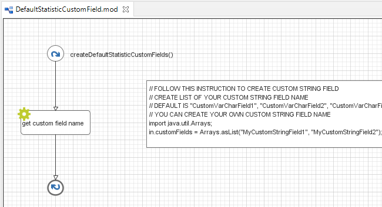

.. _customization-default-custom-field:

Default Statistic Custom Field
==============================

.. _customization-default-custom-field-introduction:

Introduction
------------

In the Portal statistics, when a user adds a new chart, the statistic filter will
display the five default custom string fields ``CustomVarCharField1`` to
``CustomVarCharField5``. You can customize them with your custom
string fields.

|default-custom-field|

.. _customization-default-custom-field-customization:

Customization
-------------

Create an override that overrides subprocess
``createDefaultStatisticCustomField()`` in ``DefaultStatisticCustomField.p.json``
process in PortalKit. This subprocess return a list of custom string fields.
Follow instruction to create default custom fields.

|custom-field|

.. |default-custom-field| image:: ../../screenshots/statistic/chart-creation-page.png