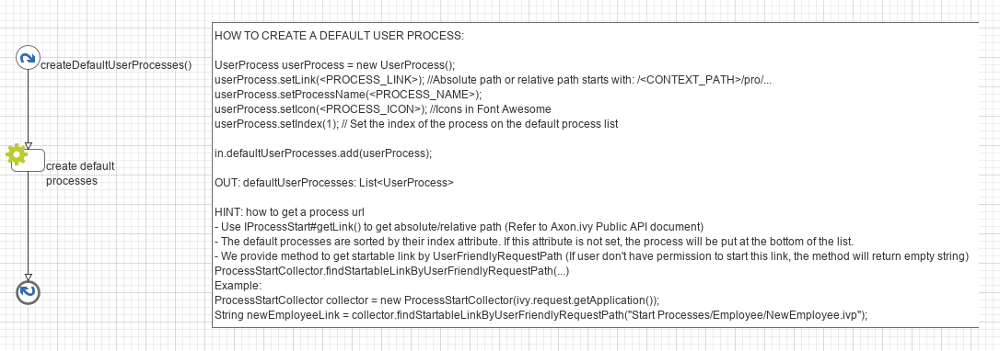

.. _customization-default-user-process:

Default user process
====================

.. _customization-default-user-process-introduction:

Introduction
------------

In Portal homepage, the ``Process widget`` displays default processes,
you can customize them so that project important starts are displayed.

.. _customization-default-user-process-customization:

Customization
-------------

Create an override which overrides sub process
``createDefaultUserProcess()`` in PortalKit. This sub process return a
list of user processes. Follow instruction to create default processes.

|default-user-processes|

.. tip::
   - We provide the method to generate link from UserFriendlyRequestPath
     in  ``ProcessStartAPI``  class: ``findStartableLinkByUserFriendlyRequestPath(IApplication application, String requestPath)`` . This method
     will return startable link if user has permission to start the process, otherwise return emtpy string.

   - To display process name with multilingual, define a **CMS** and set it for **UserProcess#setProcessName**

   - For external link, please mark it as external link by set true to method **UserProcess#setExternalLink**

