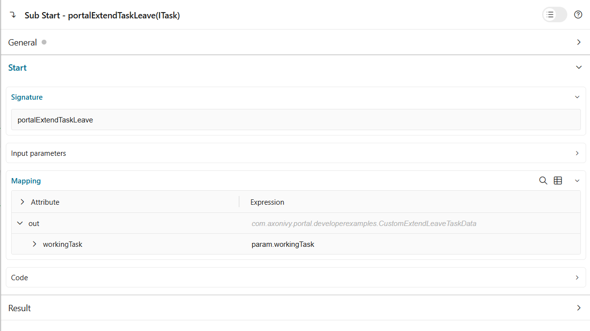

.. _customization-execute-customized-logic-on-leaving-task:

Execute Customized Logic on Leaving Task
=========================================

While working on a task, a warning dialog appears if the user attempts to leave the task with unsaved changes. The dialog shows options to either **Leave** the task or **Reserve** the task.
You can add your customized logic to be executed when the user chooses to leave or reserve the task. The logic runs before the task is actually left or reserved.
This feature enables you to perform additional operations such as:

   - Logging task leave/reserve actions
   - Updating custom fields

Extend logic on leaving a task
------------------------------

Create a callable subprocess with

**Signature**: portalExtendTaskLeave

+--------------------+-----------------------------------------------------------+---------------+
| Name               | Type                                                      | Note          |
+====================+===========================================================+===============+
| **Parameter**                                                                                  |
+--------------------+-----------------------------------------------------------+---------------+
| workingTask        | ch.ivyteam.ivy.workflow.ITask                             |               |
+--------------------+-----------------------------------------------------------+---------------+

|portal-extend-task-leave|

The parameter of the callable subprocess is the current ``workingTask`` task.
Implement your custom logic in this callable subprocess.

Extend logic on reserving a task
---------------------------------

Create a callable subprocess with

**Signature**: portalExtendTaskReserve

+--------------------+-----------------------------------------------------------+---------------+
| Name               | Type                                                      | Note          |
+====================+===========================================================+===============+
| **Parameter**                                                                                  |
+--------------------+-----------------------------------------------------------+---------------+
| workingTask        | ch.ivyteam.ivy.workflow.ITask                             |               |
+--------------------+-----------------------------------------------------------+---------------+

|portal-extend-task-reserve|

The parameter of the callable subprocess is the current ``workingTask`` task.
Implement your custom logic in this callable subprocess.

There is an example implementation in the project ``portal-developer-examples`` under the process names
``CustomExtendTaskLeave``. 
There are 2 simple callable subprocesses:
   - The first one is for extending logic on leaving task, it checks the category of the task, if it is ``CreateInvestment``, it creates a note who has left the task.
   - The second one is for extending logic on reserving task, it checks the category of the task, if it is ``CreateInvestment``, it updates a custom field ``reserveTask`` to count how many times the task has been reserved.
To see how it works, run the process ``portal-developer-examples: createStockInvestment``, start the created task ``Create stock investment``, then leave the task with unsaved changes and click on leave or reserve button.

.. hint::

   - If there are many customized callable subprocesses defined for the same signature, they will be executed in the order.
   - If you want to execute customized logic only for specific tasks, you must check the task properties such as category, name, id, etc. in the callable subprocess implementation.

.. important::

   - You have to handle exceptions in the callable subprocess implementation to avoid breaking the leave or reserve action.

.. |portal-extend-task-reserve| image:: images/execute-customized-logic-on-leaving-task/portal-extend-task-reserve.png