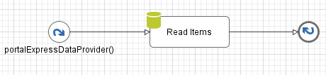
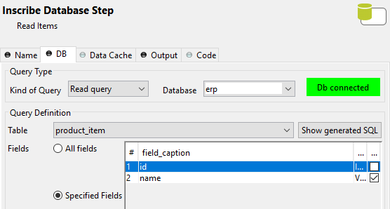

.. _customization-express-external-data-provider:

Express External Data Provider
==============================

.. _customization-express-external-data-provider-introduction:

Introduction
------------

In Portal Express, we can provide the external data for checkbox values
when creating form, like a product catalog that can be maintained in the
background; the process calls this data provider.

.. _customization-express-external-data-provider-customization:

Customization
-------------

#. Create a callable subprocess that has the signature
   "portalExpressDataProvider"

   |callable-sub-process|

   The subprocess returns a list of strings:

   |callable-sub-process-result|

   Below is an example that uses the Database element to read the data from a
   database as a data provider.

   In the Database tab, set these fields:

   -  Kind of Query: choose "Read query"
   -  Database: select the database name
   -  Table: select the table name
   -  Fields: choose "Specified Fields" and tick one column that is used as the
      data provider.

   |database|

   In the Output tab, set the value for the output variable:

   ``out.items = recordset.getColumn("[name of the column]")``

   |database-output|

#. Create new Express Workflow

   In the form creation, choose Checkbox and select the data provider in the
   dropdown list. Then set the label of the check box and press the
   :guilabel:`Create` button. You can drag and drop the checkbox element to its
   intended location and preview the values of the checkbox.

   Note: The first item in the dropdown list is "Special static data provider",
   it means that the user will provide the values of the checkbox manually.

   |express-workflow|

.. |callable-sub-process-result| image:: images/express-external-data-provider/callable-sub-process-result.png

.. |database-output| image:: images/express-external-data-provider/database-output.png
.. |express-workflow| image:: ../../screenshots/express/express-workflow.png

