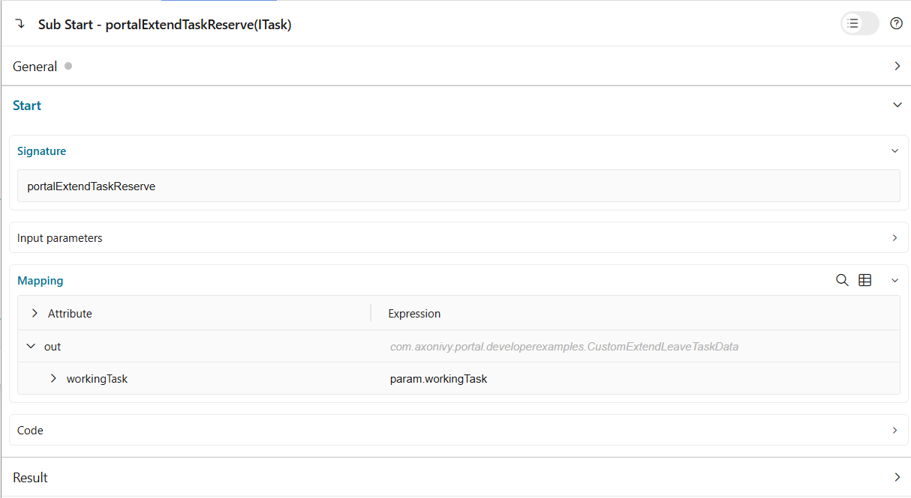

.. _customization-extend-task-leave-and-reserve-actions:

Extend Task Leave and Reserve Actions
========================================

Introduction
------------

Portal provides a feature to run your own logic before a user leaves or reserves a task. This allows developers to inject their own business rules to perform additional operations.

This custom logic runs just before the leave or reserve action is completed. The primary trigger points are:
   
   - Clicking **leave** or **reserve** in the unsaved changes warning dialog when leaving a task.
   - Clicking the **reserve** button in the task action menu.

Implementation
--------------

1. To add your logic before task **leave** action, you create a callable subprocess with

   **Signature**: portalExtendTaskLeave

   +--------------------+-----------------------------------------------------------+---------------+
   | Name               | Type                                                      | Note          |
   +====================+===========================================================+===============+
   | **Parameter**                                                                                  |
   +--------------------+-----------------------------------------------------------+---------------+
   | workingTask        | ch.ivyteam.ivy.workflow.ITask                             |               |
   +--------------------+-----------------------------------------------------------+---------------+

   |portal-extend-task-leave|

   The parameter of the callable subprocess is the current ``workingTask``.
   Implement your custom logic in this callable subprocess.

2. To add your logic before task **reserve** action, you create a callable subprocess with

   **Signature**: portalExtendTaskReserve

   +--------------------+-----------------------------------------------------------+---------------+
   | Name               | Type                                                      | Note          |
   +====================+===========================================================+===============+
   | **Parameter**                                                                                  |
   +--------------------+-----------------------------------------------------------+---------------+
   | workingTask        | ch.ivyteam.ivy.workflow.ITask                             |               |
   +--------------------+-----------------------------------------------------------+---------------+

   |portal-extend-task-reserve|

   The parameter of the callable subprocess is the current ``workingTask``.
   Implement your custom logic in this callable subprocess.

Example
-------

There is an example implementation in the project ``portal-developer-examples`` under the process name
``CustomExtendTaskLeave``.

There are 2 simple callable subprocesses:

   - The first one is for extending logic on leaving a task. It checks the category of the task, if it is ``OtherLeave/SickLeave/Long``, it creates a note indicating who has left the task.
   - The second one is for extending logic on reserving a task. It checks the category of the task, if it is ``OtherLeave/SickLeave/Long``, it updates a custom field ``reserveTask`` to count how many times the task has been reserved.

To see how it works, run the process ``portal-developer-examples: Start Processes/CreateTestData:CategoriedLeaveRequest()``, start the created task ``Sick Leave Request``, then leave the task with unsaved changes and click on the **leave** or **reserve** button.

.. hint::

   - If there are many customized callable subprocesses defined for the same signature, they will be executed in order.
   - If you want to execute customized logic only for specific tasks, you must check the task properties such as category, name, or id in the callable subprocess implementation.

.. |portal-extend-task-leave| image:: images/extending-task-leave-and-reserve-actions/portal-extend-task-leave.png
