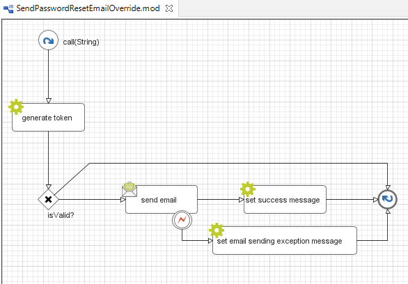
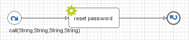

.. _customization-forgot-password:

Forgot Password
===============

.. _customization-case-widget-how-to-override-token-generation-and-email-sending:

How To Override Token Generation And Email Sending
--------------------------------------------------

Create a new callable process to override ``SendPasswordResetEmail``.
In project ``portal-developer-examples``, you find the following example:

|token-generation-and-email-sending|

.. _customization-case-widget-how-to-override-password-resetting:

How To Override Password Resetting
----------------------------------

Create a new callable process to override ``ResetPassword``.
In project ``portal-developer-examples``, you find the following example:

|password-resetting|

