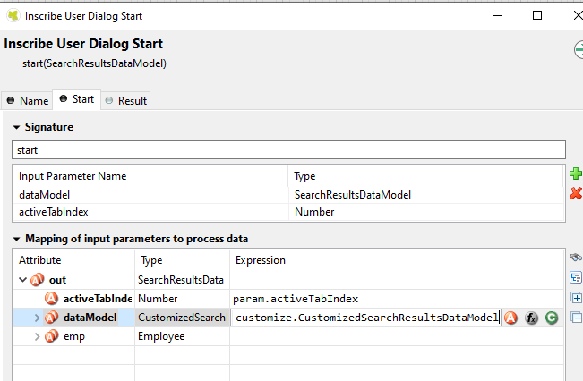

.. _customization-global-search-result:

Global Search Result
====================

Global Search Result
--------------------

|global-search-result|

Follow these steps to customize the global search page:

#. Introduce an Axon Ivy project which has ``PortalTemplate`` as a
   required library.

#. Copy the ``PortalStart`` process from ``PortalTemplate`` to your
   project. This process is new home page and administrator should
   register this link by global

#. Refer to :ref:`Customize Portal home<customization-portal-home>` to set new home
   page.

#. Create the customized search data model extends
   ``SearchResultsDataModel``, and override the ``search`` method to
   filter your objects.

   .. note:: It is recommended that lazy loading or pagination should be
    applied for custom tabs to have a good performance.

#. Use :dev-url:`Axon Ivy HtmlOverride wizard </doc/9.3.5/designer-guide/how-to/overrides.html?#override-new-wizard>` to override ``SearchResults`` HTML dialog.

   In dataclass, change the ``dataModel`` to the above one, and in logic, also cast it.

   |customized-data-model-cast|

#. Define the ``custom-search`` section to add your customized tabs:

   .. code-block:: html
   
    <ui:composition template="/layouts/SearchResultsTemplate.xhtml">
        <ui:define name="custom-search">
        <p:tab title="Employees">
            <p:dataTable id="employee-table" value="#{data.dataModel.employees}" var="emp" sortBy="#{emp.firstName}">
            <p:column headerText="First Name" sortBy="#{emp.firstName}" filterBy="#{emp.firstName}">
                <h:outputText value="#{emp.firstName}" />
            </p:column>
            <p:column headerText="Last Name" sortBy="#{emp.lastName}" filterBy="#{emp.lastName}">
                <h:outputText value="#{emp.lastName}" />
            </p:column>
            <p:column headerText="Country" sortBy="#{emp.country}" filterBy="#{emp.country}">
                <h:outputText value="#{emp.country}" />
            </p:column>
            </p:dataTable>
        </p:tab>
        </ui:define>

        <ui:define name="css">
        <h:outputStylesheet library="css" name="examples.css" />
        </ui:define>
    </ui:composition>
  
   ..
   

#. Override the ``OpenPortalSearch`` callable process and change the
   HTML dialog to your customized one.

   .. tip:: Refer to the example in the portal-developer-examples project:

      - CustomizedSearchResultsDataModel.java
      - CustomizedSearchResults HTML dialog
      - OpenPortalSearchOverride callable process

.. |global-search-result| image:: ../../screenshots/search/global-search-result.png

