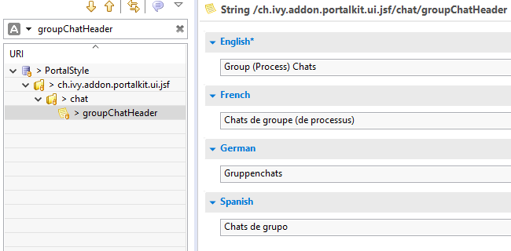
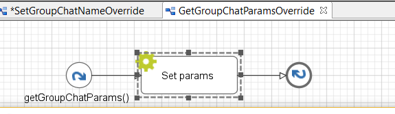
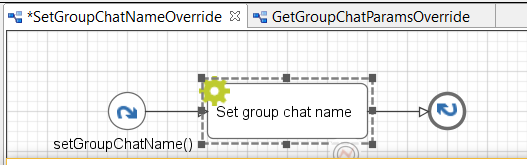

.. _customization-group-chat:

Group Chat Customization
========================

.. _customization-group-chat-introduction:

Introduction
------------

The group chat feature allows you to customize the Group chat header, the Group
chat name, and the configured role list for each process.

.. _customization-group-chat-customize-group-chat-header:

Customize Group Chat Header
---------------------------

Override group chat header using the ``groupChatHeader`` CMS entry.

|customize-group-chat-header|

.. _customization-group-chat-customize-group-chat-name:

Customize Group Chat Name
-------------------------

#. Create an Axon Ivy project which has ``portal`` as a required library.

#. Override process ``SetGroupChatName``, then, Follow these steps:

   |customize-group-chat-name|

   Open ``Set group chat name`` script and change the variable ``name`` to *your group chat name*, for example:

   .. code-block:: java

        out.name = ivy.cms.co("/ch.ivy.addon.portalkit.ui.jsf/common/case") + "-{caseId} {caseName}" + " {groupChatCreator}";
   ..

#. If you have parameters which are not available in GroupChat.java,
   override the ``GetGroupChatParams`` callable process and follow these steps:

   |customize-group-chat-name-params|

   Open the ``Set param`` script and add your parameters to the params variable, for example:
   
   .. code-block:: java
   
        out.params.put("groupChatCreator", ivy.session.getSessionUser().getDisplayName());
   ..

.. _customization-group-chat-customize-predefined-roles:

Customize Predefined Responsible Roles
--------------------------------------

Override the ``AssignRolesGroupChat`` process to customize predefined
responsible roles, follow its note to configure.

|customize-predefined-roles|

.. |customize-predefined-roles| image:: images/group-chat/customize-predefined-roles.png