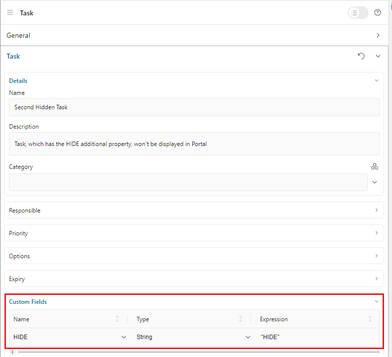
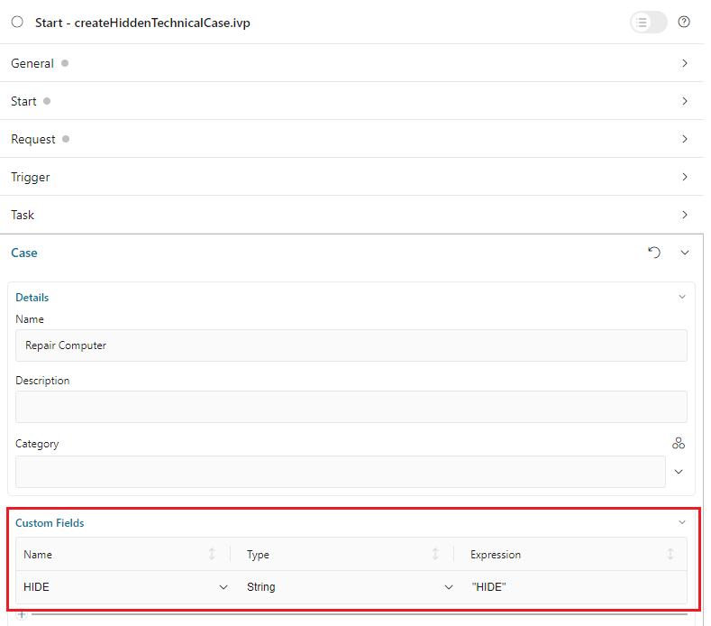

.. _customization-hideTechnicalStuffs:

Hide Technical Stuff
====================

Depending on the value of Ivy variable ``PortalHiddenTaskCaseExcluded``, hidden
tasks and cases are shown (``FALSE``) or hidden (``TRUE``). Default value is ``TRUE``.

Hide Technical Roles
--------------------

A technical role is not displayed anywhere (e.g. in delegation or absence
management). ``AXONIVY_PORTAL_ADMIN`` is a technical role by default.

To mark a role as a technical role, set the ``HIDE`` property with any
value on the role.

.. admonition:: Use the utility method of Portal
      
      - Set property:
         ch.ivy.addon.portalkit.publicapi.RoleAPI.setProperty([YOUR_ROLE], ch.ivy.addon.portalkit.enums.AdditionalProperty.HIDE.toString(), "HIDE")
      - Reverse it:
         ch.ivy.addon.portalkit.publicapi.RoleAPI.removeProperty([YOUR_ROLE], ch.ivy.addon.portalkit.enums.AdditionalProperty.HIDE.toString())

Hide Technical Tasks
--------------------

A technical task is not displayed in any task lists of Portal.

To mark a task as a technical task, follow one of the two ways below:

.. admonition:: Use the utility methods of the Portal TaskAPI

      If your project depends on Portal

      - Set task as technical:
         ch.ivy.addon.portalkit.publicapi.TaskAPI.setHidePropertyToHideInPortal(ITask)
      - Reverse it:
         ch.ivy.addon.portalkit.publicapi.TaskAPI.removeHidePropertyToDisplayInPortal(ITask)

.. admonition:: Use the customfields of the ITask API

      Open the task editor, expand the ``Custom Fields`` section

      - Set task as technical:
         Define a ``STRING`` field with the name ``HIDE``. Set value to ``HIDE``
      - Reverse it:
         Remove the custom ``STRING`` field named ``HIDE``

      |hide-technical-task|

Hide Technical Cases
--------------------

A technical case is not displayed in any case lists of Portal.

Tasks belonging to a technical case are considered technical tasks and should be
hidden as well.

To mark a case as a technical case, follow one of the two ways below:

.. admonition:: Use the utility methods of the Portal CaseAPI

      If your project depends on Portal

      - Set case as technical:
         ch.ivy.addon.portalkit.publicapi.CaseAPI.setHidePropertyToHideInPortal(ICase)
      - Reverse it:
         ch.ivy.addon.portalkit.publicapi.CaseAPI.removeHidePropertyToDisplayInPortal(ICase)

.. admonition:: Use the customfields of the ITask API

      Open the case editor, expand the ``Custom Fields`` section

      - Set case as technical:
         Define a ``STRING`` field with the name ``HIDE``. Set value to ``HIDE``
      - Reverse it:
         Remove the custom ``STRING`` field named ``HIDE``

      |hide-technical-case|

