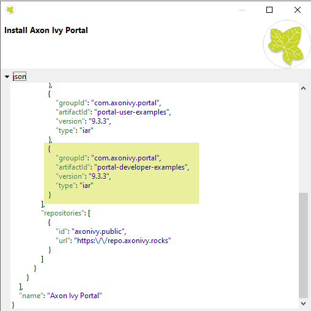

Customization
*************

Portal provides an easy way to customize features, user interface, user
experiences... Besides the documentation, you could refer to project ``PortalExamples`` for customization examples.
You could find project ``PortalExamples`` in engine demo mode or import ``Ivy Projects`` in designer.

.. note::
	If you copy ``PortalStart.mod`` to your project for customization, set default pages to your project, follow this guide to customize standard processes:
	:dev-url:`Standard Processes </doc/8.0.28/engine-guide/administration/standard-processes.html>`

.. figure:: images/customization/engine-demo-mode.png

.. toctree::
   :maxdepth: 1

   build-your-own-portal
   portal-style-customization-logos-colors-date-patterns
   login
   menu
   portal-home
   task-widget
   task-item-details
   case-widget
   case-item-details
   default-user-process
   default-chart
   default-statistic-custom-field
   default-chart-colors
   change-password-process
   logout-process
   express-end-page
   express-external-data-provider
   navigate-back
   hide-technical-stuffs
   additional-case-details-page
   global-search-result
   document-processes
   responsive-css
   group-chat-customization
   change-group-id
   user-with-environment-info
   page-header-footer
