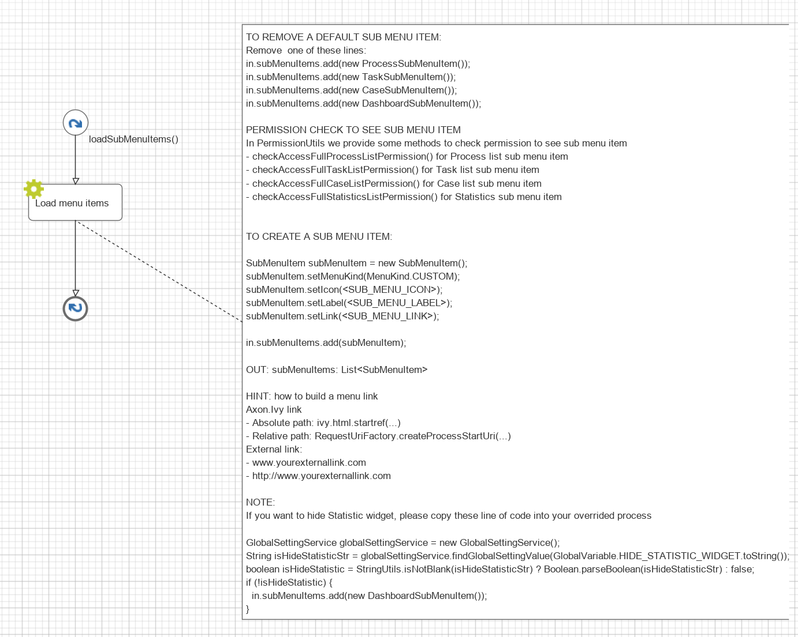

.. _customization-menu:

Menu And Default Homepage In User Profile
=========================================

.. _customization-menu-introduction:

Introduction
------------

By default, the Portal main menu has four items: Processes, Tasks, Cases and
Statistics. You can remove these items or add your own items. This will affect
the homepage selection in the user profile. There, the menu items which are not
external links are shown in the homepage selection.

|default-menu-items|

.. _customization-menu-customization:

Customization
-------------

Create a callable subprocess with signature ``loadSubMenuItems()`` in your
project. Make sure that this signature is unique in your application and follow
the hints below.

|load-sub-menu-items-process|

You can hide the Statistics widget in :ref:`Admin settings
<settings-admin-settings>`. Therefore, if you want to hide the Statistics widget
in your overridden process, please take a look at the NOTE section of
``LoadSubMenuItems`` in ``portal``.

.. tip::
    | For the Label of a SubMenuItem, if you want it to show correctly in several 
    | languages, you need to create a CMS entry and use the ``ApplicationMultiLanguageAPI.getCmsValueByUserLocale`` method.
    | E.g: ``subMenuItem.setLabel(ApplicationMultiLanguageAPI.getCmsValueByUserLocale<CMS_URI>));``

.. |default-menu-items| image:: ../../screenshots/dashboard/expanded-left-menu.png
