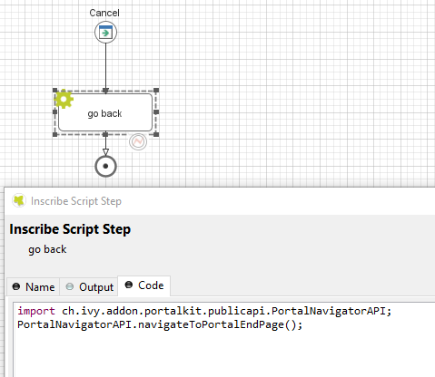

.. _customization-navigateback:

Navigate Back
=============

.. _customization-navigateback.introduction:

When a task finishes, the Portal navigates back to the previous page. For
example, if a task is started from the homepage, it redirects to the homepage.
If a task is started from a task list, it redirects to that task list
after the task is finished.

If your project has a navigation button that does not finish a task, e.g Cancel,
you have to implement the following:

If using an IFrame:

-  Previous page: call ``navigateToPortalEndPage()`` from class ``PortalNavigatorInFrameAPI``.
-  A specific URL: call ``navigateToUrl(String url)`` from class ``PortalNavigatorInFrameAPI``.

Without IFrame:

-  Home page: call ``navigateToPortalHome()`` from class ``PortalNavigatorAPI``.
-  Previous page: call ``navigateToPortalEndPage()`` from class ``PortalNavigatorAPI``.

   |navigate-back|

