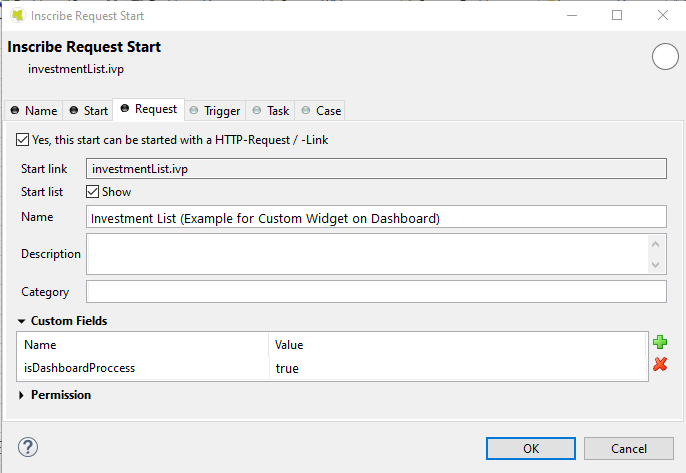
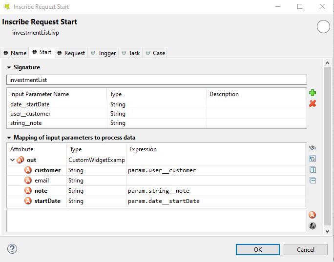

.. _customization-new-dashboard-custom-widget:

Configure custom widget
========================

Define an Ivy process for the custom widget
-------------------------------------------

The custom widget can display a predefined Ivy process inside it.
This solution allows users to work directly on Portal Dashboard.

First, the developer needs to create a specific process for Portal Dashboard:

   Set value for process' custom field ``isDashboardProcess`` to true.

   |dashboard-custom-field|

   Parameters for the process must be a String variable and named in a special format: ``type__name``

   |dashboard-custom-params|

   ``type``: type of parameter. There are four supported types

      ``user``: username of an Ivy user.

      ``string``: type java.lang.String.

      ``boolean``: type java.lang.Boolean.

      ``date``: type java.util.Date.

   ``name``: name of the field that you want to show on the configuration dialog of the custom widget.

   The reason to define in the above format is to allow end-user to send parameters to the Ivy process in the proper way.

   For example, if you define parameter ``user__customer``, Portal will display a dropdown named "customer" 
   to select an Ivy user in the system in the configuration dialog of the custom widget.

   This is how the configuration dialog for the custom widget for the above process looks like.

Define a custom widget using JSON
---------------------------------

Custom widget of Portal dashboard is a widget that allows users to interact
with an external webpage or an Ivy process on the dashboard through iframes.

Below is a standard JSON definition of the custom widget in the Portal dashboard.

   .. code-block:: html

      {
         "type": "custom",
         "id": "custom-widget",
         "name": "Custom Widget",
         "layout": {
            "x": 10, "y": 0, "w": 2, "h": 4
         },
         "data": {
            ...
         }
      }
   ..

the basic structure of JSON of custom widget

   ``type``: type of widget. Use ``custom`` to mark that this widget is a custom widget

   ``id``: ID of the widget

   ``name``: Name of the widget on UI

   ``data``: data for customization. Please refer to below sections to understand how to use this field.

Define External webpage
-----------------------

The custom widget can allow users to embed an external webpage into Portal dashboard.
This feature is extremely useful for a company using another system besides Axon Ivy.
Now users can interact with multiple systems on the Portal dashboard.

JSON structure

   .. code-block:: html

      {
         "type": "custom",
         "id": "custom-widget",
         "name": "Custom Widget",
         "layout": {
            "x": 10, "y": 0, "w": 2, "h": 4
         },
         "data": {
            "url" : "https://www.axonivy.com/"
         }
      }
   ..

Attribute explanation

   ``url``: the URL of the external webpage you want to show.

.. warning::
	Some external website restricted to load in iFrame. So please be aware of external website security policy when you use it in custom widget.

Define Ivy process
------------------

Developer can predefine a custom widget by declaring it in JSON file:

JSON structure

   .. code-block:: html

      {
         "type": "custom",
         "id": "custom-widget",
         "name": "Custom Widget",
         "layout": {
            "x": 10, "y": 0, "w": 12, "h": 6
         },
         "data" : {
           "processStart": "Start Processes/DashboardCustomWidgetExample/investmentList.ivp",
           "params": [
               {
                  "type": "user",
                  "name": "customer",
                  "value": "demo"
               },
               {
                  "type": "date",
                  "name": "startDate",
                  "value": "11/19/2021"
               },
               {
                  "type": "string",
                  "name": "note",
                  "value": "a short note for demo process"
               }
            ]
        }
      }
   ..

Before you continue, please read the section **Define an Ivy process for custom widget** above to understand the relation between name and type.

Attributes explanation

   ``processStart``: relative link to the ivy process which will be displayed in custom widget

   ``params``: parameters for ivy process above, each parameter can be defined as follows:

      - name of the parameter for Ivy process described in attribute ``processStart``.

      - value: predefined value for the parameter.

      - type: desire type for the parameter to be shown on configuration dialog of Custom widget. There are four types: ``string``, ``user``, ``date``, ``boolean``.

         - type ``string``: Mark that the parameter is a normal String. In the configuration dialog, the user can edit this parameter in an input text field.

         .. code-block:: html

            {
               ...

               "params": [
                     {
                        "type": "string",
                        "name": "note",
                        "value": "a short note for demo process"
                     }
                  ]
            }
         ..

         - type ``user``: Mark that the parameter is the username of an Ivy user.
           In the configuration dialog, the user can edit this parameter by choosing a user from the dropdown to select user.
           This type only accepts the username of an Ivy user as a value.

         .. code-block:: html

            {
               ...

               "params": [
                     {
                        "type": "user",
                        "name": "customer",
                        "value": "demo"
                     }
                  ]
            }
         ..

         - type ``date``: Mark that the parameter is a date.
           In the configuration dialog, the user can edit this parameter with a date picker.
           This type only accepts date formats dd.MM.yyyy and MM/dd/yyyy.

         .. code-block:: html

            {
               ...

               "params": [
                     {
                        "type": "date",
                        "name": "startDate",
                        "value": "11/19/2021"
                     }
                  ]
            }
         ..

         - type ``boolean``: Mark that the parameter is a boolean variable.
           On configuration dialog, this field will be rendered as radio buttons, user can choose between true or false by click the radio buttons.
           This type only accept two values ``true`` or ``false``.

Please refer to JSON file variables.Portal.Dashboard.json and process ``DashboardCustomWidgetExample/investmentList.ivp``
in project ``portal-developer-examples`` for more details about how to define Ivy process for the custom widget.

