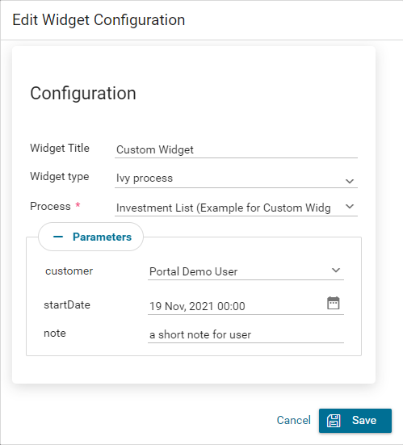

.. _customization-new-dashboard-custom-widget:

Configure custom widget
========================

Define an Ivy process for custom widget
---------------------------------------

Custom widget can display a predefined Ivy process inside it.
This solution allow user to work directly on Portal Dashboard.

First, developer need to create a specific process for Portal Dashboard:

   Set value for process' custom field ``isDashboardProccess`` to true.

   |dashboard-custom-field|

   Parameters for process must be a String variable and naming in special format: ``type__name``

   |dashboard-custom-params|

   ``type``: type of parameter. There are four supported types

      ``user``: username of an Ivy user.

      ``string``: type java.lang.String.

      ``boolean``: type java.lang.Boolean.

      ``date``: type java.util.Date.

   ``name``: name of the field that you want to show it on configuration dialog of Custom widget.

   The reason to define in above format is to allow end user send parameter to the Ivy process in proper way.

   For example, if you define parameter ``user__customer``, Portal will display an dropdown named "customer" 
   to select an Ivy user in the system in the configuration dialog of Custom widget.

   This is how configuration dialog for custom widget for above process look like.

   |dashboard-custom-widget-configuration|

Define a custom widget using JSON
---------------------------------

Custom widget of Portal dashboard is a widget that allow user interact
with an external webpage or an Ivy process on the dashboard through iframes.

Below is a standard JSON definition of the custom widget in the Portal dashboard.

   .. code-block:: html

      {
         "type": "custom",
         "id": "custom-widget",
         "name": "Custom Widget",
         "layout": {
            "x": 10, "y": 0, "w": 2, "h": 4
         },
         "data": {
            ...
         }
      }
   ..

the basic structure of JSON of custom widget

   ``type``: type of widget. Use ``case`` to mark that this widget is a case widget

   ``id``: ID of the widget

   ``name``: Name of the widget on UI

   ``data``: data for customization. Please refer to below sections to understand how to use this field.

Define External webpage
-----------------------

Custom widget can allow user embedded an external webpage into Portal dashboard.
This feature is extremely useful for company using other system beside Axon Ivy.
Now user can interact with multiple systems on Portal dashboard.

JSON structure

   .. code-block:: html

      {
         "type": "custom",
         "id": "custom-widget",
         "name": "Custom Widget",
         "layout": {
            "x": 10, "y": 0, "w": 2, "h": 4
         },
         "data": {
            "url" : "www.axonivy.com"
         }
      }
   ..

Attribute explanation

   ``url``: the URL of external webpage you want to show.

Define Ivy process
------------------

Developer can predifine a custom widget by declare it in JSON file:

JSON structure

   .. code-block:: html

      {
         "type": "custom",
         "id": "custom-widget",
         "name": "Custom Widget",
         "layout": {
            "x": 10, "y": 0, "w": 12, "h": 4
         },
         "data" : {
           "processStart": "Start Processes/DashboardCustomWidgetExample/investmentList.ivp",
           "params": [
               {
                  "type": "user",
                  "name": "customer",
                  "value": "demo"
               },
               {
                  "type": "date",
                  "name": "startDate",
                  "value": "11/19/2021"
               },
               {
                  "type": "string",
                  "name": "note",
                  "value": "a short note for demo process"
               }
            ]
        }
      }
   ..

Before you continue, please read section **Define an Ivy process for custom widget** above to understand relation between name and type.

Attributes explanation

   ``processStart``: relative link to the ivy process which will be displayed in custom widget

   ``params``: paramters for ivy process above, each parameter can be defined as follows:

      - name of the parameter for Ivy process described in attribute ``processStart``.

      - value: predefined value for the parameter.

      - type: desire type for the parameter to be show on configuration dialog of Custom widget.
      There are four types ``string``, ``user``, ``date``, ``boolean``.

         - type ``string``: Mark that the parameter is a normal String.
         On configuration dialog, user can edit this paramter in a input text field.

         .. code-block:: html

            {
               ...

               "params": [
                     {
                        "type": "string",
                        "name": "note",
                        "value": "a short note for demo process"
                     }
                  ]
            }
         ..

         - type ``user``: Mark that the parameter is username of an Ivy user.
         On configuration dialog, user can edit this paramter by choose user from dropdown to select user.
         This type only accept username of an Ivy user as value.

         .. code-block:: html

            {
               ...

               "params": [
                     {
                        "type": "user",
                        "name": "customer",
                        "value": "demo"
                     }
                  ]
            }
         ..

         - type ``date``: Mark that the parameter is a date.
         On configuration dialog, user can edit this paramter with a date picker.
         This type only accept date formats ``dd.MM.yyyy`` and ``MM/dd/yyyy``.

         .. code-block:: html

            {
               ...

               "params": [
                     {
                        "type": "date",
                        "name": "startDate",
                        "value": "11/19/2021"
                     }
                  ]
            }
         ..

         - type ``boolean``: Mark that the parameter is a boolean variable.
         On configuration dialog, this field will be rendered as a checkbox, user can choose between true or false by check the checkbox.
         This type only accept two values ``true`` or ``false``.

Please refer to JSON file ``variables.Portal.Dashboard.json`` and process ``DashboardCustomWidgetExample\investmentList.ivp``
in porject ``portal-developer-examples`` for more details about how to define Ivy process for custom widget.

.. |dashboard-custom-field| image:: images/new-dashboard-custom-widget/process-custom-field.png
.. |dashboard-custom-params| image:: images/new-dashboard-custom-widget/process-custom-params.png
