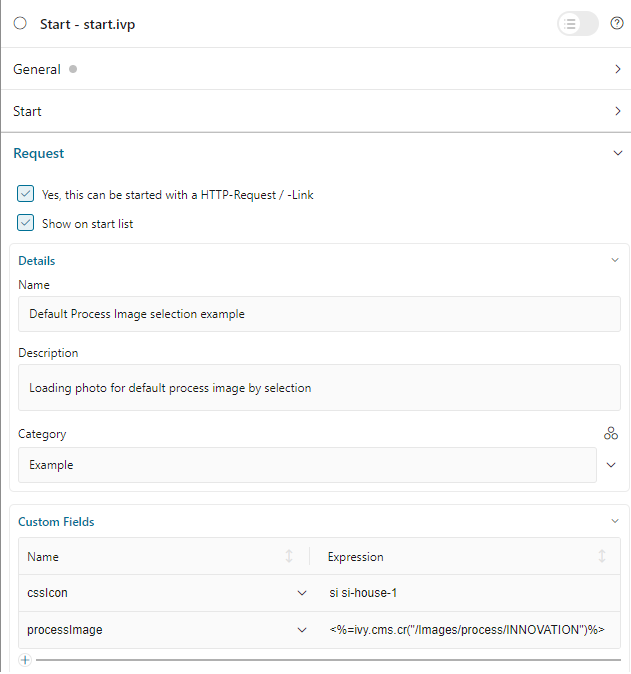

.. _customization-process-image:

Process Image
=============

.. _customization-process-image-introduction:

Introduction
------------

To customize the process image, follow this section to override the process
image of Portal.

.. _customization-process-image-customization:

Define Your Own Process Image
-----------------------------

#. Create a CMS object with type image in your project.

#. Define a custom field ``processImage`` in :guilabel:`Custom Fields` of the process start.
   The value of this custom field is the CMS object which you created above.

   |define-process-image|

#. Go to the full process list page and search your customized process.

   |image-process-list|

.. |image-process-list| image:: ../../screenshots/process-image/customization/image-process-list.png