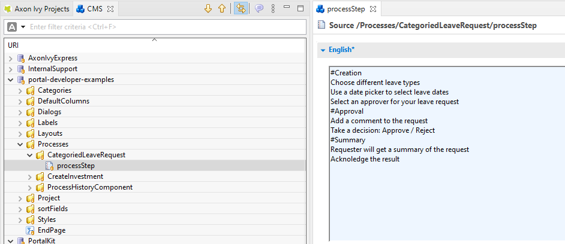

.. _customization-process-information:

Process Information
===================

.. _customization-process-information-introduction:

Introduction
------------

When you want to customize the Process information page, e.g. to add a case list
related to the selected process, follow this section to override the built-in
Portal Process information page.

.. _customization-process-information-customization:

Define Your Own Process Steps
-----------------------------

You can describe the details and steps of each process easily by defining
process steps for it.

#. Create a CMS object with type ``source`` in your project with this path:
   ``Processes\*Example*\processStep``

   ``*Example*`` is the process start signature name (Example.ivp)

#. Format of process step:

   -  Header lines for process step start with the ``#`` (hashtag) symbol.

   -  Other lines are descriptions of each step.

   |process-step|

   .. tip::
      You can define as many steps as you want. However, we recommend 
      defining at most three steps to have a better look and feel.

Customization
-------------

#. Override the HTML dialog ``ch.ivy.addon.portal.component.ProcessInformation``
   of ``portal``.

#. Copy content and logic of the HTML dialog ``ch.ivy.addon.portal.component.ProcessInformation``
   to your overridden HTML dialog.

#. Define your customization in the ``processInfo`` section. This section will be displayed
   below the process steps section.

   .. code-block:: html

      <ui:define name="processInfo">
        <!-- Put your customization here -->
      </ui:define>

   .. tip::
      Please refer to HTML dialog ``CustomizedProcessInformation``
      of ``portal-developer-examples`` for details.

