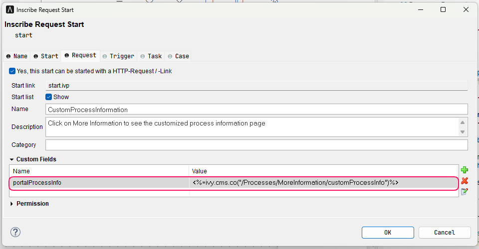

.. _customization-process-information:

Process Information
===================

.. _customization-process-information-page-introduction:

Introduction
------------

When you want to provide your Process information page, follow this section to define the built-in
Portal Process information page.

.. _customization-process-information-page-customization:

Define Your Own Process Information Page
----------------------------------------

#. Define a custom field ``portalProcessInfo`` in :guilabel:`Custom Fields` of the process start.

#. Define value for ``portalProcessInfo``

   |define-portal-process-info|

   .. tip::
      You can directly define value for ``portalProcessInfo`` in your process. However, we recommend
      define it in a CMS object.

