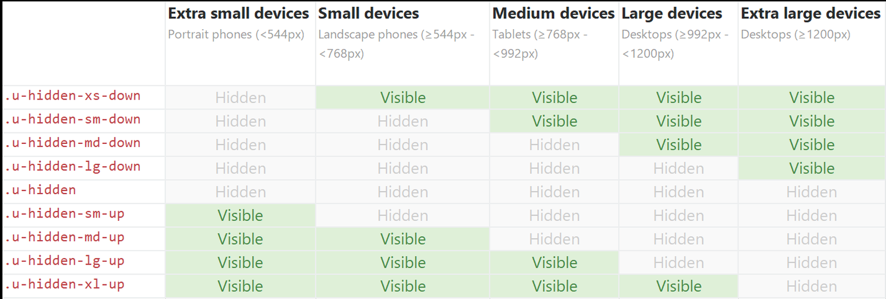

.. _customization-responsive-css:

Responsive CSS
==============

.. _customization-responsive-css-introduction:

Introduction
------------

Portal has some utility css classes to support show/hide elements on
different resolutions.

.. _customization-responsive-css-detail:

Bootstrap based responsive css
------------------------------

These classes was created base on bootstrap responsive.

|responsive-bootstrap-classes|

