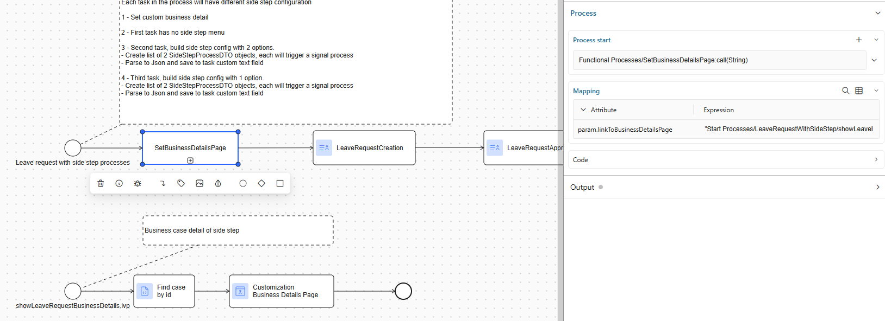

.. _side-step:

Integrate A Side Step Process
=============================

.. _side-step-introduction:

Introduction
------------

Side step processes let you attach one or more auxiliary workflow steps to an existing business process in Axon Ivy Portal without touching the core flow. 
At runtime Portal reads a JSON definition from the custom field ``sideStepTask`` (task level) or ``sideStepCase`` (case level), shows the available side steps in the task action menu and launches them either

- Synchronous - the main task pauses until the side step finishes, or

- Asynchronous - the main task continues while the side step runs in parallel.

Portal delivers the framework (public APIs, DTOs and UI hooks); you design and own the actual side step BPMN, dialogs, signals and business logic.
  
|side-step-menu|

Side step configuration dialog

|side-step-config|

Benefits and Outcomes
---------------------

- Low integration effort – add or remove auxiliary steps without modifying the main process model.

- Modular architecture – encourages clean separation between core and optional logic.

- Greater agility – quickly provide customer-specific extensions (e.g. extra approvals, data collection forms) with minimal risk.

- Parallel work – optional tasks can run concurrently, shortening throughput time.

- Custom UX – you control the side step dialog, result views and security (assignee or group callables).

How to Use and Set Up
---------------------

#. Model the side step process

   Create a process that performs the additional work (for example “Ask for more details”)
   and define a signal that starts this process (e.g. ``com:axonivy:portal:developerexample:sideStep:askMoreDetails`` ).
   
   |signal-process|

#. Define custom list of users and roles which the side step task can be assigned (optional)
   
   Create a process with no parameter which return 2 lists type ``ch.ivyteam.ivy.security.IRole`` with the following names

     - ``userRolesToDelegate`` : side step task can be assigned to all users who have role in this list
     - ``rolesToDelegate`` : side step task can be assigned to all children roles in this list

   If not defined, side step task can be assigned to all users and roles in the security context

#. Define configuration for side step by building a list of ``SideStepProcessDTO`` objects. 

    .. code-block:: javascript
        // Create process name in multiple languages by creating a map with key as language code and value as process name title
        Map processNames1 = new HashMap();
        processNames1.put("en", "Side step: Ask for more details");
        processNames1.put("de", "Seitenschritt: Fragen Sie nach weiteren Details");
        
        // First configuration option
        SideStepProcessDTO dto1 = SideStepProcessDTO.builder()
        .processNames(processNames1)
        .signal("com:axonivy:portal:developerexample:sideStep:askMoreDetails")
        .build();

        Map processNames2 = new HashMap();
        processNames2.put("en", "Side step: CEO Approval");
        processNames2.put("de", "Seitenschritt: Genehmigung durch den CEO");

        // Second configuration option
        SideStepProcessDTO dto2 = SideStepProcessDTO.builder()
        .processNames(processNames2)
        // Set signature name of the process which defines custom users and roles in the previous step
        .customSecurityMembersCallable("getCustomSecurityMemberForSideStep()")  // Optional
        .signal("com:axonivy:portal:developerexample:sideStep:CEOApproval")
        .build();

        // Define side step process dto list
        List processes = new List();
        processes.add(dto1);
        processes.add(dto2);        
    
    ..

#. Create a ``SideStepConfigurationDTO`` object of ``portal-components`` from this list created on the above code snippet. Convert it to JSON and write the value to a custom text field

    - For a single task: save to custom text field ``sideStepTask`` on that task.
    - For every task in a case: save to custom text field ``sideStepCase`` on that case.

    .. code-block:: javascript

      // Create a SideStepConfigurationDTO object of portal-components from this list created on the above code snippet
      // If the isParallelSideStep value is not defined, on the UI you will see a drop down to select
      Map customParallelTiles = new HashMap();
      customParallelTiles.put("en", "Custom parallel title");
      customParallelTiles.put("de", "Benutzerdefinierter Paralleltitel");

      Map customSwitchTiles = new HashMap();
      customSwitchTiles.put("en", "Custom switch title");
      customSwitchTiles.put("de", "Benutzerdefinierter Schaltertitel");

      SideStepConfigurationDTO sideStepConfigurationDto = SideStepConfigurationDTO.builder()
        .processes(processes)
        .isParallelSideStep(true)
        .customParallelSideStepTitles(customParallelTiles) // Optional
        .customSwitchSideStepTitles(customSwitchTiles) // Optional
        .build();

      // Convert SideStepConfigurationDTO to Json 
      String jsonValue = BusinessEntityConverter.entityToJsonValue(sideStepDto);

      // For side step task level
      task.customFields().textField(CustomFields.SIDE_STEPS_TASK).set(jsonValue);
      // Or for side step case level
      ivy.case.customFields().textField(CustomFields.SIDE_STEP_CASE).set(jsonValue);

    ..
      
    The generated Json value will have structure like this

    .. code-block:: javascript

      [
        "version": "12.0.0",
        "processes": [
          {
            "signal": "com:axonivy:portal:developerexample:sideStep:askMoreDetails",
            "processNames": {
              "de": "Seitenschritt: Fragen Sie nach weiteren Details",
              "en": "Side step: Ask for more details"
            }
          },
          {
            "signal": "com:axonivy:portal:developerexample:sideStep:CEOApproval",
            "processNames": {
              "de": "Seitenschritt: Genehmigung durch den CEO",
              "en": "Side step: CEO Approval"
            }
          },
          {
            "signal": "com:axonivy:portal:developerexample:sideStep:informCustomer",
            "processNames": {
              "de": "Nebenschritt: Kunden informieren",
              "en": "Side step: Inform customer"
            },
            "customSecurityMemberCallable": "getCustomSecurityMemberForSideStep()"
          }
        ],
        "customParallelSideStepTitles": {
          "de": "Benutzerdefinierter Paralleltitel",
          "en": "Custom parallel title"
        },
        "customSwitchSideStepTitles": {
          "de": "Benutzerdefinierter Schaltertitel",
          "en": "Custom switch title"        
        }
      ]
    ..

#. Build business case detail if needed

   Your process needs to call the subprocess ``SetBusinessDetailsPage`` of the ``portal-components``, with param ``linkToBusinessDetailsPage`` set to the link of the custom business detail page in your project.
   You can also do this by using ``BusinessDetailsAPI``.

   |business-case-detail-page|

#. Start of the main task

   When the user opens the task, Portal reads the field and populates the task action menu with the configured side steps.

#. User triggers a side step

   Portal sends signal to your selected process, with the JSON parameters contain your input information like task uuid, case uuid, your comment. 
   In case user select ``SWITCH`` step type (synchronously), Portal will park and set ``HIDE`` property to the original task until the side step completes. Otherwise the side step will run parallel with the original task.

#. Handle data in the process which was triggers by Portal

   Process developer gets data from signal as JSON string, parses it to class ``SideStepProcessParamDTO`` object of ``portal-components``. This object contains data send from Portal to use for the process.
      
    .. code-block:: javascript

      SideStepProcessParamDTO data = BusinessEntityConverter.jsonValueToEntity(signal.getSignalData() as String, SideStepProcessParamDTO.class) as SideStepProcessParamDTO;

    ..
      
#. Handle completion

   On finish your side step process must raise a done signal by calling API ``SideStepAPI.finishSideStep(String originalTaskUuid, boolean isParallelSideStep)``. 
   This API will reactivates and removes ``HIDE`` property from the parked task if the side step task is ``SWITCH`` step type (synchronously).

.. |signal-process| image:: images/side-step/signal-process.png
.. |side-step-sample-process| image:: images/side-step/side-step-sample-process.png

.. |side-step-menu| image:: ../../screenshots/side-step/side-step-menu.png
.. |side-step-config| image:: ../../screenshots/side-step/side-step-config.png

