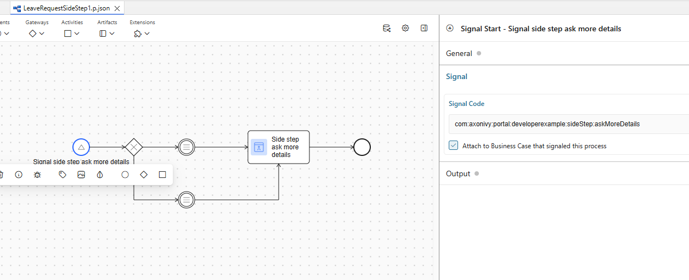
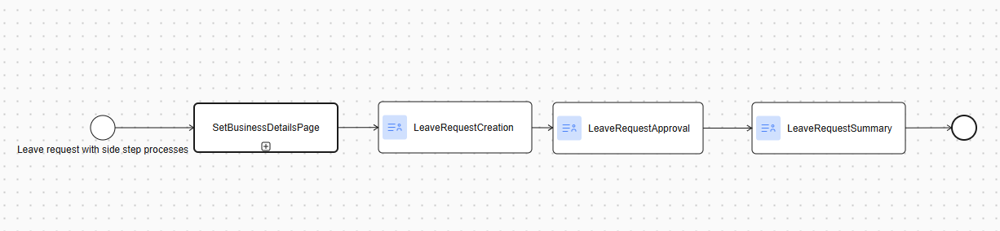

.. _side-step:

Integrate a side step process
=============================

.. _side-step-introduction:

Introduction
------------

Side-step processes let you attach one or more auxiliary workflow steps to an existing business process in Axon Ivy Portal without touching the core flow. 
At runtime the Portal reads a JSON definition from the custom field ``SIDE_STEPS_TASK`` (task scope) or ``SIDE_STEPS_PROCESS`` (case scope), shows the available side steps in the task action menu and launches them either

- ``Synchronously`` - the main task pauses until the side step finishes, or

- ``Asynchronously`` - the main task continues while the side step runs in parallel.

The Portal delivers the framework (public APIs, DTOs and UI hooks); you design and own the actual side-step BPMN, dialogs, signals and business logic.
  
|side-step-menu|

Side step configuration dialog

|side-step-config|

Benefits and Outcomes
---------------------

- Low integration effort – add or remove auxiliary steps without modifying the main process model.

- Modular architecture – encourages clean separation between core and optional logic.

- Greater agility – quickly provide customer-specific extensions (e.g. extra approvals, data collection forms) with minimal risk.

- Parallel work – optional tasks can run concurrently, shortening throughput time.

- Custom UX – you control the side-step dialogs, result views and security (assignee or group callables).

How to Use and Set Up
---------------------

#. Model the side-step process

    - Create a normal Ivy process that performs the additional work (for example “Add Comment”).
    - Define an Ivy signal that starts this process (e.g. ``ch:axonivy:portal:component:example:sideStep1:created`` ).
    |signal-process|

#. Prepare the JSON payload

    Use the SideStepDTO class from portal-component, then serialize to JSON:

    .. code-block:: javascript

      [
        "processes": [
        {
          "signal": "com:axonivy:portal:developerexample:sideStep1:created",
          "processName": "Side step 1: Add comment",
          "caseUuid": "7af73c93-3bb1-4a74-aa8f-366f33d8a489",
          "params": {
            "stepId": "1",
            "caseUuid": "7af73c93-3bb1-4a74-aa8f-366f33d8a489"
          }
        }
        ],
        "stepTypeParallelTitle": "This is customized parallel title",
        "stepTypeSwitchTitle": "This is customized switch title"
      ]
    ..

#. Write the value to a custom field

    - For a single task: ``SIDE_STEPS_TASK`` on that task.
    - For every task in a case: ``SIDE_STEPS_PROCESS`` on the case.

#. Start of the main task

    When the user opens the task, the Portal reads the field and populates the task action menu with the configured side steps.

#. User triggers a side step

    The Portal launches your signal, passes the JSON parameters and, if synchronous, parks the original task until the side step completes. A built-in dialog shows process, step type and optional assignee; you can replace or extend this dialog.

#. Handle completion

    On finish your side-step process must raise a done signal. The Portal reactivates the parked task, opens an optional Side-step result dialog that you can fully customize and writes any output data back to the task or case as needed.

#. Security and roles

    Use ``securityMembersCallable`` to limit who may start or see a particular side step, or leave it null for unrestricted access.

#. Best practices

    - Keep each side step atomic and reusable.

    - Use asynchronous mode for long-running or optional tasks to avoid blocking the main workflow.

    - Log both the start and completion events for auditability.

    - Version-control your JSON templates alongside the BPMN model.

.. |side-step-menu| image:: ../../screenshots/side-step/side-step-menu.png
.. |side-step-config| image:: ../../screenshots/side-step/side-step-config.png