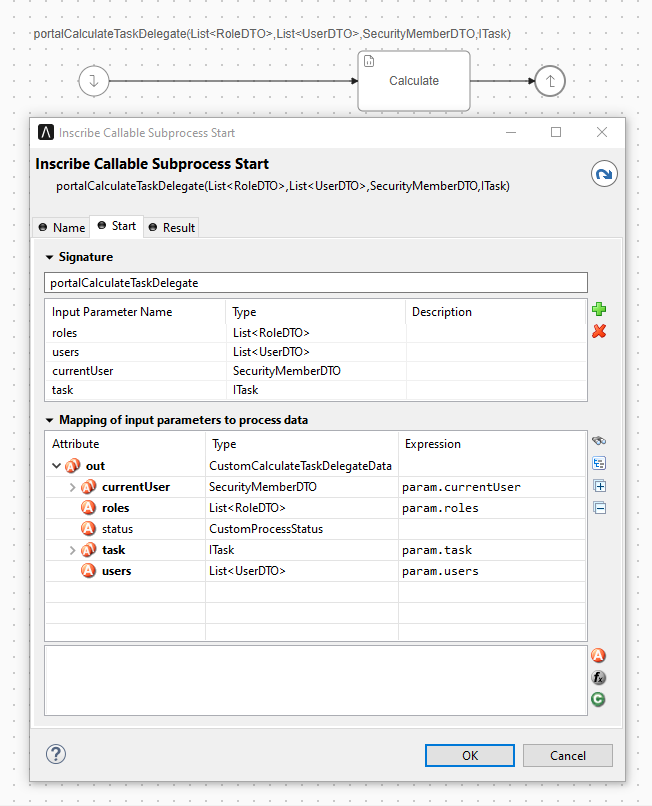

.. _customization-task-delegation:

Task Delegation
===============

To customize the list of users and roles a task can be delegated to,
create a callable subprocess with:

**Signature**: portalCalculateTaskDelegate

+--------------------+-----------------------------------------------------------+---------------+
| Name               | Type                                                      | Note          |
+====================+===========================================================+===============+
| **Parameter**                                                                                  |
+--------------------+-----------------------------------------------------------+---------------+
| roles              | java.util.List<com.axonivy.portal.components.dto.RoleDTO> |               |
+--------------------+-----------------------------------------------------------+---------------+
| users              | java.util.List<com.axonivy.portal.components.dto.UserDTO> |               |
+--------------------+-----------------------------------------------------------+---------------+
| currentUser        | com.axonivy.portal.components.dto.SecurityMemberDTO       |               |
+--------------------+-----------------------------------------------------------+---------------+
| task               | ch.ivyteam.ivy.workflow.ITask                             |               |
+--------------------+-----------------------------------------------------------+---------------+
| **Result**                                                                                     |
+--------------------+-----------------------------------------------------------+---------------+
| status             | java.lang.String                                          | OK or SKIP    |
+--------------------+-----------------------------------------------------------+---------------+
| roles              | java.util.List<com.axonivy.portal.components.dto.RoleDTO> |               |
+--------------------+-----------------------------------------------------------+---------------+
| users              | java.util.List<com.axonivy.portal.components.dto.UserDTO> |               |
+--------------------+-----------------------------------------------------------+---------------+

|calculate-task-delegate|

The parameters of the callable subprocess data contain the
``currentUser`` and the current ``task`` to be delegated.

Get the users and roles the task can be delegated to from
the lists ``users`` and ``roles``. Modify those two to create
your delegate list.

Portal will call subprocesses with the details above and then combine all
``roles`` and ``users`` from the results into a list of roles and users the task can be delegate to.
To skip the result of one callable subprocess, please set the result variable ``status`` to ``"SKIP"``.

