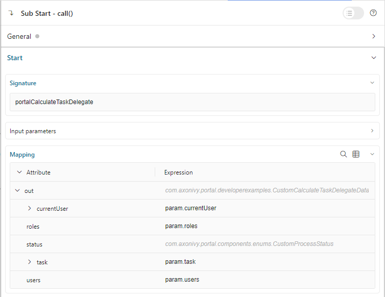

.. _customization-task-delegation:

Task Delegation
===============

Introduction
------------

The Task Delegation customization allows you to control which users and roles appear in the delegation list for specific tasks.
By implementing the portalCalculateTaskDelegate callable subprocess, you can apply custom business rules to filter available delegates based on task properties, organizational hierarchies, or security constraints,
ensuring tasks are only delegated to appropriate personnel.

How It Works
------------

Portal provides a standard list of users (with their roles) and roles as parameters to your callable subprocess. You can then filter these lists based on your business rules:

- The ``currentUser`` and current ``task`` are provided as parameters
- You receive pre-populated ``users`` and ``roles`` lists
- Modify these lists to create your custom delegate list
- Return the filtered lists, or set ``status`` to ``SKIP`` to exclude this subprocess's results

Portal will call all configured subprocesses and combine their results into the final delegate list shown to users.

.. tip::
    **Performance Best Practice:**
    
    Portal provides the standard ``users`` list together with their roles as a parameter for the callable. Please filter the ``users`` list instead of creating a new user list as this is more performant.
    
    In case you want to filter specific users by some roles, please use the method ``getRoles()`` of each user.

Customize
---------

To customize the list of users and roles a task can be delegated to, create a callable subprocess with:

**Signature**: portalCalculateTaskDelegate

|calculate-task-delegate|

**Parameters:**

``roles`` (java.util.List<com.axonivy.portal.components.dto.RoleDTO>)
   List of roles that can be delegated to. Modify this list to create your custom delegate list.

``users`` (java.util.List<com.axonivy.portal.components.dto.UserDTO>)
   List of users that can be delegated to. Filter this list rather than creating a new one for better performance.

``currentUser`` (com.axonivy.portal.components.dto.SecurityMemberDTO)
   The user performing the delegation.

``task`` (ch.ivyteam.ivy.workflow.ITask)
   The task being delegated.

**Result:**

``status`` (java.lang.String)
   Operation status: OK or SKIP. Set to SKIP to exclude this subprocess result from the combined delegate list.

``roles`` (java.util.List<com.axonivy.portal.components.dto.RoleDTO>)
   Filtered list of roles that can be delegated to.

``users`` (java.util.List<com.axonivy.portal.components.dto.UserDTO>)
   Filtered list of users that can be delegated to.

