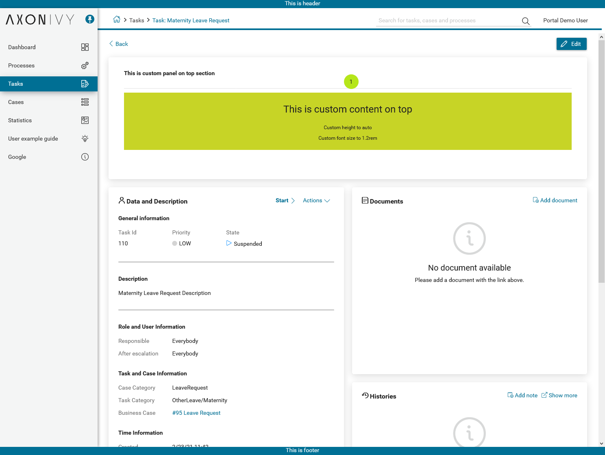
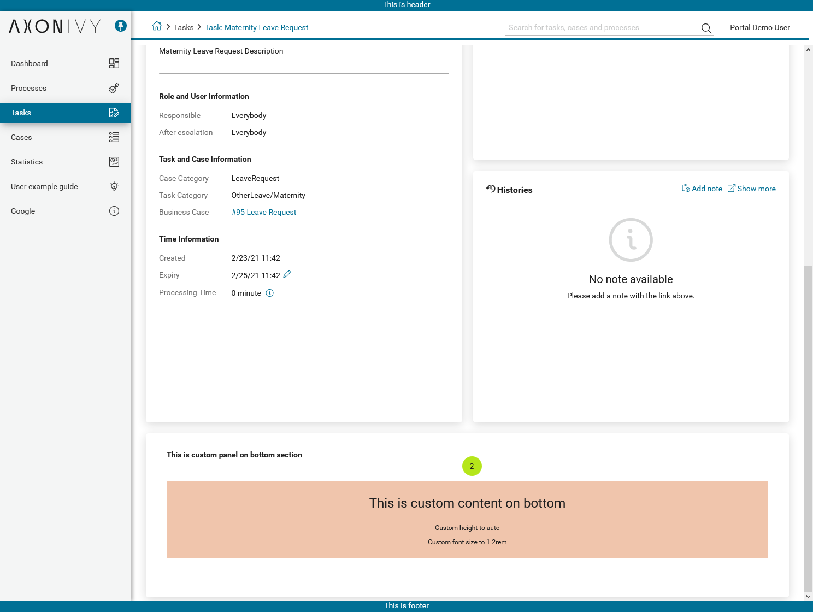
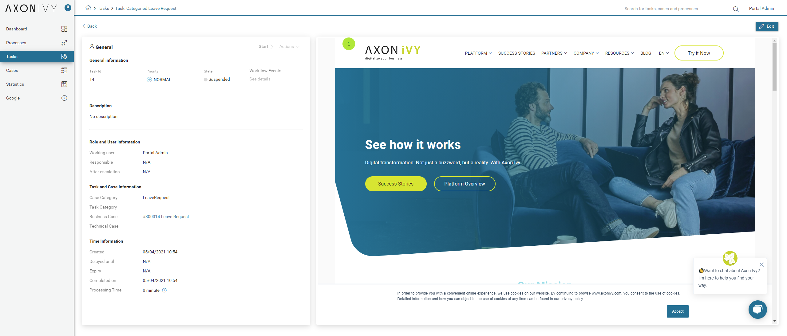
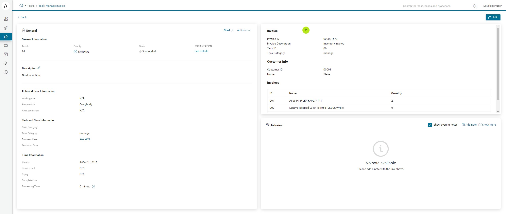

.. _customization-task-item-details:

Task item details
=================

TaskItemDetails is a built-in component of Portal which contains the
role, user, task, case and time information which users can interact with.
In order to show needed task's information,
Portal supports you to override concepts of TaskItemDetails component.

Each TaskItemDetails contains

-  **Data and Description** ``1``

-  **Documents** ``2``

-  **Histories** ``3``

-  **Custom panels (widgets)**

|task-standard|

.. important:: All visible widgets will be configured in :ref:`Global Variable Portal.TaskDetails<task-details-configuration-variable>`.

.. _task-details-configuration-variable:

How to configure widgets in task details
----------------------------------------

-  Settings of all visible widgets on task details page are saved in **Global Variable Portal.TaskDetails**.
-  Cockpit Administrator can configure widgets via global variable **Portal.TaskDetails** on Cockpit settings page.
   |edit-variable-portal-task-case-details|

-  Default configuration includes 3 widgets.

   .. code-block:: html

      [
         {
         "id": "default-task-detail",
         "default": true,
         "filters": {
            "taskCategories" : ["support"]
         },
         "widgets": 
         [
            {
               "id": "information",
               "type": "information",
               "layout": {
                  "x": 0, "y": 0, "width": 6, "height": 6
               }
            },
            {
               "id": "history",
               "type": "history",
               "layout": {
                  "x": 6, "y": 6, "width": 6, "height": 6
               }
            },
            {
               "id": "document",
               "type": "document",
               "layout": {
                  "x": 6, "y": 0, "width": 6, "height": 6
               }
            }
            {
               "id": "custom",
               "type": "custom",
               "layout": {
                  "x": 0, "y": 6, "width": 6, "height": 6
               },
               "data" : {
                  "ivy": "Start Processes/Sale/invoiceDetails.ivp",
                  "params": {
                     "invoiceId": "000001573"
                  }
               }
            }
         ]
         }
      ]

   ..

-  Structure of each task details layout in variable **Portal.TaskDetails**:

   ``id``: ID which used to identify layout.
   
   ``default``: a boolean flag to marked a layout as default.

   ``widgets``: definition of widgets in layout.

   ``filters``: conditions to determine which tasks able to use the layout.

-  Structure of each widget inside task details layout in variable **Portal.TaskDetails**:

   ``type``: There are 4 types: ``information``, ``document``, ``history``, ``custom``

   ``id``: It's used to detect custom widgets.

   ``x``: HTML DOM Style ``left`` will be calculated by formula ``x / 12 * 100%``

   ``y``: HTML DOM Style ``top`` will be calculated by formula ``y / 12 * 100%``

   ``width``: HTML DOM Style ``width`` will be calculated by formula ``60 * width + 20 * (width - 1)``

   ``height``: HTML DOM Style ``height`` will be calculated by formula ``60 * height + 20 * (height - 1)``

   ``styleClass`` (optional): add CSS Classes to HTML DOM

   ``style`` (optional): add inline style to HTML DOM

   ``data`` (for custom widget): data for custom widget using iframe.

   ``url`` (for data of custom widget): URL for external website.

   ``ivy`` (for data of custom widget): relative link to the ivy process which will be displayed in custom widget.

   ``param`` (for data of custom widget): paramters for ivy process above.

.. important::
   -  **Do not change** ``type`` and ``id`` of widgets.
      You can change ``x``, ``y``, ``width`` and ``height`` to update size and position of widgets.
   -  ``x``, ``y``, ``width`` and ``height`` must be **integers**.
   -  ``x + width`` must **not be larger** than **12**.
   -  For data of custom widget, if you input ``ivy``, don't input ``url``. You can only use one of them.

.. _customization-task-item-details-how-to-overide-ui:

How to customize Task item details UI
-------------------------------------

Refer to ``portal-developer-examples`` project for examples.

#. Introduce an Axon Ivy project which has ``PortalTemplate`` as a
   required library.

#. To customize task item details, you must customize Portal Home first.
   Refer to :ref:`Customize Portal
   home <customization-portal-home>` to set new home
   page.

#. Copy the ``PortalStart`` process from ``PortalTemplate`` to your
   project. Point PortalHome element to your custom home page in
   previous step. This process is new home page and administrator should
   register this link by Portal's Admin Settings.

#. Use `Axon Ivy HtmlOverride wizard <https://developer.axonivy.com/doc/9.1/designer-guide/how-to/overrides.html?#override-new-wizard>`_ to override ``PortalTaskDetails`` HTML dialog.

#. After previous steps, you can override Task item details UI elements
   to show custom panels, show or hide elements.

   To **show or hide elements**, refer to :ref:`Show or hide
   elements <customization-task-item-details-how-to-overide-ui-show-hidden-ui>`.

   To **show custom panels (widgets)**, refer to :ref:`Show Custom
   Panels (Widgets) <customization-task-item-details-how-to-overide-ui-custom-body>`.

.. _customization-task-item-details-how-to-overide-ui-show-hidden-ui:

Show or hide elements
---------------------

Refer to list of ``ui:param`` tag in ``PortalTaskDetails.xhtml`` of
PortalTemplate. If you want to show or hide elements on
TaskItemDetails, you must override ``ui:param``

List of valid ``ui:param``:

-  ``ui:param name="showItemDetailsHeader" value="true"``

   To show or hide Task Header, use ``showItemDetailsHeader``. Default value is true.

.. _customization-task-item-details-how-to-overide-ui-custom-body:

Show Custom Panels (Widgets)
----------------------------

There are **two steps** for adding new custom panels.

#. **Cockpit admin** must configure global variable :ref:`Portal.TaskDetails<task-details-configuration-variable>`
   on Cockpit Page to add custom widgets.

   .. _task-details-custom-configuration-variable-example:
   
   -  Example Portal.TaskDetails with layout configuration includes 4 custom widgets:
   
   .. code-block:: html

      [
         {
            "id": "default-task-detail",
            "default": true,
            "filters": {
               "taskCategories" : ["support"]
            },
            "widgets": 
               [
                  {
                     "type": "information",
                     "id": "information",
                     "layout": {
                        "x": 0, "y": 4, "width": 6, "height": 12
                     }
                  },
                  {
                     "type": "document",
                     "id": "document",
                     "layout": {
                        "x": 6, "y": 4, "width": 6, "height": 6
                     }
                  },
                  {
                     "type": "history",
                     "id": "history",
                     "layout": {
                        "x": 6, "y": 10, "width": 6, "height": 6
                     }
                  },
                  {
                     "type": "custom",
                     "id": "taskItemDetailCustomPanelTop",
                     "layout": {
                        "x": 0, "y": 0, "width": 12, "height": 4
                     }
                  },
                  {
                     "type": "custom",
                     "id": "taskItemDetailCustomPanelBottom",
                     "layout": {
                        "x": 0, "y": 16, "width": 6, "height": 4
                     }
                  },
                  {
                     "type": "custom",
                     "id": "customWidgetWithUrl",
                     "layout": {
                        "x": 0, "y": 10, "width": 6, "height": 6
                     },
                     "data" : {
                        "url": "https://www.axonivy.com/"
                     }
                  },
                  {
                     "type": "custom",
                     "id": "customWidgetWithIvyProcess",
                     "layout": {
                        "x": 0, "y": 16, "width": 6, "height": 6
                     },
                     "data" : {
                        "ivy": "Start Processes/Sale/invoiceDetails.ivp",
                        "params": {
                           "invoiceId": "000001573"
                        }
                     }
                  }
               ]
            }
         }
      ]

   ..

#. To customize task details which do not use Iframe, refer to the ``taskItemDetailCustomPanel*`` section in ``PortalTaskDetails.xhtml`` of PortalTemplate.

   -  We need to define the ``ui:define`` tag with the valid name such as
      ``taskItemDetailCustomPanelTop`` and ``taskItemDetailCustomPanelBottom``.
   
      The ``taskItemDetailCustomPanel*`` will be displayed
      base on value of global variable
      :ref:`Portal.TaskDetails<task-details-configuration-variable>`.
   
   -  Add your custom code into ``<ui:define name="taskItemDetailCustomPanel*"></ui:define>`` tags.
   
   -  Example code for overriding custom panel box of task details:
   
      .. code-block:: html
   
               
         <!-- In this HTML dialog, we override task list header, task header, task filter, and task body -->
   
         <ui:composition template="/layouts/PortalTaskDetailsTemplate.xhtml">
            <ui:param name="task" value="#{data.task}" />
            <ui:param name="dataModel" value="#{data.dataModel}" />
            <ui:param name="portalPage" value="#{data.portalPage}" />
            <ui:param name="isFromTaskList" value="#{data.isFromTaskList}" />
            <ui:param name="isTaskStartedInDetails" value="#{data.isTaskStartedInDetails}" />
            <!-- To show/hidden any sections of Task detail, you can turn true/false for below parameters -->
            <!-- To show the Header component inside Task details body. By default it's true -->
            <ui:param name="showItemDetailsHeader" value="true" />
            <!-- To show the Notes component inside Task details body. By default it's true -->
            <ui:param name="showItemDetailsNotes" value="true" />
            <!-- To show the Documents component inside Task details body. By default, it's true -->
            <ui:param name="showItemDetailDocuments" value="true" />
            <ui:define name="title">#{ivy.cms.co('/Labels/TaskItemDetail')}</ui:define>
   
            <!--!!!!!!!!!!!!!!!!!!!!!!!!!!!!!!!!!!!!!!!!!!!!!!!!!!!!!!!!!!!!!!!!!!!!!!!!!!!!!!!!!!!!!!!!!!!!!!!!!!!!!!!!!!!!!!!!!!!!!!!!!!!!!!!
               !!!!!!!!!!!!!!!!!!!!!!!!!!!!!!!!!!!!!!!!!!!!!!!!!!!!!!!!!!!!!!!!!!!!!!!!!!!!!!!!!!!!!!!!!!!!!!!!!!!!!!!!!!!!!!!!!!!!!!!!!!!!!!!!!!!
               !!!!!BELOW IS SAMPLE CODE FOR CUSTOMIZATION, WRAPPED IN <ui:remove> TAG. TO ACTIVATE THE CUSTOMIZATION, REMOVE <ui:remove> TAG!!!!!
               !!!!!!!!!!!!!!!!!!!!!!!!!!!!!!!!!!!!!!!!!!!!!!!!!!!!!!!!!!!!!!!!!!!!!!!!!!!!!!!!!!!!!!!!!!!!!!!!!!!!!!!!!!!!!!!!!!!!!!!!!!!!!!!!!!!
               !!!!!!!!!!!!!!!!!!!!!!!!!!!!!!!!!!!!!!!!!!!!!!!!!!!!!!!!!!!!!!!!!!!!!!!!!!!!!!!!!!!!!!!!!!!!!!!!!!!!!!!!!!!!!!!!!!!!!!!!!!!!!!!!-->
            <!-- Add a content as Custom panel for Task Detail on top -->
            <ui:define name="taskItemDetailCustomPanelTop">
               <h:panelGroup styleClass="ui-g-12 ui-sm-12 custom-task-panel">
               

                  <h:outputText value="This is custom panel on top section" />
               

               

   
               

                  <h1>This is custom content on top</h1>
                  
Custom height to auto

                  
Custom font size to 1.2rem

               

               </h:panelGroup>
            </ui:define>
   
            <!-- Add a content as Custom panel for Task Detail on top-left-->
            <ui:define name="taskItemDetailCustomPanelBottom">
               <h:panelGroup styleClass="ui-g-12 ui-sm-12 custom-task-panel">
               

                  <h:outputText value="This is custom panel on bottom section" />
               

               

   
               

                  <h1>This is custom content on bottom</h1>
                  
Custom height to auto

                  
Custom font size to 1.2rem

               

               </h:panelGroup>
            </ui:define>
   
            <ui:define name="css">
               <h:outputStylesheet library="css" name="examples.css" />
            </ui:define>
         </ui:composition>
      ..
   
   -  After applied above **example xhtml code** and **example variable Portal.TaskDetails** to your custom page, custom panels
      will be displayed as the below image.
      ``taskItemDetailCustomPanelTop (1)``
   
      ``taskItemDetailCustomPanelBottom (2)``
   
      |task-customized-top|
      |task-customized-bottom|

#. To customize task details use Iframe, please make sure

   -  Must input parameter ``url`` if you want to use external URL.

   -  Must input parameter ``ivy`` if you want to use ivy start process.

   -  If you use ivy start process, you can predefine paramter for by parameter ``params``.

   Customized task details using external URL
   |task-customized-iframe-url|

   Customized task details using ivy process start
   |task-customized-iframe-process|

.. |task-standard| image:: ../../screenshots/task-detail/customization/task-standard.png

.. |edit-variable-portal-task-case-details| image:: images/customization/edit-variable-portal-task-case-details.png

