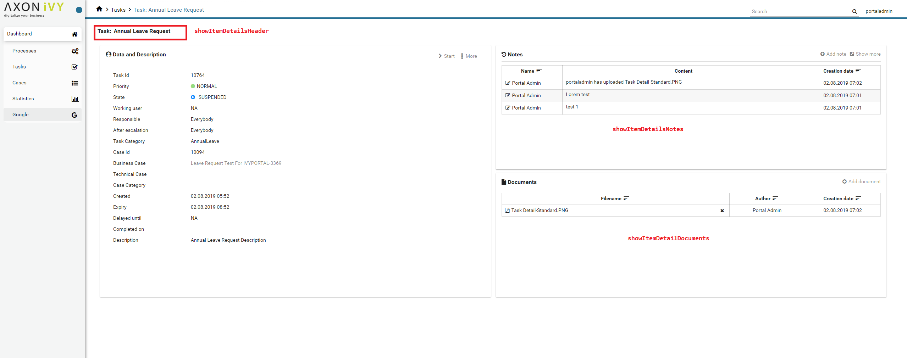
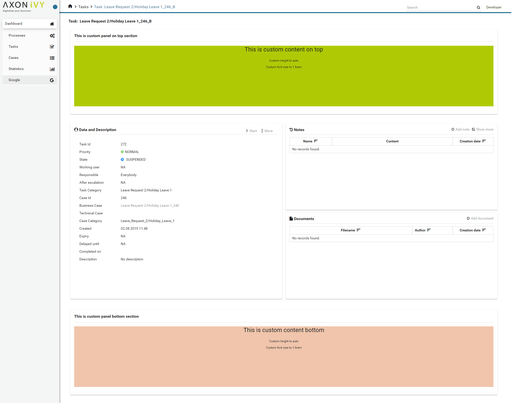

.. _customization-task-item-details:

Task item details
=================

TaskItemDetails is a built-in component of Portal which contains the
case info which users can interact with. In order to show needed task's
information, Portal supports overriding concept for TaskItemDetails.

Each TaskItemDetails contains

-  showItemDetailsHeader

-  showItemDetailsNotes

-  showItemDetailDocuments

-  TaskItemDetail custom panel: taskItemDetailCustomPanelTop,
   taskItemDetailCustomPanelBottom

|task-standard|

.. important:: Task Data and Description box always display, we cannot override the
            content or hidden/show (they stay where they are)

.. _customization-task-item-details-how-to-overide-ui:

How to custom Task item details UI
----------------------------------

Refer to ``PortalExamples`` project for examples.

1. Introduce an Axon.ivy project which has ``PortalTemplate`` as a
   required library.

2. To customize task item detail, you must customize Portal Home first.
   Refer to :ref:`Customize Portal
   home <customization-portal-home>` to set new home
   page.

3. Copy the ``PortalStart`` process from ``PortalTemplate`` to your
   project. Point PortalHome element to your custom home page in
   previous step. This process is new home page and administrator should
   register this link by Portal's Admin Settings.

4. Custom the Task item details:

   -  Introduce a new HTMLDialog which uses template
      ``/layouts/PortalTaskDetailsTemplate.xhtml``. You can take a look
      at ``PortalTaskDetails.xhtml`` to see how to customize it.

      .. tip:: Highly recommend to copy the ``PortalTaskDetails`` HTMLDialog
               in PortalTemplate. Remove ``ui:remove`` and change the copied
               one's view.

   -  Use Axon.ivy Override to override the ``OpenPortalTaskDetail``  callable. The original implementation of this
      callable is calling  ``PortalTaskDetails`` , change it to call the customized
      Page introduced in the step above. The signature of this callable is ``call(ITask)``  and customized page must receive this  ``ITask``  instance, put in
      the dialog's  ``Data``  with the exact name  ``taskData``  .

5. After previous steps, you can override Task item details UI elements
   as shown/hidden element by keywords:

   To show/hide, please using ``showItemDetailsHeader``,
   ``showItemDetailsNotes``, ``showItemDetailDocuments`` code. For more
   details, please refer to :ref:`Show/Hide
   components <customization-task-item-details-how-to-overide-ui-show-hidden-ui>`.

   And to add a new elements, please refer to  :ref:`Add new Custom
   panel <customization-task-item-details-how-to-overide-ui-custom-body>`
   code

.. _customization-task-item-details-how-to-overide-ui-show-hidden-ui:

Show/Hide components by keywords
--------------------------------

Refer to the ``ui`` tag list in ``PortalTaskDetails.xhtml`` of
PortalTemplate. In case, we want to show/hide any elements on
TaskItemDetails, we should override value of ``ui:param``

List valid parameters:

-  ``ui:param name="showItemDetailsHeader" value="true"``

   To show/hide Task header, by default it's true.

-  ``ui:param name="showItemDetailsNotes" value="true">``

   To show/hide Task Notes component, by default it's true.

-  ``ui:param name="showItemDetailDocuments" value="true"``

   To show/hide Task Documents component, by default it's true.

.. _customization-task-item-details-how-to-overide-ui-custom-body:

Add new Custom panel
--------------------

Refer to the ``taskItemDetailCustomPanel*`` section in
``PortalTaskDetails.xhtml`` of PortalTemplate.

-  We need to define the ``ui:define`` with the valid name such as
   ``taskItemDetailCustomPanelTop`` and
   ``taskItemDetailCustomPanelBottom``.

   The ``taskItemDetailCustomPanelTop``: will be shown on the top of the
   component

   The ``taskItemDetailCustomPanelBottom``: will be shown on the bottom
   of the component

-  Add your custom code into that tag

-  Finally, your custom panel will be displayed inside of
   :ref:`TaskItemDetails <customization-task-item-details>`
   page

-  Below is example code for override custom panel box of task details

   .. code-block:: html

            
      <!-- In this HTML dialog, we override task list header, task header, task filter, and task body -->

      <ui:composition template="/layouts/PortalTaskDetailsTemplate.xhtml">
      <ui:param name="task" value="#{data.task}" />
      <ui:param name="dataModel" value="#{data.dataModel}" />
      <ui:param name="portalPage" value="#{data.portalPage}" />
      <ui:param name="isFromTaskList" value="#{data.isFromTaskList}" />
      <ui:define name="title">#{ivy.cms.co('/Labels/TaskItemDetail')}</ui:define>

      <!-- To show/hidden any sections of Task detail, you can turn true/false for below parameters -->
      <!-- To show the Header component inside Task details body. By default it's true -->
      <ui:param name="showItemDetailsHeader" value="true" />
      <!-- To show the Notes component inside Task details body. By default it's true -->
      <ui:param name="showItemDetailsNotes" value="true" />
      <!-- To show the Documents component inside Task details body. By default, it's true -->
      <ui:param name="showItemDetailDocuments" value="true" />
      
      
      <!--!!!!!!!!!!!!!!!!!!!!!!!!!!!!!!!!!!!!!!!!!!!!!!!!!!!!!!!!!!!!!!!!!!!!!!!!!!!!!!!!!!!!!!!!!!!!!!!!!!!!!!!!!!!!!!!!!!!!!!!!!!!!!!! 
      !!!!!!!!!!! TO ADD YOUR CUSTOMIZATION CODE ON THE TASK DETAILS PAGE, WE PROVIDE 2 SECTIONS AS BELOW HELP YOU CAN DO IT !!!!!!!!!!!!
      !!!!!!!!!!!!!!!!!!!!!!!!!!!!!!!!!!!!!!!!!!!!!!!!!!!!!!!!!!!!!!!!!!!!!!!!!!!!!!!!!!!!!!!!!!!!!!!!!!!!!!!!!!!!!!!!!!!!!!!!!!!!!!!!-->
      <!-- Add a content as a Custom panel for Task Detail on top section -->

      <!-- Add a content as Custom panel for Task Detail on top -->
      <ui:define name="taskItemDetailCustomPanelTop">
            <h:panelGroup styleClass="ui-g-12 ui-sm-12 custom-task-panel">
            

            

                  <h:outputText value="This is custom panel on top section" />
            

            

            

                  <h1>This is custom content on top</h1>
                  
Custom height to auto

                  
Custom font size to 1.6rem

            

            

            </h:panelGroup>
      </ui:define>

            <!-- Add content as Custom panel for Task Detail on bottom-->
      <ui:define name="taskItemDetailCustomPanelBottom">
            <h:panelGroup styleClass="ui-g-12 ui-sm-12 custom-task-panel">
            

            

                  <h:outputText value="This is custom panel bottom section" />
            

            

            

                  <h1>This is custom content bottom</h1>
                  
Custom height to auto

                  
Custom font size to 1.6rem

            

            

            </h:panelGroup>
      </ui:define>
      
      <ui:define name="css">
            <h:outputStylesheet library="css" name="examples.css" />
      </ui:define>
      </ui:composition>
   ..

-  After applied above code to your custom page, the custom panel will
   display as below

   |custom-panel-override|

-  Finally, we have a custom Task details page

   |task-customized|

.. |custom-panel-override| image:: images/task-item-details/custom-panel-override.png

