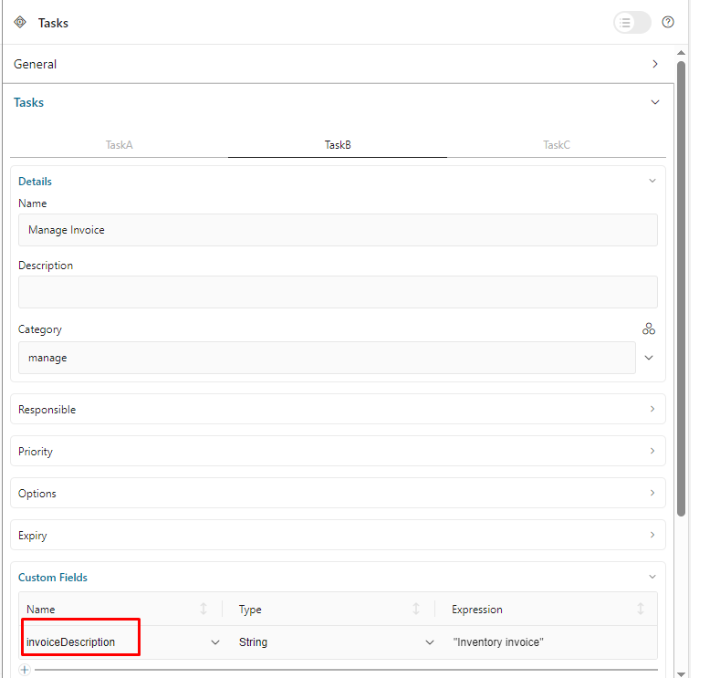
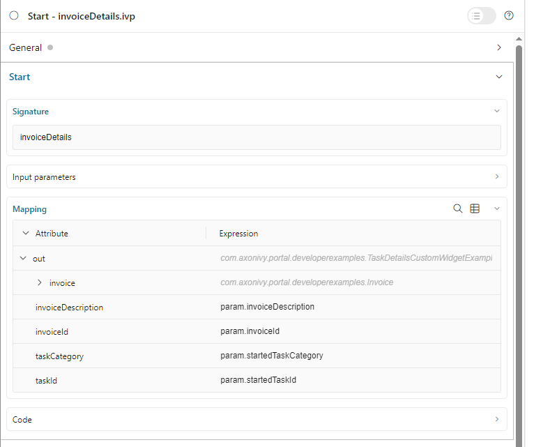

.. _customization-task-item-details:

Task Item Details
=================

TaskItemDetails is a built-in component of Portal which contains the
role, user, task, case and time information which users can interact with.
To show needed task's information,
Portal supports you to override concepts of TaskItemDetails component.

Each TaskItemDetails contains

-  **Data and Description** ``1``

-  **Documents** ``2``

-  **Histories** ``3``

-  **Custom panels (widgets)**

|task-standard|

.. important:: All visible widgets will be configured in :ref:`Variable Portal.TaskDetails<task-details-configuration-variable>`.

.. _task-details-configuration-variable:

How to configure widgets in task details
----------------------------------------

-  Settings of all visible widgets on task details page are saved in **variable Portal.TaskDetails**.
-  Cockpit Administrator can configure widgets via variable **Portal.TaskDetails** on Cockpit settings page.
   |edit-variable-portal-task-details|

-  Default configuration includes 3 widgets.

   .. code-block:: javascript

      [
         {
            "id": "default-task-detail",
            "filters": {
               "categories" : ["support"],
               "states" : ["DONE", "OPEN"]
            },
            "widgets": 
            [
               {
                  "id": "information",
                  "type": "information",
                  "layout": {
                     "x": 0, "y": 0, "w": 6, "h": 6
                  }
               },
               {
                  "id": "history",
                  "type": "history",
                  "layout": {
                     "x": 6, "y": 6, "w": 6, "h": 6
                  }
               },
               {
                  "id": "document",
                  "type": "document",
                  "layout": {
                     "x": 6, "y": 0, "w": 6, "h": 6
                  }
               },
               {
                  "id": "custom",
                  "type": "custom",
                  "layout": {
                     "x": 0, "y": 6, "w": 6, "h": 6
                  },
                  "data" : {
                     "processPath": "Start Processes/TaskDetailsCustomWidgetExample/invoiceDetails.ivp",
                     "params": {
                        "startedTaskId": "task.id",
                        "startedTaskCategory": "task.category",
                        "invoiceId": "000001573",
                        "invoiceDescription": "task.customFields.invoiceDescription"
                     }
                  }
               }
            ]
         }
      ]

   ..

-  Structure of each task details layout in variable **Portal.TaskDetails**:

   ``id``: ID which used to identify layout.

   ``widgets``: definition of widgets in layout.

   ``filters``: conditions to determine which tasks are able to use the layout. There are 2 types of filter **:** ``categories`` (task categories) and ``states`` (task business states).

-  Structure of each widget inside task details layout in variable **Portal.TaskDetails**:

   ``type``: There are 4 types: ``information``, ``document``, ``history``, ``custom``

   ``x``: HTML DOM Style ``left`` will be calculated by formula ``x / 12 * 100%``

   ``y``: HTML DOM Style ``top`` will be calculated by formula ``y / 12 * 100%``

   ``w``: HTML DOM Style ``width`` will be calculated by formula ``60 * w + 20 * (w - 1)``

   ``h``: HTML DOM Style ``height`` will be calculated by formula ``60 * h + 20 * (h - 1)``

   ``styleClass`` (optional): add CSS Classes to HTML DOM

   ``style`` (optional): add inline style to HTML DOM

   ``data`` (for custom widget): data for custom widget using iframe

      ``type``: type of custom widget which is not using IFrame. There are two type ``taskItemDetailCustomPanelTop`` and ``taskItemDetailCustomPanelBottom``

      ``url``: URL for external website

      ``processPath``: the user-friendly request path of the Ivy process which will be displayed in the custom widget

      ``params``: parameters for the Ivy process above, each parameter can be defined as follows:

         - Key name that will be parameter name for the Ivy process above. Note: don't use ``taskId``.

         - Key value for task has to start with ``task.``. Supported are two values: ``task.id``, ``task.category``.

         - Key value for task custom fields have to start with ``task.customFields.``, follow by the custom field name.

         - Other key values will be treated as hard coded values.

.. important::
   -  **Do not change** ``type`` of widgets.
      You can change ``x``, ``y``, ``w`` and ``h`` to update size and position of widgets.
   -  ``x``, ``y``, ``w`` and ``h`` must be **integers**.
   -  ``x + w`` must **not be larger** than **12**.
   -  For data of custom widget, if you input ``processPath``, don't input ``url``. You can only use one of them.
   -  We support all task business states for filter type ``states``. Please refer to :dev-url:`Task Business States </doc/|version|/public-api/ch/ivyteam/ivy/workflow/TaskBusinessState.html>` to check for available task business states.

Show Custom Panels (Widgets)
----------------------------

.. tip:: 
   To quickly understand how the JSON of custom task details looks like.

   - Refer to ``variables.Portal.TaskDetails.json`` file in ``portal-developer-examples/resources/files`` project.
   - Copy to the corresponding application folder located in the designer.

      - E.g., AxonIvyDesigner/configuration/applications/designer

   - Create some destroyed task or start the process ``Start Processes/TaskDetailsCustomWidgetExample/SalesManagement.ivp`` in ``portal-developer-examples`` project.
   - Go to the example homepage by the process ``Start Processes/ExamplePortalStart/DefaultApplicationHomePage.ivp``
   - Lastly, go to task details to check the new custom layout.

   About how to configure Variables, refer to :dev-url:`|ivy| Variables </doc/|version|/designer-guide/configuration/variables.html>`

There are **two steps** for adding new custom panels.

#. The **Engine administrator** has to configure variable :ref:`Portal.TaskDetails<task-details-configuration-variable>`
   on Cockpit Page to add custom widgets.

   .. _task-details-custom-configuration-variable-example:
   
   -  Example Portal.TaskDetails with layout configuration includes 4 custom widgets:
   
   .. code-block:: javascript

      [
         {
            "id": "default-task-detail",
            "widgets": 
               [
                  {
                     "type": "information",
                     "layout": {
                        "x": 0, "y": 4, "w": 6, "h": 12
                     }
                  },
                  {
                     "type": "document",
                     "layout": {
                        "x": 6, "y": 4, "w": 6, "h": 6
                     }
                  },
                  {
                     "type": "history",
                     "layout": {
                        "x": 6, "y": 10, "w": 6, "h": 6
                     }
                  },
                  {
                     "type": "custom",
                     "layout": {
                        "x": 0, "y": 0, "w": 12, "h": 4
                     },
                     "data" : {
                        "type": "taskItemDetailCustomPanelTop"
                     }
                  },
                  {
                     "type": "custom",
                     "layout": {
                        "x": 0, "y": 16, "w": 6, "h": 4
                     },
                     "data" : {
                        "type": "taskItemDetailCustomPanelBottom"
                     }
                  }
               ]
            }
        ]

   ..

#. To customize task details use IFrame, please make sure

   -  Must input parameter ``url`` if you want to use external URL.

   -  Must input parameter ``ivy`` if you want to usestart process.

   -  If you usestart process, you can predefine parameter for ``params``.

      Customized task details using external URL

      .. code-block:: javascript

         [
            {
               "id": "task-detail",
               "widgets": [
                  {
                     "type": "information",
                     "layout": {
                     "x": 0, "y": 0, "w": 4, "h": 12
                     }
                  },
                  {
                     "type": "custom",
                     "layout": {
                     "x": 6, "y": 0, "w": 8, "h": 6
                     },
                     "data" : {
                     "url": "https://www.axonivy.com/"
                     }
                  }
               ]
            }
         ]

      Result

      |task-customized-iframe-url|

      Customized task details usingprocess start, please refer to ``TaskDetailsCustomWidgetExample`` process in ``portal-developer-examples`` for details

      .. code-block:: javascript

            [
               {
                  "id": "task-detail",
                  "widgets": [
                     {
                        "type": "information",
                        "layout": {
                        "x": 0, "y": 0, "w": 6, "h": 12
                        }
                     },
                     {
                        "type": "history",
                        "layout": {
                        "x": 6, "y": 6, "w": 6, "h": 6
                        }
                     },
                     {
                        "type": "custom",
                        "layout": {
                        "x": 0, "y": 6, "w": 6, "h": 6
                        },
                        "data" : {
                           "processPath": "Start Processes/TaskDetailsCustomWidgetExample/invoiceDetails.ivp",
                           "params": {
                              "startedTaskId": "task.id",
                              "startedTaskCategory": "task.category",
                              "invoiceId": "000001573",
                              "invoiceDescription": "task.customFields.invoiceDescription"
                           }
                        }
                     }
                  ]
               }
            ]

      Provide task custom field

      |task-customized-iframe-process-custom-field|

      Map parameters to process data

      |task-customized-iframe-process-input-mapping|

      Result

      |task-customized-iframe-process|

.. |task-standard| image:: ../../screenshots/task-detail/customization/task-standard.png
.. |edit-variable-portal-task-details| image:: images/customization/edit-variable-portal-task-details.png
.. |task-customized-iframe-url| image:: ../../screenshots/task-detail/customization/task-customized-iframe-url.png
.. |task-customized-iframe-process| image:: ../../screenshots/task-detail/customization/task-customized-iframe-process.png

