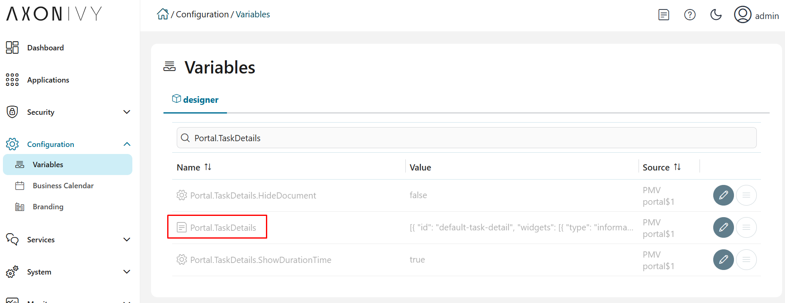

.. _customization-task-item-details:

Task item details
=================

TaskItemDetails is a built-in component of Portal which contains the
role, user, task, case and time information which users can interact with.
In order to show needed task's information,
Portal supports you to override concepts of TaskItemDetails component.

Each TaskItemDetails contains

-  **Data and Description** ``1``

-  **Documents** ``2``

-  **Histories** ``3``

-  **Custom panels (widgets)**

|task-standard|

.. important:: All visible widgets will be configured in :ref:`Global Variable PORTAL_TASK_DETAILS<task-details-configuration-variable>`.

.. _task-details-configuration-variable:

How to configure widgets in task details
----------------------------------------

-  Settings of all visible widgets on task details page are saved in **Global Variable PORTAL_TASK_DETAILS**.
-  Cockpit Administrator can configure widgets via **PORTAL_TASK_DETAILS** in Cockpit settings page.
   |edit-variable-portal-task-details|

-  Default configuration includes 3 widgets.

   .. code-block:: html

      {
         "widgets": 
         [
            {
               "type": "information",
               "id": "information",
               "axisX": 0,
               "axisY": 0,
               "width": 6,
               "height": 12
            },
            {
               "type": "document",
               "id": "document",
               "axisX": 6,
               "axisY": 0,
               "width": 6,
               "height": 6
            },
            {
               "type": "history",
               "id": "history",
               "axisX": 6,
               "axisY": 6,
               "width": 6,
               "height": 6
            }
         ]
      }

   ..

-  Structure of each widget in variable **PORTAL_TASK_DETAILS**:

   ``type``: There are 4 types: ``information``, ``document``, ``history``, ``custom``

   ``id``: It's used to detect custom widgets.

   ``axisX``: HTML DOM Style ``left`` will be calculated by formula ``axisX / 12 * 100%``

   ``axisY``: HTML DOM Style ``top`` will be calculated by formula ``axisY / 12 * 100%``

   ``width``: HTML DOM Style ``width`` will be calculated by formula ``60 * width + 20 * (width - 1)``

   ``height``: HTML DOM Style ``height`` will be calculated by formula ``60 * height + 20 * (height - 1)``

   ``styleClass`` (optional): add CSS Classes to HTML DOM

   ``style`` (optional): add inline style to HTML DOM

.. important::
   -  **Do not change** ``type`` and ``id`` of widgets.
      You can change ``axisX``, ``axisY``, ``width`` and ``height`` to update size and position of widgets.
   -  ``axisX``, ``axisY``, ``width`` and ``height`` must be **integers**.
   -  ``axisX + width`` must **not be larger** than **12**.

.. _customization-task-item-details-how-to-overide-ui:

How to customize Task item details UI
-------------------------------------

Refer to ``portal-developer-examples`` project for examples.

1. Introduce an Axon.ivy project which has ``PortalTemplate`` as a
   required library.

2. To customize task item details, you must customize Portal Home first.
   Refer to :ref:`Customize Portal
   home <customization-portal-home>` to set new home
   page.

3. Copy the ``PortalStart`` process from ``PortalTemplate`` to your
   project. Point PortalHome element to your custom home page in
   previous step. This process is new home page and administrator should
   register this link by Portal's Admin Settings.

4. Use `Axon.ivy HtmlOverride wizard <https://developer.axonivy.com/doc/9.1/designer-guide/how-to/overrides.html?#override-new-wizard>`_ to override ``PortalTaskDetails`` HTML dialog.

5. After previous steps, you can override Task item details UI elements
   to show custom panels, show or hide elements.

   To **show or hide elements**, refer to :ref:`Show or hide
   elements <customization-task-item-details-how-to-overide-ui-show-hidden-ui>`.

   To **show custom panels (widgets)**, refer to :ref:`Show Custom
   Panels (Widgets) <customization-task-item-details-how-to-overide-ui-custom-body>`.

.. _customization-task-item-details-how-to-overide-ui-show-hidden-ui:

Show or hide elements
---------------------

Refer to list of ``ui:param`` tag in ``PortalTaskDetails.xhtml`` of
PortalTemplate. If you want to show or hide elements on
TaskItemDetails, you must override ``ui:param``

List of valid ``ui:param``:

-  ``ui:param name="showItemDetailsHeader" value="true"``

   To show or hide Task Header, use ``showItemDetailsHeader``. Default value is true.

.. _customization-task-item-details-how-to-overide-ui-custom-body:

Show Custom Panels (Widgets)
----------------------------

There are **two steps** for adding new custom panels.

1. **Cockpit admin** must configure global variable :ref:`PORTAL_TASK_DETAILS<task-details-configuration-variable>`
   on Cockpit Page to add custom widgets.

   Number of custom widgets can be up to 6.

   Type of custom widget must be ``custom``.

   Id of custom widget must be one in
   ``custom-widget-1``, ``custom-widget-2``,
   ``custom-widget-3``, ``custom-widget-4``,
   ``custom-widget-5`` and ``custom-widget-6``.

   Each id ``custom-widget-*`` corresponds to each defined ui ``taskItemDetailCustomPanel*``

.. _task-details-custom-configuration-variable-example:

-  Example PORTAL_TASK_DETAILS with 4 custom widgets configuration:

   .. code-block:: html

      {
         "widgets": 
         [
            {
               "type": "information",
               "id": "information",
               "axisX": 0,
               "axisY": 0,
               "width": 6,
               "height": 12
            },
            {
               "type": "document",
               "id": "document",
               "axisX": 6,
               "axisY": 0,
               "width": 6,
               "height": 6
            },
            {
               "type": "history",
               "id": "history",
               "axisX": 6,
               "axisY": 6,
               "width": 6,
               "height": 6
            },
            {
               "type": "custom",
               "id": "custom-widget-1",
               "axisX": 0,
               "axisY": 12,
               "width": 6,
               "height": 5
            },
            {
               "type": "custom",
               "id": "custom-widget-2",
               "axisX": 6,
               "axisY": 12,
               "width": 6,
               "height": 5
            },
            {
               "type": "custom",
               "id": "custom-widget-3",
               "axisX": 0,
               "axisY": 17,
               "width": 6,
               "height": 5
            },
            {
               "type": "custom",
               "id": "custom-widget-4",
               "axisX": 6,
               "axisY": 17,
               "width": 6,
               "height": 5
            }
         ]
      }

   ..

2. Refer to the ``taskItemDetailCustomPanel*`` section in ``PortalTaskDetails.xhtml`` of PortalTemplate.

-  We need to define the ``ui:define`` tag with the valid name such as
   ``taskItemDetailCustomPanel1``,
   ``taskItemDetailCustomPanel2``,
   ``taskItemDetailCustomPanel3``,
   ``taskItemDetailCustomPanel4``,
   ``taskItemDetailCustomPanel5`` and
   ``taskItemDetailCustomPanel6``.

   The ``taskItemDetailCustomPanel*`` will be displayed
   base on configured in global variable
   :ref:`PORTAL_TASK_DETAILS<task-details-configuration-variable>`.

-  Add your custom code into ``<ui:define name="taskItemDetailCustomPanel*"></ui:define>`` tags.

-  Example code for overriding custom panel box of task details:

   .. code-block:: html

            
      <!-- In this HTML dialog, we override task list header, task header, task filter, and task body -->

      <ui:composition template="/layouts/PortalTaskDetailsTemplate.xhtml">
      <ui:param name="task" value="#{data.task}" />
      <ui:param name="dataModel" value="#{data.dataModel}" />
      <ui:param name="portalPage" value="#{data.portalPage}" />
      <ui:param name="isFromTaskList" value="#{data.isFromTaskList}" />
      <ui:param name="isTaskStartedInDetails" value="#{data.isTaskStartedInDetails}" />
      <ui:define name="title">#{ivy.cms.co('/Labels/TaskItemDetail')}</ui:define>

      <!-- To show/hidden any sections of Task detail, you can turn true/false for below parameters -->
      <!-- To show the Header component inside Task details body. By default it's true -->
      <ui:param name="showItemDetailsHeader" value="true" />
      
      <!--!!!!!!!!!!!!!!!!!!!!!!!!!!!!!!!!!!!!!!!!!!!!!!!!!!!!!!!!!!!!!!!!!!!!!!!!!!!!!!!!!!!!!!!!!!!!!!!!!!!!!!!!!!!!!!!!!!!!!!!!!!!!!!! 
      !!!!!!!!!!! TO ADD YOUR CUSTOMIZATION CODE ON THE TASK DETAILS PAGE, WE PROVIDE 2 SECTIONS AS BELOW HELP YOU CAN DO IT !!!!!!!!!!!!
      !!!!!!!!!!!!!!!!!!!!!!!!!!!!!!!!!!!!!!!!!!!!!!!!!!!!!!!!!!!!!!!!!!!!!!!!!!!!!!!!!!!!!!!!!!!!!!!!!!!!!!!!!!!!!!!!!!!!!!!!!!!!!!!!-->
      
      <!-- Add a content as Custom panel for Task Detail-->
      <ui:define name="taskItemDetailCustomPanel1">
      <h:panelGroup styleClass="ui-g-12 ui-sm-12 custom-task-panel-1">
         

            

            <h:outputText value="This is custom panel section 1" />
            

            

            

            <h1>This is custom content 1</h1>
            
Custom height to auto

            
Custom font size to 1.6rem

            

         

      </h:panelGroup>
      </ui:define>

      <!-- Add a content as Custom panel for Task Detail-->
      <ui:define name="taskItemDetailCustomPanel2">
      <h:panelGroup styleClass="ui-g-12 ui-sm-12 custom-task-panel-2">
         

            

            <h:outputText value="This is custom panel section 2" />
            

            

            

            <h1>This is custom content 2</h1>
            
Custom height to auto

            
Custom font size to 1.6rem

            

         

      </h:panelGroup>
      </ui:define>

      <!-- Add a content as Custom panel for Task Detail-->
      <ui:define name="taskItemDetailCustomPanel3">
      <h:panelGroup styleClass="ui-g-12 ui-sm-12 custom-task-panel-3">
         

            

            <h:outputText value="This is custom panel section 3" />
            

            

            

            <h1>This is custom content 3</h1>
            
Custom height to auto

            
Custom font size to 1.6rem

            

         

      </h:panelGroup>
      </ui:define>

      <!-- Add a content as Custom panel for Task Detail-->
      <ui:define name="taskItemDetailCustomPanel4">
      <h:panelGroup styleClass="ui-g-12 ui-sm-12 custom-task-panel-4">
         

            

            <h:outputText value="This is custom panel section 4" />
            

            

            

            <h1>This is custom content 4</h1>
            
Custom height to auto

            
Custom font size to 1.6rem

            

         

      </h:panelGroup>
      </ui:define>

      <ui:define name="css">
         <h:outputStylesheet library="css" name="examples.css" />
      </ui:define>
      </ui:composition>
   ..

-  After applied above **example xhtml code** and **example variable PORTAL_TASK_DETAILS** to your custom page, the custom panels
   will be displayed as the below image.

   |task-customized-new-style|

.. |task-standard| image:: ../../screenshots/task-detail/customization/task-standard.png
.. |task-customized-top| image:: ../../screenshots/task-detail/customization/task-customized-top.png
.. |task-customized-bottom| image:: ../../screenshots/task-detail/customization/task-customized-bottom.png
.. |task-customized-new-style| image:: images/customization/customized-tasks-new-style.png

