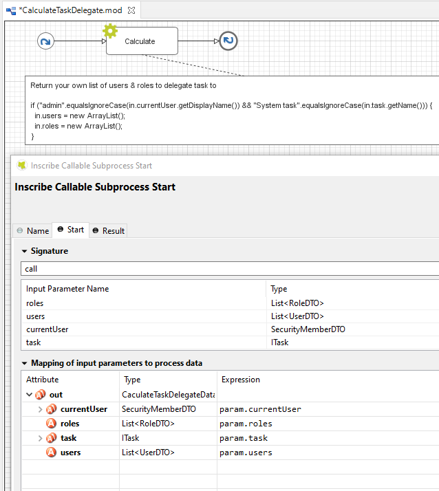
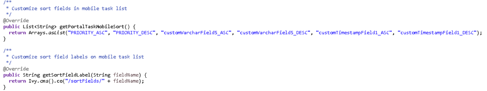

.. _customization-task-widget:

Task widget
===========

TaskWidget is a built-in component of Portal which contains the tasks
users can interact with. To show needed task's information,
Portal supports overriding concept for TaskWidget. Each TaskWidget
contains 2 parts:

#. :ref:`UI <customization-task-widget-how-to-overide-ui>`:
   TaskHeader and TaskListHeader and TaskFilter

#. :ref:`Data
   query <customization-task-widget-how-to-override-data-query>`:
   display the tasks as you want

.. important::
   - Task header customization currently support responsive design. Refer to :ref:`this part <customization-task-widget-responsive-layout>` for detail.

   - Task header's buttons cannot be modified (they stay where they are)

.. _customization-task-widget-how-to-overide-ui:

How To Override Task Widget's UI
--------------------------------

Refer to ``portal-developer-examples`` project for examples

#. Introduce an Axon Ivy project which has ``PortalTemplate`` as a
   required library.

#. To customize task widget, you must customize Portal Home first. Refer
   to :ref:`Customize Portal
   home <customization-portal-home>` to set new home
   page.

#. Copy the ``PortalStart`` process from ``PortalTemplate`` to your
   project. Point PortalHome element to your custom home page in
   previous step. This process is new home page and administrator should
   register this link by Portal's Admin Settings.

#. Use :dev-url:`Axon Ivy HtmlOverride wizard </doc/nightly/designer-guide/how-to/overrides.html?#override-new-wizard>` to override ``PortalTasks`` HTML dialog.

   .. tip:: This action overrides ``Task widget`` in: TaskList page, Task Search result.

#. After previous steps, you can override :ref:`TaskListHeader and
   TaskHeader <customization-task-widget-how-to-overide-ui-task-header>`
   and :ref:`TaskFilter <customization-task-widget-how-to-overide-ui-task-filter>`

.. _customization-task-widget-how-to-overide-ui-task-header:

Task List Header And Task Header
--------------------------------

Refer to the ``taskListHeader (1)`` and ``taskHeader (2)`` sections in
``PortalTasks.xhtml`` of PortalTemplate. In case your task widget has
new columns, you should override TaskLazyDataModel to make the sort
function of these columns work:

|task-list|

*  Introduce a Java class which extends TaskLazyDataModel

*  Override the ``extendSort`` method and extend the sort function for
   the added columns (see the method's Javadoc comments)

*  Default taskList supports user to config display/hide column: ``Custom SortFields (1)``, ``Custom checkboxes (2)`` and ``Custom header column (3)``

   |task-columns-configuration|

   *  In case you have new columns, override method
      ``getDefaultColumns`` of the extended class from TaskLazyDataModel
      to display checkboxes in Config columns panel and display/hide
      sortFields (see the methods' Javadoc comments)

   *  To add CMS for checkboxes's label, add new entries to folder
      ``/ch.ivy.addon.portalkit.ui.jsf/taskList/defaultColumns/`` in
      ``PortalStyle`` or override method ``getColumnLabel``\ (see the
      methods' Javadoc comments)

   *  In ``taskListHeader`` section, use ``TaskColumnHeader`` component

   *  In ``taskHeader`` section, use ``TaskCustomField`` component for
      each additional columns. This component will handle display/hide
      new columns on task list.

      Currently, TaskCustomField only supports text field. If you want
      to create your own component, remember to add
      rendered="#{taskView.dataModel.isSelectedColumn('YOUR_CUSTOM_COLUMN')}"

      For example: Show custom field ``customer name`` which stored in
      ``task.customFields().stringField('CustomVarCharField5')``

      .. code-block:: html

         <ic:ch.ivy.addon.portalkit.component.task.column.TaskCustomField id="customer-name-component" componentId="customer-name" column="customVarCharField5" dataModel="#{taskView.dataModel}" labelValue="#{task.customFields().stringField('CustomVarCharField5')}" />

*  Use Axon Ivy Override to override the ``InitializeTaskDataModel``
   callable and initialize data model by your customized one.

*  In your customized Portal tasks HTMLDialog, the customized data model
   should be passed as a parameter to components (refer to
   ``PortalTasks.xhtml``).

.. important::
   The sort options of the compact task list depend on the default columns defined in the ``TaskLazyDataModel``.

   That means if you removed a default column in the ``getDefaultColumns()`` method, make sure that options related to that column are removed from the compact task sort options, by overriding the ``getPortalTaskSort()`` method.

   -  e.g: If you removed ``EXPIRY_TIME`` column from ``getDefaultColumns()``, remove two options related to ``EXPIRY_TIME`` in ``getPortalTaskSort()`` method: ``EXPIRY_TIME_AS``, ``EXPIRY_TIME_DESC``.

.. _customization-task-widget-how-to-overide-ui-task-filter:

Task Filter
-----------

-  Refer to the ``taskFilter`` section in ``PortalTasks.xhtml`` of
   PortalTemplate.

-  To introduce new filter, create a new Java class extends
   TaskFilter and override its methods (see javadoc comments)

   #. Filter ``label()`` and ``value()`` method.
   #. Filter ``resetValue()`` method.
   #. Filter ``validate()`` method.

   |task-filter|

-  Introduce a Java class which extends TaskFilterContainer. This filter
   container contains your filters, you can reuse default filters, refer
   to ``DefaultTaskFilterContainer.java``

   .. tip:: StateFilter is added as default to container. If you don't need
               it, use this code in constructor: ``filters.remove(stateFilter);``

-  Introduce a Java class which extends TaskLazyDataModel. Override the
   ``initFilterContainer`` method and initialize filter container (see
   javadoc comments)

-  Use Axon Ivy Override to override the ``InitializeTaskDataModel``
   callable and initialize data model by your customized one.

-  In your customized Portal tasks HTMLDialog, the customized data model
   and filter container should be passed as parameters to components
   (refer to ``PortalTasks.xhtml``).

-  **Advanced usage:** Portal supports storing/restoring filters. Your
   filter class (extends ``TaskFilter``) is stored in business data.
   Properties stored user input values should be persisted, properties
   controlled logic should not be persisted to reduce persisted data
   size in business data. Use annotation ``@JsonIgnore`` to exclude
   properties. By default, Portal takes care storing/restoring filters.
   If you want to customize storing/restoring filter data, do it in your
   data model class (extends ``TaskLazyDataModel`` class).

   By default, filters are stored/restored in process model level. You
   can change this by setting the ui:param ``filterGroupId`` in
   ``PortalTasks.xhtml`` to a new Long value.

   .. tip:: If you have multiple case lists in your project, you may want to
               set ``filterGroupId`` to an unique identifier for each of your
               ``PortalTasks.xhtml across your projects``

.. _customization-task-widget-how-to-override-data-query:

How To Override Task Widget's Data Query
----------------------------------------

-  Override the
   BuildTaskQuery callable process of PortalKit and build your own query to
   effect the data of task widget, task categories and statistic widget.
-  If you want to apply a query for only Home page task list, not for
   Full mode task list, use attribute isQueryForHomePage in BuildTaskQuery
   callable process to specify the query for Home page task list

   *E.g:*

   .. code-block:: java

      if (in.isQueryForHomePage) { // in home page
          in.taskQuery = TaskQuery.create().where().activatorId().isNotNull();
      }

-  Apply the following steps in case you would like to provide data for
   task list after navigating to task list from your page, e.g. clicking
   on a bar chart then opening the tasks of that bar:

   -  Use the ``OpenPortalTasks`` callable process with the ``TaskView``
      parameter. It is used to define which information are displayed in
      TaskWidget.

   -  Refer to TaskView, TaskSearchCriteria to build your TaskView

   .. code-block:: java

      TaskLazyDataModel dataModel = new TaskLazyDataModel();
      // Set your TaskQuery
      dataModel.getCriteria().setCustomTaskQuery(YOUR_TASK_QUERY);
      // Display the tasks of all users
      dataModel.getCriteria().setAdminQuery(true);
      out.taskView = TaskView.create().dataModel(dataModel)
      .showHeaderToolbar(false).createNewTaskView();

.. _customization-task-widget-how-to-override-export-feature:

How To Override Export Feature
------------------------------

#. Extend the TaskExporter Java class of PortalKit.

   -  Override the ``getColumnName`` method.

   .. code-block:: java

      @Override
      protected String getColumnName(String column) {
         String columnName = getSpecialColumnName(column);
         return columnName != null ? columnName : Ivy.cms().co("/DefaultColumns/".concat(column));
      }

   -  Override the ``getColumnValue`` method.

   .. code-block:: java

      @Override
      protected Object getColumnValue(String column, ITask task) {
         switch (column) {
            case CustomizedTaskLazyDataModel.CUSTOM_VAR_CHAR_FIELD5:
               return task.customFields().stringField(CUSTOM_VARCHAR_FIELD5).getOrNull();
            case CustomizedTaskLazyDataModel.CUSTOM_TIMESTAMP_FIELD12:
               return task.customFields().timestampField(CUSTOM_TIMESTAMP_FIELD1).getOrNull();
            default:
               return getCommonColumnValue(column, task);
         }
      }

#. Override the ExportTaskToExcel callable process and apply your extended TaskExporter Java class.

   .. code-block:: java

      TaskExporter exporter = new CustomizedTaskExporter(in.columnsVisibility);
      in.exportedFile = exporter.getStreamedContent(in.collectedTasksForExporting);

.. _customization-task-widget-custom-task-delegate:

Custom Task Delegate
--------------------

Portal allows to customize the list of users and roles that a task can
be delegated to. This can be done following these steps:

#. Introduce a Axon Ivy project which has ``PortalTemplate`` as a
   required library and its own ``PortalStart`` process. Refer to step
   1, 2, 3, 4 in :ref:`override task widget's
   UI <customization-task-widget-how-to-overide-ui>` guide.

#. In your project, override the callable subprocess
   ``CalculateTaskDelegate``

   |calculate-task-delegate|

#. The callable subprocess data contains the current user
   ``in.currentUser`` and the current task to be delegated ``in.task``.
   The lists ``in.users`` and ``in.roles`` contain all possible users
   and roles that the task can be delegated to. Modify those two to have
   your own delegate list.

.. _customization-task-widget-responsive-layout:

How To Make Responsive Task List
--------------------------------

If you have customized task list and want it responsive on different
screen sizes, please follow below steps.

You can refer to ``portal-developer-examples`` project for examples

#. Add responsiveStyleClass param (in case you're using Portal
   component), or styleClass (in case you're using Primefaces or JSF
   component) with the same responsive css class for both taskListHeader
   and taskHeader. You can find responsive class in `this
   part. <#axonivyportal.customization.responsivecss>`__

   .. code-block:: html
      :emphasize-lines: 6,10,28,39

      <ui:define name="taskListHeader">
            <ic:ch.ivy.addon.portalkit.component.task.column.TaskListHeader dataModel="#{taskView.dataModel}" />
            <ic:ch.ivy.addon.portalkit.component.task.column.TaskColumnHeader dataModel="#{taskView.dataModel}"
            styleClass="TexAlCenter" componentId="task-custom" sortField="customVarCharField5"
            value="#{ivy.cms.co('/DefaultColumns/customVarCharField5')}"
            responsiveStyleClass="u-hidden-lg-down" />
            <ic:ch.ivy.addon.portalkit.component.task.column.TaskColumnHeader dataModel="#{taskView.dataModel}"
            styleClass="TexAlCenter" componentId="task-custom" sortField="customTimestampField1"
            value="#{ivy.cms.co('/DefaultColumns/customTimestampField1')}"
            responsiveStyleClass="u-hidden-lg-down
            js-hidden-when-expand-menu" />
      </ui:define>

      <ui:define name="taskHeader">
            <!-- Flexbox is applied, so please set your column's width by flex style. The TaskName column takes the remaining width. -->
            <ic:ch.ivy.addon.portalkit.component.task.column.TaskPriority priority="#{task.priority}"
            dataModel="#{taskView.dataModel}" />
            

            <ic:ch.ivy.addon.portalkit.component.task.column.TaskName task="#{task}" dataModel="#{taskView.dataModel}" />
            

            <ic:ch.ivy.addon.portalkit.component.task.column.TaskResponsible dataModel="#{taskView.dataModel}"
            userName="#{task.getActivatorName()}" fullName="#{task.getActivator().getDisplayName()}"
            styleClass="activatior-column" />
            <ic:ch.ivy.addon.portalkit.component.task.column.TaskId value="#{task.getId()}" dataModel="#{taskView.dataModel}" />
            <ic:ch.ivy.addon.portalkit.component.task.column.TaskDate
            rendered="#{taskView.dataModel.isSelectedColumn('CREATION_TIME')}" componentId="creation-time"
            value="#{task.startTimestamp}"
            responsiveStyleClass="u-hidden-md-down
            js-hidden-when-expand-menu" />
            <ic:ch.ivy.addon.portalkit.component.task.column.TaskDate
            rendered="#{taskView.dataModel.isSelectedColumn('EXPIRY_TIME')}" componentId="expiry-time"
            value="#{task.expiryTimestamp}" />
            <ic:ch.ivy.addon.portalkit.component.task.column.TaskState dataModel="#{taskView.dataModel}" state="#{task.state}" />

            <!-- New field -->
            <ic:ch.ivy.addon.portalkit.component.task.column.TaskCustomField id="customer-name-component"
            componentId="customer-name" column="customVarCharField5" dataModel="#{taskView.dataModel}"
            labelValue="#{task.customFields().stringField('CustomVarCharField5').getOrNull()}"
            responsiveStyleClass="u-hidden-lg-down" />
            <h:outputText id="shipment-date"
            styleClass="TexAlCenter custom-datetime u-hidden-lg-down js-hidden-when-expand-menu"
            value="#{task.customFields().timestampField('CustomTimestampField1').getOrNull()}"
            rendered="#{taskView.dataModel.isSelectedColumn('customTimestampField1')}">
            <f:convertDateTime pattern="#{dateTimePatternBean.configuredPattern}" />
            </h:outputText>
      </ui:define>

   .. tip:: ``TaskCustomField`` component has default
      responsiveStyleClass is ``u-hidden-sm-down``

#. Responsiveness could be broken when you anchor left menu. In this
   case, to maintain the responsiveness, you could hide some columns by
   add ``js-hidden-when-expand-menu`` to responsiveStyleClass or
   styleClass param of taskListHeader and taskHeader.

   .. code-block:: html
      :emphasize-lines: 11,29

      <ui:define name="taskListHeader">
            <ic:ch.ivy.addon.portalkit.component.task.column.TaskListHeader dataModel="#{taskView.dataModel}" />
            <ic:ch.ivy.addon.portalkit.component.task.column.TaskColumnHeader dataModel="#{taskView.dataModel}"
            styleClass="TexAlCenter" componentId="task-custom" sortField="customVarCharField5"
            value="#{ivy.cms.co('/DefaultColumns/customVarCharField5')}"
            responsiveStyleClass="u-hidden-lg-down" />
            <ic:ch.ivy.addon.portalkit.component.task.column.TaskColumnHeader dataModel="#{taskView.dataModel}"
            styleClass="TexAlCenter" componentId="task-custom" sortField="customTimestampField1"
            value="#{ivy.cms.co('/DefaultColumns/customTimestampField1')}"
            responsiveStyleClass="u-hidden-lg-down
            js-hidden-when-expand-menu" />
      </ui:define>

      <ui:define name="taskHeader">
            <!-- Flexbox is applied, so please set your column's width by flex style. The TaskName column takes the remaining width. -->
            <ic:ch.ivy.addon.portalkit.component.task.column.TaskPriority priority="#{task.priority}"
            dataModel="#{taskView.dataModel}" />
            

            <ic:ch.ivy.addon.portalkit.component.task.column.TaskName task="#{task}" dataModel="#{taskView.dataModel}" />
            

            <ic:ch.ivy.addon.portalkit.component.task.column.TaskResponsible dataModel="#{taskView.dataModel}"
            userName="#{task.getActivatorName()}" fullName="#{task.getActivator().getDisplayName()}"
            styleClass="activatior-column" />
            <ic:ch.ivy.addon.portalkit.component.task.column.TaskId value="#{task.getId()}" dataModel="#{taskView.dataModel}" />
            <ic:ch.ivy.addon.portalkit.component.task.column.TaskDate
            rendered="#{taskView.dataModel.isSelectedColumn('CREATION_TIME')}" componentId="creation-time"
            value="#{task.startTimestamp}"
            responsiveStyleClass="u-hidden-md-down
            js-hidden-when-expand-menu" />
            <ic:ch.ivy.addon.portalkit.component.task.column.TaskDate
            rendered="#{taskView.dataModel.isSelectedColumn('EXPIRY_TIME')}" componentId="expiry-time"
            value="#{task.expiryTimestamp}" />
            <ic:ch.ivy.addon.portalkit.component.task.column.TaskState dataModel="#{taskView.dataModel}" state="#{task.state}" />

            <!-- New field -->
            <ic:ch.ivy.addon.portalkit.component.task.column.TaskCustomField id="customer-name-component"
            componentId="customer-name" column="customVarCharField5" dataModel="#{taskView.dataModel}"
            labelValue="#{task.customFields().stringField('CustomVarCharField5').getOrNull()}"
            responsiveStyleClass="u-hidden-lg-down" />
            <h:outputText id="shipment-date"
            styleClass="TexAlCenter custom-datetime u-hidden-lg-down js-hidden-when-expand-menu"
            value="#{task.customFields().timestampField('CustomTimestampField1').getOrNull()}"
            rendered="#{taskView.dataModel.isSelectedColumn('customTimestampField1')}">
            <f:convertDateTime pattern="#{dateTimePatternBean.configuredPattern}" />
            </h:outputText>
      </ui:define>

  .. tip:: The smallest browser width you can anchor the left menu is
      1025. So you could reduce width of browser to 1025 to test and
      decide which columns need to be hidden.

.. |task-filter| image:: ../../screenshots/task/customization/task-filter.png

.. |task-columns-configuration| image:: ../../screenshots/task/customization/task-columns-configuration.png
.. |task-list| image:: ../../screenshots/task/customization/task-list.png

