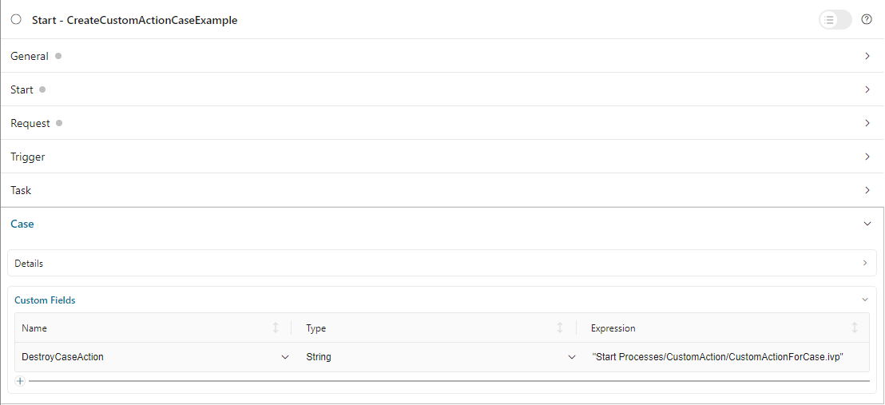
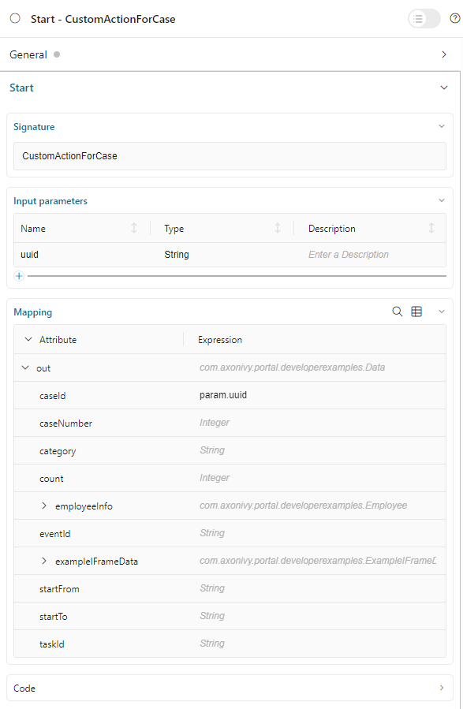
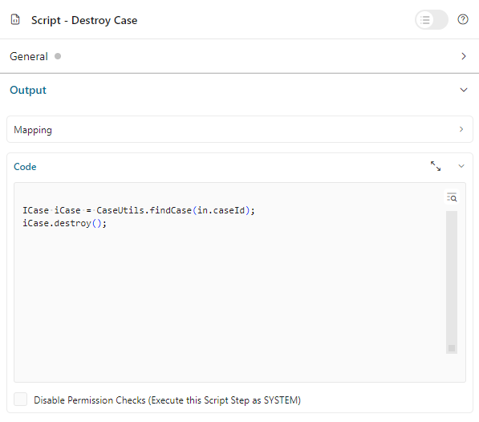

.. _configure-new-dashboard-case-widget:

Configure Case Widget
=====================

The case widget displays an interactive, customizable list of cases with advanced filtering, sorting, and search capabilities. It supports custom columns (including custom action buttons), pre-configured filters, quick search across multiple fields, and multi-language support for custom string fields via CMS.

Define Case Widget
------------------

The case widget displays cases with full control over columns, filters, sorting, and layout. Refer to :ref:`Case List Widget <new-dashboard-case-list-widget>` for widget behavior details.

Configuration Example
^^^^^^^^^^^^^^^^^^^^^

Below is a sample JSON definition of the case widget in the Portal dashboard.

Below is a sample JSON definition of the case widget in the Portal dashboard.

.. code-block:: javascript

   {
      "type": "case",
      "id": "case-widget",
      "names": [
         {
            "locale": "en",
            "value": "Your Cases"
         },
         {
            "locale": "de",
            "value": "Ihre Vorgänge"
         }
      ],
      "layout": {
         "x": 0,
         "y": 0,
         "w": 10,
         "h": 9,
         "style": "text-color: blue;",
         "styleClass": "your-widget-class"
      },
      "sortField": "name",
      "sortDescending": false,
      "rowsPerPage": 20,
      "showWidgetInfo": true,
      "showFullscreenMode": true,
      "enableQuickSearch": true,
      "isTopMenu": false,
      "columns": [
         {
            "field": "id"
         },
         {
            "field": "name",
            "visible": "true",
            "quickSearch": "true"
         },
         {
            "field": "description",
            "quickSearch": "true"
         },
         {
            "field": "creator"
         },
         {
            "field": "state",
            "headers": [
               {
                  "locale": "en",
                  "value": "State"
               },
               {
                  "locale": "de",
                  "value": "Status"
               }
            ]
         },
         {
            "field": "startTimestamp"
         },
         {
            "field": "actions"
         }
      ],
      "filters": [
         {
            "field": "state",
            "values": ["OPEN", "DONE"],
            "operator": "in",
            "type": "standard"
         }
      ]
   }
..

JSON Configuration Reference
^^^^^^^^^^^^^^^^^^^^^^^^^^^^^

**Required Properties**

.. list-table::
   :widths: 20 15 65
   :header-rows: 1

   * - Property
     - Type
     - Description
   * - ``type``
     - string
     - Widget type. Must be ``"case"`` for case widget
   * - ``id``
     - string
     - Unique identifier for the widget
   * - ``names``
     - array
     - Multilingual display names. Each entry: ``{"locale": "en", "value": "Name"}``
   * - ``layout``
     - object
     - Widget position and size (see Layout Properties below)
   * - ``columns``
     - array
     - Column configurations (see Columns section below)

**Layout Properties**

.. list-table::
   :widths: 20 15 65
   :header-rows: 1

   * - Property
     - Type
     - Description
   * - ``x``
     - number
     - Column position in 12-column grid (0-11). CSS left = ``x / 12 * 100%``
   * - ``y``
     - number
     - Row position. CSS top = ``y / 12 * 100%``
   * - ``w``
     - number
     - Width in grid columns (1-12). Pixel width = ``60 * w + 20 * (w - 1)``
   * - ``h``
     - number
     - Height in grid rows (min 5). Pixel height = ``60 * h + 20 * (h - 1)``
   * - ``styleClass``
     - string
     - *(Optional)* CSS classes for custom styling
   * - ``style``
     - string
     - *(Optional)* Inline CSS styles

.. tip::
   **Recommended case widget size:** Width 8-12 columns, Height 8-12 rows for optimal table display with pagination.

**Display & Behavior Properties**

.. list-table::
   :widths: 20 15 15 50
   :header-rows: 1

   * - Property
     - Type
     - Default
     - Description
   * - ``sortField``
     - string
     - *(none)*
     - Default column for sorting (e.g., ``"name"``, ``"startTimestamp"``)
   * - ``sortDescending``
     - boolean
     - ``false``
     - Sort direction. ``false`` = ascending, ``true`` = descending
   * - ``rowsPerPage``
     - number
     - ``10``
     - Number of cases displayed per page
   * - ``showWidgetInfo``
     - boolean
     - ``true``
     - Show/hide widget information icon
   * - ``showFullscreenMode``
     - boolean
     - ``true``
     - Show/hide fullscreen mode icon
   * - ``enableQuickSearch``
     - boolean
     - ``false``
     - Enable quick search text box
   * - ``isTopMenu``
     - boolean
     - ``false``
     - ``true`` = top-level nav item, ``false`` = under Dashboard menu

**Columns Configuration**

Each column object in the ``columns`` array:

.. list-table::
   :widths: 20 15 15 50
   :header-rows: 1

   * - Property
     - Type
     - Default
     - Description
   * - ``field``
     - string
     - *(required)*
     - Column field name (see Standard Columns below)
   * - ``visible``
     - string
     - ``"true"``
     - Column visibility: ``"true"`` or ``"false"``
   * - ``quickSearch``
     - string
     - ``"false"``
     - Include in quick search: ``"true"`` or ``"false"``
   * - ``headers``
     - array
     - *(none)*
     - Multilingual column headers: ``[{"locale": "en", "value": "Header"}]``
   * - ``type``
     - string
     - ``"STANDARD"``
     - Column type: ``"STANDARD"`` or ``"CUSTOM"``
   * - ``style``
     - string
     - *(none)*
     - Inline CSS for custom columns (e.g., ``"width: 110px"``)

**Standard Column Fields**

- ``id`` - Case ID
- ``Pin`` - Pin button for case
- ``name`` - Case name
- ``description`` - Case description
- ``state`` - Case business state
- ``creator`` - Case creator
- ``startTimestamp`` - Creation date and time
- ``endTimestamp`` - End date and time
- ``owner`` - List of case owners
- ``category`` - Case category
- ``actions`` - Action buttons (details, destroy, etc.)

**Filters Configuration**

The ``filters`` array defines pre-configured filter conditions:

.. list-table::
   :widths: 20 15 65
   :header-rows: 1

   * - Property
     - Type
     - Description
   * - ``field``
     - string
     - Column field name to filter
   * - ``values``
     - array
     - Filter values (format depends on field type)
   * - ``operator``
     - string
     - Filter operator (see Filter Conditions section)
   * - ``type``
     - string
     - ``"standard"`` or ``"custom"``

.. note::
   For detailed filter configuration, see the :ref:`Filter Conditions <configure-new-dashboard-case-widget-filter-structure>` section below.

.. _configure-new-dashboard-case-widget-custom-columns:

Custom Columns
--------------

The Portal supports custom fields for a case. You can show them on the case widget
as a column.

Traditional Custom Columns
^^^^^^^^^^^^^^^^^^^^^^^^^^

You can predefine which columns to display, along with other attributes such as
filters, formats, and styles. Below is a standard JSON example of a custom
column.

.. code-block:: javascript

   {
      ...

      "columns": [
         {
            "type": "CUSTOM",
            "field": "HIDE",
            "style": "width: 110px"
         }
      ]
   }

..

Besides the attributes explained in the previous section, a custom column has
two differences:

   - ``type``: type of the widget column. There are two options: ``STANDARD`` and ``CUSTOM``.

   - ``field``: this attribute is the name of the case's custom field which will
     be used to get data for the column.

.. important::
   Portal only displays custom fields declared in the ``custom-fields.yaml`` file.
   Refer to :doc-url:`Custom Fields Meta Information </designer-guide/how-to/workflow/custom-fields.html#meta-information>` for more information.

Custom Action Button Columns
^^^^^^^^^^^^^^^^^^^^^^^^^^^^
Portal supports creating custom action buttons as a column in case widget for specific needs. By clicking on these buttons, a custom process is triggered.

Follow these steps to implement it:

   #. Create a new process that will be triggered after clicking on the custom action button. In this process, define a request start event that accepts the ``uuid`` parameter. 
   When the ``Custom Action`` button on the case details page is clicked, Portal will call this process and pass the case UUID as 
   the ``uuid`` parameter.
      
      |custom-action-button-process-demo|

   #. Design and implement the action/script for the custom action within this process.
   
      |custom-action-destroy-case|

   #. Describe the custom action button in ``custom-fields.yaml``. 

      .. code-block:: yaml

         CustomFields:
            Cases:
               DestroyCaseAction:
                  Label: Destroy Case Action
                  Category: Custom Case Action
                  Icon: si si-controls-play
                  IsCustomAction: true

      - ``IsCustomAction: true`` is mandatory to inform Portal that it is an action button.
      - For the ``Icon``, please refer to the streamline icon showcase available in Html Dialog Demos on Axon Ivy Market.

   #. On the process start of the main process, assign a custom field to it.
   
      |custom-action-button-custom-field|

Filter Conditions
-----------------

You can predefine filter conditions for most columns of the case widget. Each
column has different conditions: some accept only a list, some accept only a
string, and others require a string in a specific format, such as date-time.
Please refer to :ref:`Complex Filter <complex-filter>` for more details.

Base structure of filter json:

   .. code-block:: javascript

         {
            ...
      
            "columns": [
               {
                  "field": "name"
               }
            ],
            "filters" : [
               {
                  "field" : "name",
                  "values" : [ "Mike ", "Nam" ],
                  "operator" : "contains",
                  "type" : "standard"
               } 
            ]
         }

   ..
   
.. _configure-new-dashboard-case-widget-filter-structure:

   - ``field``: filter field name corresponding with column name

   - ``values``: filter value, could be a list, a string or a number

   - ``operator``: filter operator, operators can be difference depend on each field type.

     - **String column**: is, is_not, empty, not_empty, contains, not_contains, start_with, not_start_with, end_with, not_end_with

     - **Number column**: between, not_between, empty, not_empty, equal, not_equal, less, less_or_equal, greater, greater_or_equal

     - **Date column**: today, yesterday, is, is_not, before, after, between, not_between, current, last, next, empty, not_empty

   - ``type``: ``standard`` for a standard column or ``custom`` for a custom column

   - Date type additional field:

      - ``periodType``: string value, ``YEAR``, ``MONTH``, ``WEEK``, ``DAY``

      - ``from``: string value. E.g.: "03/19/2024"

      - ``to``: string value. E.g.: "01/01/2024"
   
   - Number type additional field:

      - ``from``: string value. E.g.: "3.0"

      - ``to``: string value. E.g.: "55.2"

There are additional fields dependent on the operator and many specific filters for each field type. Below is the list of filterable columns and their corresponding filter
conditions.

.. tip:: 
   We encourage utilizing dashboard configurations to edit widgets and then leveraging the export dashboard feature to ensure better expectations when customizing these widgets.  

Standard Column:

   - ``name``

      .. code-block:: javascript

         {
            ...
      
            "columns": [
               {
                  "field": "name"
               }
            ],
            "filters" : [ 
               {
                  "field" : "name",
                  "values" : [ "Mike ", "Nam" ],
                  "operator" : "contains",
                  "type" : "standard"
               } 
            ]
         }

      ..

      This column accepts all operators available for String column. Additionally, it accepts ``values`` as a list of strings .

   - ``description``

      .. code-block:: javascript

         {
            ...
      
            "columns": [
               {
                  "field": "description"
               }
            ],
            "filters" : [ 
               {
                  "field" : "description",
                  "values" : [ "Leave" ],
                  "operator" : "not_end_with",
                  "type" : "standard"
               } 
            ]
         }

      ..

      This column accepts all operators available for String column. Additionally, it accepts ``values`` as a list of strings .

   - ``state``: Case business state

      .. code-block:: javascript

         {
            ...
      
            "columns": [
               {
                  "field": "state"
               }
            ],
            "filters" : [ 
               {
                  "field" : "state",
                  "values" : [ "DESTROYED", "DONE", "OPEN" ],
                  "operator" : "in",
                  "type" : "standard"
               } 
            ]
         }
      ..

      This column only accepts a list of case business state names as the filter value. The available filter operator is ``in``.

      Refer to :doc-url:`Case business states </public-api/ch/ivyteam/ivy/workflow/caze/CaseBusinessState.html>` for
      available case business states.

   - ``creator``

      .. code-block:: javascript

         {
            ...
      
            "columns": [
               {
                  "field": "creator"
               }
            ],
            "filters" : [ 
               {
                  "field" : "creator",
                  "values" : [ "backendDev2", "gm1" ],
                  "operator" : "in",
                  "type" : "standard"
               },
               {
                  "field" : "creator",
                  "operator" : "current_user",
                  "type" : "standard"
               } 
            ]
         }

      ..

      This column only accepts a list of usernames as filter value for the case creator's username. The available filter operators are ``in``, ``not_in`` and ``current_user``. 
      The ``current_user`` operator does not require value field.

   - ``startTimestamp`` and ``endTimestamp``: created date and finished date of the Case

      .. code-block:: javascript

         {
            ...
      
            "columns": [
               {
                  "field": "creator"
               }
            ],
            "filters" : [ 
               {
                  "field" : "startTimestamp",
                  "to" : "03/12/2024",
                  "operator" : "after",
                  "type" : "standard"
               },
               {
                  "field" : "startTimestamp",
                  "operator" : "current",
                  "periodType" : "MONTH",
                  "type" : "standard"               
               },
               {
                  "field" : "startTimestamp",
                  "from" : "03/01/2024",
                  "to" : "03/17/2024",
                  "operator" : "between",
                  "type" : "standard"
               },
               {
                  "field" : "startTimestamp",
                  "operator" : "last",
                  "periods" : 2,
                  "periodType" : "YEAR",
                  "type" : "standard"
               },
               {
                  "field" : "startTimestamp",
                  "from" : "03/19/2024",
                  "operator" : "is",
                  "type" : "standard"
               },
               {
                  "field" : "startTimestamp",
                  "operator" : "empty",
                  "type" : "standard"
               }
            ]
         }

      ..

      This column accepts all operators available for Date column. Fields may vary depending on the operator. The JSON example above covers most use cases for the Date field.
      Acceptable date formats: ``dd.MM.yyyy``, ``dd.MM.yyyy HH:mm``, ``MM/dd/yyyy`` and ``MM/dd/yyyy HH:mm``.

   - ``category``

      .. code-block:: javascript

         {
            ...
      
            "columns": [
               {
                  "field": "category"
               }
            ],
            "filters" : [ 
               {
                  "field" : "category",
                  "values" : [ "LeaveRequest", "Leave_Request_1" ],
                  "operator" : "in",
                  "type" : "standard"
               }
            ]
         }

      ..

      The available filter operators are ``in``, ``not_in``, ``no_category``, ``contains`` and ``not_contains``. 
      The ``no_category`` operator does not require value field.

Custom Field Column: 

   - :ref:`configure-new-dashboard-case-widget-custom-columns` are using the same operator as :ref:`Standard Column <configure-new-dashboard-case-widget-filter-structure>`

   - ``type`` field must be ``custom``

   .. code-block:: javascript

      {
         ...

         "columns": [
            {
               "field": "InvoiceNumber"
            }
         ],
         "filters" : [ 
            {
               "field" : "InvoiceNumber",
               "value" : "566.00",
               "operator" : "less_or_equal",
               "type" : "custom"
            }
         ]
      }

   ..

Quick Search
------------

The Quick search is a useful function for users to quickly search the cases within the case widget.
The configuration of the quick search has two attributes:
   
   * ``enableQuickSearch``: enables the quick search feature for the widget.

   * ``quickSearch``: indicates that a column is searchable using the quick search feature.

If you set the ``enableQuickSearch`` attribute to ``false``, the quick search feature will be disabled,
regardless of the ``quickSearch`` attribute's value.

Conversely, if you set the ``enableQuickSearch`` attribute to ``true``, the quick search feature will
search within the values of all columns that have the ``quickSearch`` attribute set to ``true``.
If you haven't assigned the ``quickSearch`` attribute to any column in the case widget,
the quick search feature will default to searching the name and description fields.

Below are the definition of these attributes:

   * ``enableQuickSearch``: to enable/disable the quick search feature, set the
     ``enableQuickSearch`` field of the case widget as shown below.

      .. code-block:: javascript

         {
            ...
            "type": "case",
            "id": "case_98ae4fc1c83f4f22be5244c8027ecf40"
            ...
            "enableQuickSearch": "true",
            ...
         }

      ..

      Valid values:

      * ``true``: show the quick search text box.
      * ``false``: hide the quick search text box.
      * ``not defined``: hide the quick search text box.

   * ``quickSearch``: to choose which columns can be searched by the quick search
     feature, set the ``quickSearch`` field for each column as shown below.

      .. code-block:: javascript

         {
            ...
            "type": "case",
            "id": "case_98ae4fc1c83f4f22be5244c8027ecf40"
            ...
            "columns": [
               {
                  "field": "id",
                  "quickSearch": "false"
               },
               ...
            ]
            ...
         }

      ..

      Valid values:

      * ``true``: apply quick search for this column.
      * ``false``: do not apply quick search for this column.
      * ``not defined``: the ``name`` and ``description`` columns are ``true``, other columns are ``false`` by default.

Multi-Language Support for Custom String Fields
-----------------------------------------------

With the **Multi-Language Support for Custom Fields** feature, we enable the provision of values in a custom field in multiple languages.
The field content is displayed based on the language selected in the custom field.

.. important::
   Portal only supports Multi-Language for Custom Fields with ``TYPE: STRING``.

Enabling Multi-Language Support
^^^^^^^^^^^^^^^^^^^^^^^^^^^^^^^

To allow a custom field to retrieve multilingual values from the CMS, set the ``HasCmsValue`` attribute to ``true`` in the corresponding ``custom-field`` yaml file configuration.
Otherwise, the logic remains unchanged, and the custom field uses the static value.
Additionally, the value must be entered and maintained in the CMS in multiple languages.

Following this path to add your custom field values: ``/CustomFields/Cases/{fieldName}/Values/{value}``
Please follow this :doc-url:`Localize Label, Description, Category
and Values </designer-guide/configuration/custom-fields.html#localize-label-description-category-and-values>`
to get more information.

Example YAML Configuration
^^^^^^^^^^^^^^^^^^^^^^^^^^

.. code-block:: yaml

   Country:
      Label: Country
      Description: Country description
      HasCmsValues: true
      TYPE: STRING

In your CMS, the path should be
``/CustomFields/Cases/Country/Values/Vietnam``,
``/CustomFields/Cases/Country/Values/Korea`` or
``/CustomFields/Cases/Country/Values/Germany``.

|case-field-cms|

Result
^^^^^^

- If ``HasCmsValues`` is set with ``true``, the values from the CMS are used.
- If the values are entered and translated in the CMS, then the custom field is displayed based on the selected language.
- If the translation for a value is missing in the CMS, the static value from the entry is used instead.

Sorting, Filtering, and Searching with Multi-Language Custom Fields
^^^^^^^^^^^^^^^^^^^^^^^^^^^^^^^^^^^^^^^^^^^^^^^^^^^^^^^^^^^^^^^^^^^

Sorting
^^^^^^^

1. ``HasCmsValues = false`` or not set. Sorting is performed as usual based on the stored values.
2. ``HasCmsValues = true``. Sorting is performed based on values translated in the currently selected language.

.. note::

   If ``HasCmsValues = true`` but a translation is missing in a specific language, only the translated values are sorted.

Searching
^^^^^^^^^

1. ``HasCmsValues = false`` or not set. The search is performed as usual based on the stored value.
2. ``HasCmsValues = true``. The search is conducted in both the CMS translations and the original value.

Example: When language is Spanish, a user can search for **Corea** or the original value **Korea**.

Filtering
^^^^^^^^^

1. ``HasCmsValues = false`` or not set. Filtering is performed as usual based on the stored value.
2. ``HasCmsValues = true``. The filter is conducted in both the CMS translations and the original value.

.. important::

   When enabling the Multi-Language for Custom Fields, only accepted ``CONTAINS`` operator.

.. tip::

   If a value needs to be filtered in multiple languages, all corresponding translations must be in the filter.

Conclusion
^^^^^^^^^^

With Multi-Language Support for Custom Fields, we enable flexible and dynamic
provision of field content in multiple languages. The functionalities for
searching, sorting, and filtering have been adapted accordingly to ensure
consistent behavior for multilingual content.

.. |custom-action-button-process-demo| image:: images/new-dashboard-case-widget/custom-action-button-process-demo.png

