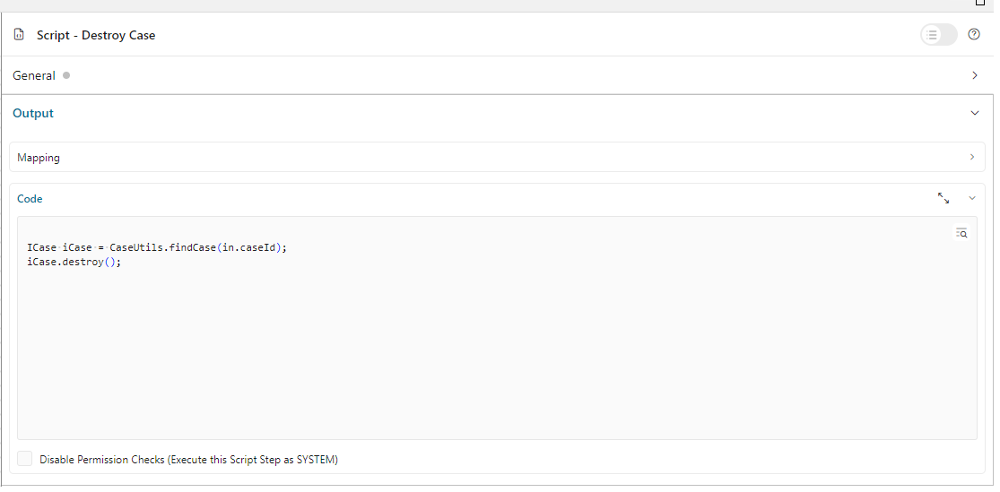

.. _configure-new-dashboard-case-widget:

Configure Case Widget
=====================

Define Case Widget
------------------

The case widget of the Portal dashboard is an interactive case list. Refer
to :ref:`Case List Widget <new-dashboard-case-list-widget>` for details.

Below is a sample JSON definition of the case widget in the Portal dashboard.

.. code-block:: javascript

   {
      "type": "case",
      "id": "case-widget",
      "names": [
         {
            "locale": "en",
            "value": "Your Cases"
         },
         {
            "locale": "de",
            "value": "Ihre Vorgänge"
         }
      ],
      "layout": {
         "x": 0,
         "y": 0,
         "w": 10,
         "h": 9,
         "style": "text-color: blue;",
         "styleClass": "your-widget-class"
      },
      "sortField": "name",
      "rowsPerPage": 20,
      "showWidgetInfo": true,
      "showFullscreenMode": true,
      "isTopMenu": false,
      "columns": [
         {
            "field": "id"
         },
         {
            "field": "name",
            "visible": "false"
         },
         {
            "field": "description"
         },
         {
            "field": "creator"
         },
         {
            "field": "state",
            "headers": [
            {
               "locale": "en",
               "value": "State"
            },
            {
               "locale": "de",
               "value": "Status"
            }
            ]
         },
         {
            "field": "startTimestamp"
         },
         {
            "field": "actions"
         }
      ]
   }
..

The basic JSON structure of the case widget
-  ``type``: type of the widget. Use ``case`` for a case widget

-  ``id``: ID of the widget

-  ``names``: multilingual name of the widget on the UI.

-  ``layout``: layout definition of the case widget

   -  ``x``: HTML DOM Style ``left`` is calculated as formula ``x / 12 * 100%``

   -  ``y``: HTML DOM Style ``top`` is calculated as formula ``y / 12 * 100%``

   -  ``w``: HTML DOM Style ``width`` is calculated as formula ``60 * w + 20 * (w - 1)``

   -  ``h``: HTML DOM Style ``height`` is calculated as formula ``60 * h + 20 * (h - 1)``

   -  ``styleClass`` (optional): add CSS classes to HTML DOM of the Case widget

   -  ``style`` (optional): add inline style to HTML DOM of the Case widget

-  ``sortField``: default sort field for the Case widget

-  ``sortDescending``: sort direction of the default sort field. The 
   default value is ``false`` (sort ascending)

-  ``rowsPerPage``: maximum number of cases that are displayed on one page of
   the case widget. The default is 10 rows per page

-  ``showWidgetInfo``: visibility of the widget information icon. The default value is ``true``, set to ``false`` to hide the icon

-  ``showFullscreenMode``: visibility of the fullscreen mode icon. The default value is ``true``, set to ``false`` to hide the icon

-  ``isTopMenu``: if the value is ``true``, the dashboard appears as a top-level item in the navigation bar. 
   If the value is ``false``, it appears as a sub-item under the `Dashboard` menu. 
   The default value is ``false``.

-  ``columns``: column configurations for each column in the case widget. You
   can predefine filters, styles, visibility,... of columns and define custom
   columns, too.

   -  ``field``: field name of the column
         
         For a standard column, ``field`` must be one of these:

            - ``id``: case ID

            - ``name``: case name

            - ``description``: case description

            - ``state``: case business state

            - ``creator``: case creator

            - ``startTimestamp``: creation date and time of the case

            - ``endTimestamp``: end date and time of the case

            - ``owner``: list of case owners

            - ``actions``: for further actions like ``access case details``,
              ``case business details``, ``destroy case``

         For custom columns, ``field`` is the name of a case custom field.
         Portal will use the value of the ``field`` attribute to get the value
         of the column.

   -  ``visible``: visibility of a column. The default value is "true". Set to
      "false" to hide the column.

   -  ``quickSearch``: Adds this field to the search scope of the quick search. The default value is ``false``.
      Set it to ``true`` to apply search condition for the column.

   -  ``headers``: multilingual header of the column.

.. _configure-new-dashboard-case-widget-custom-columns:

Custom Columns
--------------

The Portal supports custom fields for a case. You can show them on the case widget
as a column.

Traditional Custom Columns
^^^^^^^^^^^^^^^^^^^^^^^^^^

You can predefine which columns to display, along with other attributes such as
filters, formats, and styles. Below is a standard JSON example of a custom
column.

.. code-block:: javascript

   {
      ...

      "columns": [
         {
            "type": "CUSTOM",
            "field": "HIDE",
            "style": "width: 110px"
         }
      ]
   }

..

Besides the attributes explained in the previous section, a custom column has
two differences:

   - ``type``: type of the widget column. There are two options: ``STANDARD`` and ``CUSTOM``.

   - ``field``: this attribute is the name of the case's custom field which will
     be used to get data for the column.

.. important::
   Portal only displays custom fields declared in the ``custom-fields.yaml`` file.
   Refer to :dev-url:`Custom Fields Meta Information </doc/|version|/designer-guide/how-to/workflow/custom-fields.html#meta-information>` for more information.

Custom Action Button Columns
^^^^^^^^^^^^^^^^^^^^^^^^^^^^
Portal supports creating custom action buttons as a column in case widget for specific needs. By clicking on these buttons, a custom process is triggered.

Follow these steps to implement it:

   #. Create a new process that will be triggered after clicking on the custom action button. In this process, define a request start event that accepts the ``uuid`` parameter. 
   When the ``Custom Action`` button on the case details page is clicked, Portal will call this process and pass the case UUID as 
   the ``uuid`` parameter.
      
      |custom-action-button-process-demo|

   #. Design and implement the action/script for the custom action within this process.
   
      |custom-action-destroy-case|

   #. Describe the custom action button in ``custom-fields.yaml``. 

      .. code-block:: yaml

         CustomFields:
            Cases:
               DestroyCaseAction:
                  Label: Destroy Case Action
                  Category: Custom Case Action
                  Icon: si si-controls-play
                  IsCustomAction: true

      - ``IsCustomAction: true`` is mandatory to inform Portal that it is an action button.
      - For the ``Icon``, please refer to the streamline icon showcase available in Html Dialog Demos on |ivy| Market.

   #. On the process start of the main process, assign a custom field to it.
   
      |custom-action-button-custom-field|

Filter Conditions
-----------------

You can predefine filter conditions for most columns of the case widget. Each
column has different conditions: some accept only a list, some accept only a
string, and others require a string in a specific format, such as date-time.
Please refer to :ref:`Complex Filter <complex-filter>` for more details.

Base structure of filter json:

   .. code-block:: javascript

         {
            ...
      
            "columns": [
               {
                  "field": "name"
               }
            ],
            "filters" : [
               {
                  "field" : "name",
                  "values" : [ "Mike ", "Nam" ],
                  "operator" : "contains",
                  "type" : "standard"
               } 
            ]
         }

   ..
   
.. _configure-new-dashboard-case-widget-filter-structure:

   - ``field``: filter field name corresponding with column name

   - ``values``: filter value, could be a list, a string or a number

   - ``operator``: filter operator, operators can be difference depend on each field type.

     - **String column**: is, is_not, empty, not_empty, contains, not_contains, start_with, not_start_with, end_with, not_end_with

     - **Number column**: between, not_between, empty, not_empty, equal, not_equal, less, less_or_equal, greater, greater_or_equal

     - **Date column**: today, yesterday, is, is_not, before, after, between, not_between, current, last, next, empty, not_empty

   - ``type``: ``standard`` for a standard column or ``custom`` for a custom column

   - Date type additional field:

      - ``periodType``: string value, ``YEAR``, ``MONTH``, ``WEEK``, ``DAY``

      - ``from``: string value. E.g.: "03/19/2024"

      - ``to``: string value. E.g.: "01/01/2024"
   
   - Number type additional field:

      - ``from``: string value. E.g.: "3.0"

      - ``to``: string value. E.g.: "55.2"

There are additional fields dependent on the operator and many specific filters for each field type. Below is the list of filterable columns and their corresponding filter
conditions.

.. tip:: 
   We encourage utilizing dashboard configurations to edit widgets and then leveraging the export dashboard feature to ensure better expectations when customizing these widgets.  

Standard Column:

   - ``name``

      .. code-block:: javascript

         {
            ...
      
            "columns": [
               {
                  "field": "name"
               }
            ],
            "filters" : [ 
               {
                  "field" : "name",
                  "values" : [ "Mike ", "Nam" ],
                  "operator" : "contains",
                  "type" : "standard"
               } 
            ]
         }

      ..

      This column accepts all operators available for String column. Additionally, it accepts ``values`` as a list of strings .

   - ``description``

      .. code-block:: javascript

         {
            ...
      
            "columns": [
               {
                  "field": "description"
               }
            ],
            "filters" : [ 
               {
                  "field" : "description",
                  "values" : [ "Leave" ],
                  "operator" : "not_end_with",
                  "type" : "standard"
               } 
            ]
         }

      ..

      This column accepts all operators available for String column. Additionally, it accepts ``values`` as a list of strings .

   - ``state``: Case business state

      .. code-block:: javascript

         {
            ...
      
            "columns": [
               {
                  "field": "state"
               }
            ],
            "filters" : [ 
               {
                  "field" : "state",
                  "values" : [ "DESTROYED", "DONE", "OPEN" ],
                  "operator" : "in",
                  "type" : "standard"
               } 
            ]
         }
      ..

      This column only accepts a list of case business state names as the filter value. The available filter operator is ``in``.

      Refer to :dev-url:`Case business states </doc/|version|/public-api/ch/ivyteam/ivy/workflow/caze/CaseBusinessState.html>` for
      available case business states.

   - ``creator``

      .. code-block:: javascript

         {
            ...
      
            "columns": [
               {
                  "field": "creator"
               }
            ],
            "filters" : [ 
               {
                  "field" : "creator",
                  "values" : [ "backendDev2", "gm1" ],
                  "operator" : "in",
                  "type" : "standard"
               },
               {
                  "field" : "creator",
                  "operator" : "current_user",
                  "type" : "standard"
               } 
            ]
         }

      ..

      This column only accepts a list of usernames as filter value for the case creator's username. The available filter operators are ``in``, ``not_in`` and ``current_user``. 
      The ``current_user`` operator does not require value field.

   - ``startTimestamp`` and ``endTimestamp``: created date and finished date of the Case

      .. code-block:: javascript

         {
            ...
      
            "columns": [
               {
                  "field": "creator"
               }
            ],
            "filters" : [ 
               {
                  "field" : "startTimestamp",
                  "to" : "03/12/2024",
                  "operator" : "after",
                  "type" : "standard"
               },
               {
                  "field" : "startTimestamp",
                  "operator" : "current",
                  "periodType" : "MONTH",
                  "type" : "standard"               
               },
               {
                  "field" : "startTimestamp",
                  "from" : "03/01/2024",
                  "to" : "03/17/2024",
                  "operator" : "between",
                  "type" : "standard"
               },
               {
                  "field" : "startTimestamp",
                  "operator" : "last",
                  "periods" : 2,
                  "periodType" : "YEAR",
                  "type" : "standard"
               },
               {
                  "field" : "startTimestamp",
                  "from" : "03/19/2024",
                  "operator" : "is",
                  "type" : "standard"
               },
               {
                  "field" : "startTimestamp",
                  "operator" : "empty",
                  "type" : "standard"
               }
            ]
         }

      ..

      This column accepts all operators available for Date column. Fields may vary depending on the operator. The JSON example above covers most use cases for the Date field.
      Acceptable date formats: ``dd.MM.yyyy``, ``dd.MM.yyyy HH:mm``, ``MM/dd/yyyy`` and ``MM/dd/yyyy HH:mm``.

   - ``category``

      .. code-block:: javascript

         {
            ...
      
            "columns": [
               {
                  "field": "category"
               }
            ],
            "filters" : [ 
               {
                  "field" : "category",
                  "values" : [ "LeaveRequest", "Leave_Request_1" ],
                  "operator" : "in",
                  "type" : "standard"
               }
            ]
         }

      ..

      The available filter operators are ``in``, ``not_in``, ``no_category``, ``contains`` and ``not_contains``. 
      The ``no_category`` operator does not require value field.

Custom Field Column: 

   - :ref:`configure-new-dashboard-case-widget-custom-columns` are using the same operator as :ref:`Standard Column <configure-new-dashboard-case-widget-filter-structure>`

   - ``type`` field must be ``custom``

   .. code-block:: javascript

      {
         ...

         "columns": [
            {
               "field": "InvoiceNumber"
            }
         ],
         "filters" : [ 
            {
               "field" : "InvoiceNumber",
               "value" : "566.00",
               "operator" : "less_or_equal",
               "type" : "custom"
            }
         ]
      }

   ..

Quick Search
------------

The Quick search is a useful function for users to quickly search the cases within the case widget.
The configuration of the quick search has two attributes:
   
   * ``enableQuickSearch``: enables the quick search feature for the widget.

   * ``quickSearch``: indicates that a column is searchable using the quick search feature.

If you set the ``enableQuickSearch`` attribute to ``false``, the quick search feature will be disabled,
regardless of the ``quickSearch`` attribute's value.

Conversely, if you set the ``enableQuickSearch`` attribute to ``true``, the quick search feature will
search within the values of all columns that have the ``quickSearch`` attribute set to ``true``.
If you haven't assigned the ``quickSearch`` attribute to any column in the case widget,
the quick search feature will default to searching the name and description fields.

Below are the definition of these attributes:

   * ``enableQuickSearch``: to enable/disable the quick search feature, set the
     ``enableQuickSearch`` field of the case widget as shown below.

      .. code-block:: javascript

         {
            ...
            "type": "case",
            "id": "case_98ae4fc1c83f4f22be5244c8027ecf40"
            ...
            "enableQuickSearch": "true",
            ...
         }

      ..

      Valid values:

      * ``true``: show the quick search text box.
      * ``false``: hide the quick search text box.
      * ``not defined``: hide the quick search text box.

   * ``quickSearch``: to choose which columns can be searched by the quick search
     feature, set the ``quickSearch`` field for each column as shown below.

      .. code-block:: javascript

         {
            ...
            "type": "case",
            "id": "case_98ae4fc1c83f4f22be5244c8027ecf40"
            ...
            "columns": [
               {
                  "field": "id",
                  "quickSearch": "false"
               },
               ...
            ]
            ...
         }

      ..

      Valid values:

      * ``true``: apply quick search for this column.
      * ``false``: do not apply quick search for this column.
      * ``not defined``: the ``name`` and ``description`` columns are ``true``, other columns are ``false`` by default.

.. |custom-action-button-custom-field| image:: images/new-dashboard-case-widget/custom-action-button-custom-field.png

.. |custom-action-button-custom-field-start| image:: images/new-dashboard-case-widget/custom-action-button-custom-field-start.png
.. |custom-action-destroy-case| image:: images/new-dashboard-case-widget/custom-action-destroy-case.png
