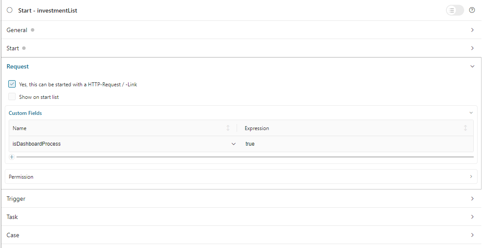

.. _configure-new-dashboard-custom-widget:

Configure Custom Widget
=======================

The custom widget allows you to embed custom content on the Portal dashboard using iframes. You can display either an Ivy process or an external webpage URL, enabling integration of specialized functionality like weather widgets, charts, or custom applications directly on the dashboard.

.. _define-an-ivy-process-for-the-custom-widget:

Define An Ivy Process For The Custom Widget
-------------------------------------------

The custom widget can display a predefined Ivy process, allowing users to interact with custom functionality directly on the Portal Dashboard without opening another page.

Process Setup Requirements
^^^^^^^^^^^^^^^^^^^^^^^^^^^

To create an Ivy process for use in a custom widget:

#. **Set the Dashboard Custom Field**

   Set custom field ``isDashboardProcess`` to ``true`` for your process.

   |dashboard-custom-field|

#. **Define Parameters with Special Format**

   Parameters must be String variables named in format: ``type__name``

   |dashboard-custom-params|

   **Parameter Type Prefixes:**

   - ``user__`` - Username of an Ivy user
   - ``string__`` - String value (java.lang.String)
   - ``boolean__`` - Boolean value (java.lang.Boolean)
   - ``date__`` - Date value (java.util.Date)

   **Parameter Name:**
   
   The part after ``__`` becomes the field label in the widget configuration dialog. If the name is empty, the widget header is hidden.

   **Example:** Parameter ``user__customer`` displays a dropdown labeled "customer" to select an Ivy user.

   |dashboard-custom-widget-configuration|

Define A Custom Widget Using JSON
---------------------------------

A custom dashboard widget allows users to interact with an external webpage or an Ivy process on the dashboard through iframes.

Configuration Example
^^^^^^^^^^^^^^^^^^^^^

Below is a standard JSON definition of the custom widget in the Portal dashboard.

   .. code-block:: javascript

      {
         "type": "custom",
         "id": "custom-widget",
         "showFullscreenMode": true,
         "names": [
            {
               "locale": "en",
               "value": "Custom Widget"
            },
            {
               "locale": "de",
               "value": "Benutzerdefiniertes Widget"
            }
         ],
         "layout": {
            "x": 0,
            "y": 0,
            "w": 6,
            "h": 8
         },
         "data": {
            "processPath": "designer/portal-user-examples/Start Processes/DashboardCustomWidgetExample/investmentList.ivp",
            "params": [
               {
                  "type": "user",
                  "name": "customer",
                  "value": "demo"
               },
               {
                  "type": "date",
                  "name": "startDate",
                  "value": "11/19/2021"
               },
               {
                  "type": "string",
                  "name": "note",
                  "value": "a short note for demo process"
               }
            ]
         }
      }
   ..

JSON Configuration Reference
^^^^^^^^^^^^^^^^^^^^^^^^^^^^^

**Required Properties**

.. list-table::
   :widths: 20 15 65
   :header-rows: 1

   * - Property
     - Type
     - Description
   * - ``type``
     - string
     - Widget type. Must be ``"custom"`` for custom widget
   * - ``id``
     - string
     - Unique identifier for the widget
   * - ``names``
     - array
     - Multilingual display names. Each entry: ``{"locale": "en", "value": "Name"}``
   * - ``layout``
     - object
     - Widget position and size (see Layout Properties below)
   * - ``data``
     - object
     - Custom widget content definition (see Data Properties below)

**Layout Properties**

.. list-table::
   :widths: 20 15 65
   :header-rows: 1

   * - Property
     - Type
     - Description
   * - ``x``
     - number
     - Column position in 12-column grid (0-11). CSS left = ``x / 12 * 100%``
   * - ``y``
     - number
     - Row position. CSS top = ``y / 12 * 100%``
   * - ``w``
     - number
     - Width in grid columns (1-12). Pixel width = ``60 * w + 20 * (w - 1)``
   * - ``h``
     - number
     - Height in grid rows (min 4). Pixel height = ``60 * h + 20 * (h - 1)``

.. tip::
   **Recommended custom widget size:** Width 4-8 columns, Height 6-10 rows for optimal content display.

**Display Properties**

.. list-table::
   :widths: 20 15 15 50
   :header-rows: 1

   * - Property
     - Type
     - Default
     - Description
   * - ``showFullscreenMode``
     - boolean
     - ``true``
     - Show/hide fullscreen mode icon

**Data Properties**

The ``data`` object defines the custom widget content:

.. list-table::
   :widths: 20 15 65
   :header-rows: 1

   * - Property
     - Type
     - Description
   * - ``processPath``
     - string
     - :doc-url:`IWebStartable </public-api/ch/ivyteam/ivy/workflow/start/IWebStartable.html>` identifier of the Ivy process
   * - ``params``
     - array
     - *(Optional)* Process parameters (see Parameter Configuration below)
   * - ``url``
     - string
     - *(Alternative to processPath)* External webpage URL to display in iframe

**Parameter Configuration**

Each parameter object in the ``params`` array:

.. list-table::
   :widths: 20 15 65
   :header-rows: 1

   * - Property
     - Type
     - Description
   * - ``name``
     - string
     - Parameter name (matches process parameter after ``type__`` prefix)
   * - ``type``
     - string
     - Parameter type: ``"string"``, ``"user"``, ``"date"``, or ``"boolean"``
   * - ``value``
     - string
     - Predefined value for the parameter

**Parameter Types**

- ``string`` - Text input field in configuration dialog. Accepts any string value.
- ``user`` - User selection dropdown in configuration dialog. Accepts Ivy usernames only.
- ``date`` - Date picker in configuration dialog. Accepts formats: ``dd.MM.yyyy`` or ``MM/dd/yyyy``.
- ``boolean`` - Radio button in configuration dialog. Accepts ``"true"`` or ``"false"``.

.. note::
   Before defining parameters in JSON, ensure your Ivy process parameters follow the ``type__name`` format as described in :ref:`Define An Ivy Process for the Custom Widget<define-an-ivy-process-for-the-custom-widget>`.

Parameter Type Examples
^^^^^^^^^^^^^^^^^^^^^^^

**String Parameter**

Displays as a text input field in the configuration dialog:

.. code-block:: javascript

   {
      "params": [
         {
            "type": "string",
            "name": "note",
            "value": "a short note for demo process"
         }
      ]
   }
..

**User Parameter**

Displays as a dropdown with Ivy users in the configuration dialog:

.. code-block:: javascript

   {
      "params": [
         {
            "type": "user",
            "name": "customer",
            "value": "demo"
         }
      ]
   }
..

**Date Parameter**

Displays as a date picker in the configuration dialog. Accepts formats: ``dd.MM.yyyy`` or ``MM/dd/yyyy``:

.. code-block:: javascript

   {
      "params": [
         {
            "type": "date",
            "name": "startDate",
            "value": "01/01/2024"
         }
      ]
   }
..

**Boolean Parameter**

Displays as radio buttons (true/false) in the configuration dialog:

.. code-block:: javascript

   {
      "params": [
         {
            "type": "boolean",
            "name": "isActive",
            "value": "true"
         }
      ]
   }
..

.. tip::
   For detailed examples, refer to ``variables.Portal.Dashboard.json`` and process ``DashboardCustomWidgetExample/investmentList.ivp`` in the ``portal-user-examples`` project.

.. |dashboard-custom-params| image:: images/new-dashboard-custom-widget/process-custom-params.png
.. |dashboard-custom-widget-configuration| image:: ../../screenshots/dashboard/process-custom-widget-configuration.png