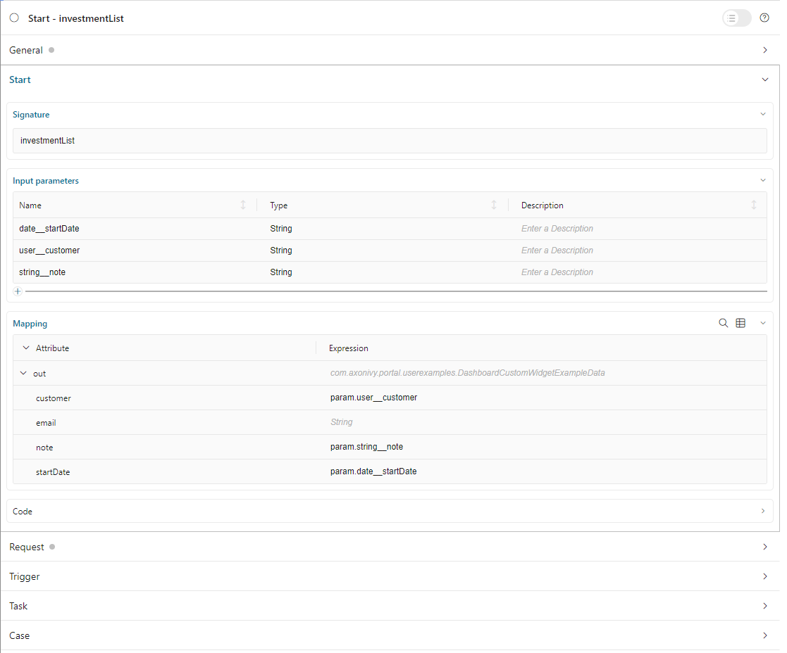

.. _configure-new-dashboard-custom-widget:

Configure Custom Widget
========================

.. _define-an-ivy-process-for-the-custom-widget:

Define An Ivy Process For The Custom Widget
-------------------------------------------

The custom widget can display a predefined Ivy process. This solution allows
users to work directly on the Portal Dashboard instead of opening another page.

First, the developer needs to create a specific process for the Portal
Dashboard:

   Set custom field ``isDashboardProcess`` for the process to true.

   |dashboard-custom-field|

   Parameters for the process have to be a String variable and named in a special format: ``type__name``

   |dashboard-custom-params|

   ``type``: type of parameter. There are four supported types

      ``user``: username of an Ivy user.

      ``string``: type java.lang.String.

      ``boolean``: type java.lang.Boolean.

      ``date``: type java.util.Date.

   ``name``: name of the field that you want to show on the configuration dialog of the custom widget.

   The reason to define in the above format is to allow end-user to send parameters to the Ivy process in the proper way.

   For example, if you define parameter ``user__customer``, Portal will display a dropdown named "customer" 
   to select an Ivy user in the system in the configuration dialog of the custom widget.

   This is how the configuration dialog for the custom widget for the above process looks like.

   |dashboard-custom-widget-configuration|

Define A Custom Widget Using JSON
---------------------------------

A custom dashboard widget allows users to interact with an external webpage or
an Ivy process on the dashboard through iframes.

Below is a standard JSON definition of the custom widget in the Portal dashboard.

   .. code-block:: html

      {
         "type": "custom",
         "id": "custom-widget",
         "name": "Custom Widget",
         "layout": {
            "x": 10, "y": 0, "w": 2, "h": 4
         },
         "data": {
            ...
         }
      }
   ..

The basic JSON structure of the custom widget

   ``type``: type of widget. Use ``custom`` to mark that this widget is a custom
   widget.

   ``id``: ID of the widget.

   ``name``: Name of the widget on UI.

   ``data``: data for customization. Please refer to the following sections to
   understand how to use this field.

Define External Webpage
-----------------------

You can use the custom widget to embed an external webpage into the Portal dashboard.
This feature is extremely useful for a company using other applications besides Axon Ivy.
Now users can interact with multiple systems from the Portal dashboard.

The JSON structure is the following:

   .. code-block:: html

      {
         "type": "custom",
         "id": "custom-widget",
         "name": "Custom Widget",
         "layout": {
            "x": 10, "y": 0, "w": 2, "h": 4
         },
         "data": {
            "url" : "https://www.axonivy.com/"
         }
      }
   ..

Attribute explanation:

   ``url``: the URL of the external webpage you want to show.

.. warning::
   Some external websites do not allow to be loaded in IFrames. You have to make sure 
   that their security policy allows the embedding if you want to use these pages in your custom widget.

Define Ivy Process
------------------

The Developer can predefine a custom widget by declaring it in a JSON file:

JSON structure

   .. code-block:: html

      {
         "type": "custom",
         "id": "custom-widget",
         "name": "Custom Widget",
         "layout": {
            "x": 10, "y": 0, "w": 12, "h": 6
         },
         "data" : {
           "processStart": "Start Processes/DashboardCustomWidgetExample/investmentList.ivp",
           "params": [
               {
                  "type": "user",
                  "name": "customer",
                  "value": "demo"
               },
               {
                  "type": "date",
                  "name": "startDate",
                  "value": "11/19/2021"
               },
               {
                  "type": "string",
                  "name": "note",
                  "value": "a short note for demo process"
               }
            ]
        }
      }
   ..

Before you continue, please read the section :ref:`Define An Ivy Process for the
Custom Widget<define-an-ivy-process-for-the-custom-widget>` above to understand
the relation between name and type.

Attributes explanation

   ``processStart``: relative link to the Ivy process that will be displayed in custom widget

   ``params``: parameters for the Ivy process above. Each parameter can be defined as follows:

      - name: name of the parameter

      - value: predefined value for the parameter.

      - type: The desired data type for the parameter to be shown in the
        configuration dialog of the custom widget. There are four types:
        ``string``, ``user``, ``date``, ``boolean``.

         - type ``string``: Marks the parameter as a normal String. In the
           configuration dialog, the user can edit this parameter in an input
           text field.

         .. code-block:: html

            {
               ...

               "params": [
                     {
                        "type": "string",
                        "name": "note",
                        "value": "a short note for demo process"
                     }
                  ]
            }
         ..

         - type ``user``: The parameter value is an Axon Ivy username. In the
           configuration dialog, the user can edit this parameter by choosing a
           user from a dropdown. Only Ivy usernames are accepted as values.

         .. code-block:: html

            {
               ...

               "params": [
                     {
                        "type": "user",
                        "name": "customer",
                        "value": "demo"
                     }
                  ]
            }
         ..

         - type ``date``: The parameter value is a date. In the configuration
           dialog, the user can edit this parameter with a date picker. This
           type only accepts date formats dd.MM.yyyy and MM/dd/yyyy.

         .. code-block:: html

            {
               ...

               "params": [
                     {
                        "type": "date",
                        "name": "startDate",
                        "value": "11/19/2021"
                     }
                  ]
            }
         ..

         - type ``boolean``: The parameter is a boolean. In the configuration
           dialog, this field will be rendered as a radio button: The user can
           choose between true or false by clicking the respective radio button.
           This type only accepts the values ``true`` or ``false``.

Please refer to JSON file ``variables.Portal.Dashboard.json`` and process
``DashboardCustomWidgetExample/investmentList.ivp`` in project
``portal-developer-examples`` for details about how to define the Ivy process for
the custom widget.

.. |dashboard-custom-field| image:: images/new-dashboard-custom-widget/process-custom-field.png

.. |dashboard-custom-widget-configuration| image:: ../../screenshots/dashboard/process-custom-widget-configuration.png